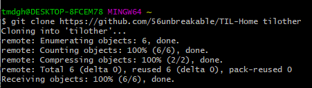

# day 2

### Git 사용중 많이 나오는 실수

1. 중첩 git init 

   git init을 하면 .git 폴더가 생긴다. 이 폴더는 git으로 관리를 시작하게 하는 폴더. 

   .git 폴더가 있는 폴더 아래에 또다시 git init을 시작하면 중첩이 되어버린다.

   홈 폴더에서는 git init을 하지 않는다.

2. .git이 있는 폴더는 이동 가능. 중첩만 하지 않으면 됨.

   즉, git으로 관리하는 폴더는 다른 저장소에 이동시켜도 가능.


## Git으로 프로젝트 관리

### .gitignore

+ 로컬 저장소에 올리지 않은 파일/폴더를 지정하는 것.
+ git add를 실행하기 전 untracked 상태의 파일/폴더를 .gitignore 파일에 저장하면 해당 파일은 로컬 저장소에 올라가지 않게된다.


### Pull, Clone

+ clone : 원격 저장소가 존재하지 않는 상태에서 원격 저장소에 있는 파일을 가져오는 것. 연결까지 완료되어있는 상태를 만들어준다.

  `git clone URL folername`

+ pull : 원격 저장소에 있는 걸 내 로컬 저장소에 받은 상태이지만, 다른 버젼을 가져오는 것. 즉, commit 되어있는 것을 가져오는 것.

  `git pull origin master`

  origin은 원격 저장소와 연결되어있는 URL을 말한다.

+ 순서

  1. 사용자 이름 설정

     `git config --global user.name 이름`

     ``git config --global user.name 이메일`

  2. git 저장소 생성

     `git init`

  3. github 원격 저장소와 연결

     `git remote add 이름 URL`

     이름에는 관례적으로 origin 사용, URL은 github 주소

  4. 작업한 파일 업로드

     ```
     # 작업한 파일을 staging area에 올리기 <.>은 모든 파일을 의미
     git add .
     
     # 작업한 파일을 커밋
     git commit -m "message"
     
     # 커밋을 원격 저장소에 올리기
     git push origin master
     ```

  5. 원격저장소에서 클론 만들기

     `git clone URL foldername`
     
     
     
  6. 원격 저장소에서 파일 가져오기.

​				`git pull origin master`

