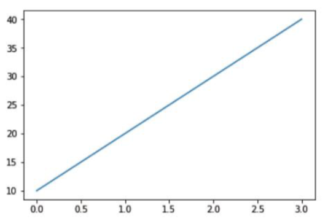
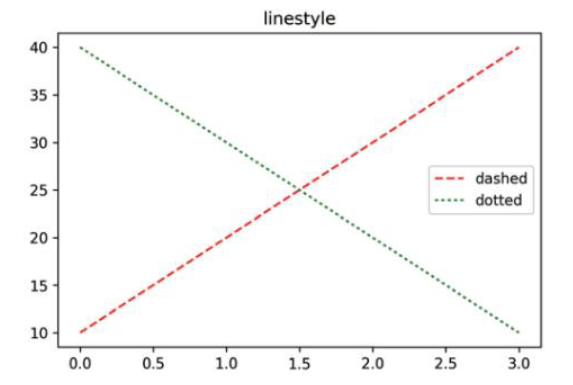

# day 5

## pandas

### 데이터 살펴보기

#### 데이터 요약정보 확인하기

+ 각 열의 고유값 개수

  `value_counts()` 메소드는 각 열의 고유값의 개수를 출력한다. 범주형 변수들로 이루어진 경우 각 범주의 개수를 세서 반환한다. `value_counts()` 는 시리즈를 반환한다.

  ```python
  unique = dataframe['열이름'].value_counts()
  print(uq)
  ```

#### 통계함수 적용

object 타입의 데이터는 산술정보를 계산하지 않는다. 산술데이터는 숫자형 데이터에서만 계산된다.

+ 평균값

  ```python
  df.mean()
  df['열이름'].mean()
  df.열이름.mean()
  ```

+ 중앙값

  ```python
  df.median()
  df['열이름'].medain()
  df.열이름.median()
  ```

+ 최대값

  object 타입의 경우 아스키 코드값을 기준으로 최대값을 판단한다

  ```python
  df.max()
  df['열이름'].max()
  df.열이름.max()
  ```

+ 최소값

  ```python
  df.min()
  df['열이름'].min()
  df.열이름.min()
  ```

+ 표준편차

  ```python
  df.std()
  df['열이름'].std()
  df.열이름.std()
  ```

+ 상관계수

  상관계수는 -1 ~ 1의 값을 가지며, 위의 산술정보들과 마찬가지로 열을 뽑아서 출력할 수 있지만, 서로 다른 두 개의 열을 사용해야한다. 만약 같은 열을 사용한다면 상관계수는 1이 나올 것이다.

  ```python
  df.corr()
  print(df[['열이름 1','열 이름2']].corr())
  ```

+ 상관관계

  

  위의 그림은 산점도이다. 산점도는 데이터의 분포에 따른 상관관계를 보여주는 그림이다. 데이터 분석 시 좋은 데이터를 넣어야 좋은 결과를 얻는다. 데이터 간의 상관관계를 잘 확인하고 input을 해줘야 더 좋은 output을 받을 수 있다.


## 그래프

### 판다스 내장 그래프 도구

#### plot 메소드

기본 사용법 `dataframe.plot()` .  `kind = ` 옵션을 사용하여 그래프를 변경할 수 있다.

+ 선 그래프

  `plot()` 메소드에 아무런 옵션을 지정하지 않으면 기본적으로 선 그래프가 출력된다.

  ```python
  df.plot()
  ```

  

+ 막대 그래프

  ```python
  df.plot(kind = 'bar')
  ```

  

+ 히스토그램

  ```python
  df.plot(kind = 'hist')
  ```

  

+ 산점도

  변수는 열을 의미한다.

  ```python
  df.plot(x = '변수 1', y = '변수 2', kind = 'scatter' )
  ```

  

+ 박스 플랏

  ```python
  df['변수 선택'].plot(kind = 'box')
  ```

  

  변수 선택은 리스트를 이용하여 여러개의 변수를 선택할 수 있다.

  `df[['a','b']].plot(kind = 'box')`


## 데이터 분석

### 공공데이터 분석

#### 기상청 기온 데이터

[기상자료 포탈](https://data.kma.go.kr)에 들어가면 기온과 관련된 공공데이터를 받을 수 있다. 통계 분석의 기온 분석 데이터를 사용하였다. 

#### csv 파일의 로드

+ csv 모듈을 import하여 csv파일을 읽어올 수 있다.

  `open` 메소드를 이용해 csv파일을 오픈하는 파이프라인을 형성한다. `open` 메소드의 `r` 옵션은 데이터를 읽기 전용으로 가져오는 인자이다. `csv.reader` 를 사용해 `data`에 csv파일의 내용을 저장한다. 이때 `delimiter` 는 `,`로 데이터를 구분한다는 의미이다. `open()`으로 데이터 파일을 열었으면 마지막에는 `close()`를 이용하여 닫아줘야 한다. 

  ```python
  import csv
  f = open('파일경로/파일이름','r',encoding='cp949')
  data = csv.reader(f, delimiter = ',')
  print(data)
  f.close()
  ```

  output은 주소값이 나온다.

+ csv파일 데이터 출력

  `for`문을 사용해서 데이터를 출력해준다. 출력한 데이터는 완전한 데이터가 아닐 수 있다.

  ```python
  import csv
  f = open('파일경로/파일이름','r',encoding='cp949')
  data = csv.reader(f, delimiter = ',')
  for i in data:
      print(i)
  f.close()
  ```

+ csv 파일의 헤더 저장하기.

  `next`는 데이터를 읽은 즉시 다음 데이터로 읽게된다. `pop`과 비슷한 느낌이다. 데이터를 뽑은 이후 다음으로 넘어가게된다.

  ```python
  import csv
  f = open('파일경로/파일이름')
  data = csv.reader(f)
  header = next(data)
  print(header)
  f.close()
  ```

+ 헤더를 저장하고 데이터만 출력하기

  `header` 객체에 헤더를 저장하고 그 뒤에 `for`문을 이용하여 데이터를 출력한다.

  ```python
  import csv
  f = open('파일경로/파일이름')
  data = csv.reader(f)
  header = next(data)
  for i in data:
      print(i)
  f.close()
  ```

#### 데이터 뽑기

데이터에게 질문을 하여 어떠한 정보를 뽑아올지 알아올 수 있다. 예를 들어 2000년에 가장 더웠던 날을 찾아올 수 있을 것이다. 데이터를 그냥 가지고 있는 것으로 끝나는게 아니라 의미있는 질문을 통해 데이터에서 답을 찾아와 인사이트를 얻을 수 있다.

데이터에는 명확하게 이야기를 전달해야한다. 데이터에게 궁금한 질문을 구체적이고 명확하게 다듬어서 해야한다. 내가 가지고 있는 데이터만으로 질문에 대한 답을 찾을 수 있는지도 확인해야한다.

+ 문제 해결

  데이터를 이용한 문제 해결을 해보자. 서울에서 가장 더웠던 날은 언제인가? 라는 질문을 다듬어보면 최고기온이 가장 높았던 날로 찾을 수 있을 것이다.

  최고 기온이 가장 높은 데이터를 찾고 날짜를 가져오면 될 것이다. 이를 순차적으로 정리하면

  1. 데이터를 읽어온다
  2. 순차적으로 최고기온 확인
  3. 최고기온이 가장 높았던 날짜의 데이터 저장
  4. 최종 저장된 데이터 출력

+ 문제 해결 코드

  문제를 해결하려면 최고기온과 최고기온이 측정된 날짜를 알아야 한다. `max_temp` 와 `max_date` 에 최고기온과 최고기온이었던 날짜를 저장해준다. 이때, 최고기온이 저장될 `max_temp`의 경우 기온과 비교되어야하기 때문에 최고기온이 될 리 없는 `-999`정도의 아주 작은 수로 지정해준다.

  ```python
  import csv
  max_temp = -999
  max_date = ''
  ```

  데이터를 불러온 후, 헤더를 저장하고 `for`문을 이용하여 데이터만을 출력한다. 찾고자 하는 데이터는 `[-1]`번째 열이다.

  ```python
  f = open('파일경로/파일이름')
  data = csv.reader(f)
  header = next(data)
  for row in data:
      print(row[-1])
  ```

  비교를 하기 위해  `string`으로 저장되어 있는 값을 `float`으로 변환하면 에러가 발생한다. `NaN`값은 변환이 불가능하기 때문이다. 따라서 `NaN`값을 다른 값으로 대체하여 에러를 해결한다. 이때, 대체값을 `-999`로 저장한 이유는 최대값을 구하는 문제이기 때문에 무시될 수 있는 값으로 대체한 것이다.

  ```python
  for row in data:
      if row[-1] == '':
          row[-1] = -999
      row[-1] = float(row[-1])
  ```

  `for`문 안에서 한줄씩 비교해가며 최고기온과 최고기온이 측정된 날짜를 저장해 준 다음 출력해준다.

  ```python
  # 최종 문제 해결 코드
  import csv
  max_temp = -999
  max_date = ''
  f = open('파일경로/파일이름')
  data = csv.reader(f)
  header = next(data)
  for row in data:
      if row[-1] == '':
          row[-1] = -999
      row[-1] = float(row[-1])
      if max_temp < row[-1]:
          max_temp = row[-1]
          max_date = row[0]
  f.close()
  print('최고기온이 가장 높았던 날은 ',max_date,'이고 기온은',max_temp,'도 입니다.')
  ```


## 데이터 시각화

### matplotlib

시각화를 할 때 가장 많이 사용되는 라이브러리다. 2차원 그래프를 그릴때 사용된다.

`import matplotlib.pyplot` 을 사용하여 `pyplot` 모듈을 사용한다

#### 기본 그래프 그리기

+ 리스트를 그래프로 출력.

  x축과 y축에 각각 1개씩의 리스트를 추가하여 그래프를 그릴 수 있다.

  ```python
  import matplotlib.pyplot as plt
  plt.plot([1,2,3,4],[12,43,25,15])
  plt.show()
  ```

  

+ 그래프에 타이틀 추가

  `plt.title('제목')` 메소드를 사용하여 제목을 추가할 수 있다.

  ```python
  import matplotlib.pyplot as plt
  plt.title('plotting')
  plt.plot([1,2,3,4],[12,43,25,15])
  plt.show()
  ```

  

+ 그래프에 범례 추가

  `plt.legend()` 메소드를 사용하여 범례를 추가할 수 있다. 인자를 지정해주면 범례의 위치가 바뀐다. `label` 옵션으로 범례의 이름을 설정할 수 있다.

  `plt.plot(data, label)`

  ```python
  import matplotlib.pyplot as plt
  plt.title('legend')
  plt.plot([10,20,30,40],label='asc')
  plt.plot([40,30,20,10],label='desc')
  plt.legend()
  plt.show()
  ```

  

+ 그래프 색상 바꾸기

  `plt.plot()` 메소드에 `color` 옵션을 사용해서 색상을 추가할 수 있다. 구글의 컬러테이블을 이용해 색상을 추가할 수 있다.

  `plt.plot(data, color, label)`

  ```python
  import matplotlib.pyplot as plt
  plt.title('color')
  plt.plot([10,20,30,40],color = 'skyblue',label='asc')
  plt.plot([40,30,20,10],'pink',label='desc')
  plt.legend()
  plt.show()
  ```

  

+ 그래프 선 모양 바꾸기

  `plt.plot()` 메소드의 `linestyle` 옵션을 사용하여 선 모양을 바꿀 수 있다. `ls`로 짧게 표현할 수 있다.

  `plt.plot(data, color, linestyle, label)`

  ```python
  import matplotlib.pyplot as plt
  plt.title('linestyle')
  plt.plot([10,20,30,40],color = 'skyblue',linestyle = '--',label='asc')
  plt.plot([40,30,20,10],'pink',ls = ':',label='desc')
  plt.legend()
  plt.show()
  ```

  

+ 마커 모양 바꾸기

  `color` 옵션 안에 `.` `^` 과 같은 인자를 넣어서 마커의 모양을 표현할 수 있다. `ls` 옵션과 같이 사용 가능하다.

  ```python
  import matplotlib.pyplot as plt
  plt.title('marker)
  plt.plot([10,20,30,40],'r.',label='asc')
  plt.plot([40,30,20,10],'g^',label='desc')
  plt.legend()
  plt.show()
  ```

  
  
+ 그래프의 스케일 색상 변경

  `color` 옵션은 눈금의 색상을, `colors` 옵션은 숫자의 색을 변경한다

  ```python
  plt.tick_params(color = 'white',colors = 'white')
  ```

  `tick_params` 메소드를 통해 다양한 옵션을 활용할 수 있다.

  `rotation` 옵션을 통해 눈금을 회전시킬 수 있다.

  ```python
  plt.tick_params(rotation = 30)
  ```

  `labelsize` 옵션으로 글자의 크기를 변경할 수 있다

  ```python
  plt.tick_params(labelsize = 10)
  ```

  `axis` 옵션으로 변경할 축을 지정할 수 있다

  ```python
  plt.tick_params(axis = 'x')
  ```

+ 타이틀에 한글 제목 작성하기

  `plt.rc` 메소드를 활용하여 한글 폰트를 지정할 수 있다. 한글 폰트를 지정해주면 `plt.title` 메소드에 한글을 넣어도 글씨가 깨지지 않는다.

  `font` 옵션으로 폰트를 지정한다. `family` 에 사용할 폰트를 지정한다.

  ```python
  plt.rc('font',family = 'Malgun Gothic')
  plt.title('내 생일의 기온 변화',color = 'white')
  ```

  

#### 기온 변화를 그래프로 그리기

+ 데이터를 리스트에 저장하기.

  `result`에 `NaN`이 아닌 값들만 저장한다.

  ```python
  import csv
  f = open('파일경로/파일이름')
  data = csv.reader(f)
  next(data)
  result = [] 
  for row in data:
      if row[-1] != '':
          result.append(float(row[-1]))
  print(result)
  ```

+ 전체 데이터 그래프 그리기

  리스트에 저장한 `result`를 이용하여 그래프를 그린다. 

  ```python
  import matplotlib.pyplot as plt
  plt.plot(result,'r')
  plt.show
  ```

+ 날짜 데이터 추출하기

  `split()` 메소드를 이용하여 데이터를 나눌 수 있다. `-`으로 분리된 데이터를 나누고자 한다면 `data.split('-')` 구문을 이용하여 데이터를 나눌 수 있다.

  `split()` 메소드의 결과는 리스트로 반환되기 때문에 리스트의 요소를 출력하는 방법인 `data.split('-')[index]` 를 사용하면 분리된 데이터를 하나씩 추출할 수 있다.

  ```python
  s = '1907-10-01'
  print(s.split('-'))
  print(s.split('-')[0])
  print(s.split('-')[1])
  print(s.split('-')[2])
  ```

  결과 : ['1907', '10', '01']

  ​			1907

  ​			10 

  ​			01

  특정 날짜의 데이터를 출력하는 방법은 `for`문에 `if`문을 추가하여 특정한 데이터만 출력할 수 있다. 다음 코드는 최고기온이 `NaN`값이 아닐 때 8월의 최고기온만을 출력하는 코드이다.

  ```python
  for row in data :
      if row[-1] != '' :
          if row[0].split('-')[1] == '08':
              result.append(float(row[-1]))
  ```

+ 내 생일의 기온 변화를 그래프로 그리기

  앞선 내용을 종합하여 생일날 기온의 변화를 그려주는 그래프를 작성해보자

  ```python
  import csv
  max_result = [] 
  min_result = []
  f = open('파일경로/파일이름')
  data = csv.reader(f)
  next(data)
  for row in data :
      if row[-1] != '' :
          if row[0].split('-')[1] == '05' and row[0].split('-')[2] == '28':
              max_result.append(float(row[-1]))
      if row[-2] != '' :
          if row[0].split('-')[1] == '05' and row[0].split('-')[2] == '28':
              min_result.append(float(row[-2]))
  plt.rc('font',family = 'Malgun Gothic')
  plt.title('내 생일의 기온 변화',color = 'white')
  plt.tick_params(color = 'white',colors = 'white')
  plt.plot(max_result,'blue',label = 'max temp')
  plt.plot(min_result,'green',label = 'min temp')
  plt.legend()
  plt.show()
  f.close()
  ```

  

#### 기온 데이터의 다양한 시각화

+ 히스토그램

  주사위를 던져서 나온 숫자를 히스토그램으로 표현할 수 있다.

  ```python
  import random
  import matplotlib.pyplot as plt
  dice = []
  for i in range(100):
      dice.append(random.randint(1,6))
  print(dice)
  plt.hist(dice,bins=6)
  plt.tick_params(color = 'white',colors = 'white')
  plt.show()
  ```

  

+ 히스토그램으로 최고기온 그래프 그리기

  `bins` 옵션은 범위를 지정해주는 옵션이다.

  ```python
  import csv
  import matplotlib.pyplot as plt
  result = [] 
  f = open('파일경로/파일이름')
  data = csv.reader(f)
  next(data)
  for row in data:
      if row[-1] != '':
          result.append(float(row[-1]))
  plt.rc('font',family = 'Malgun Gothic')
  plt.title('최고기온 히스토그램',color = 'white')
  plt.tick_params(color = 'white',colors = 'white')
  plt.hist(result, bins=100,color = 'red')
  plt.show()
  f.close()
  ```

  

+ 여러가지 데이터에 대한 히스토그램

  8월과 1월의 최고기온 데이터를 뽑아서 히스토그램으로 출력하는 코드이다.

  ```python
  import csv
  import matplotlib.pyplot as plt
  aug = []
  jan = [] 
  f = open('파일경로/파일이름')
  data = csv.reader(f)
  next(data)
  for row in data:
      month = row[0].split('-')[1]
      if row[-1] != '' and month == '08':
          aug.append(float(row[-1]))
      elif row[-1] !='' and month == '01':
          jan.append(float(row[-1]))
  plt.rc('font',family = 'Malgun Gothic')
  plt.title('최고기온 히스토그램',color = 'white')
  plt.tick_params(color = 'white',colors = 'white')
  plt.hist(aug, bins=100,color = 'red')
  plt.hist(jan, bins=100,color = 'blue')
  plt.show()
  f.close()
  ```

  

