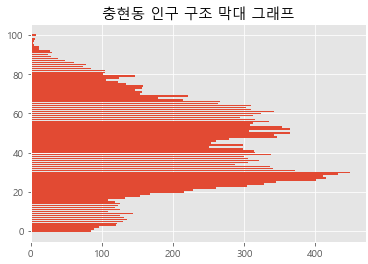

# day 6

## 데이터 시각화

### matplotlib

#### 다양한 시각화 방법

+ box plot

  box plot은 사분위수를 쉽게 알 수 있게 해주는 그래프다. 사분위수는 최소값, 1/4값, 중앙값, 3/4값, 최대값을 말한다.

  `boxplot()` 메소드를 이용해 box plot을 그릴 수 있다.

  다음 코드는 1 ~ 1000까지의 숫자중 랜덤으로 13개의 숫자를 뽑아 box plot을 그리는 코드이다.

  ```python
  import matplotlib.pyplot as plt
  import random
  result = []
  for i in range(13):
      result.append(random.randint(1,1000))
  plt.tick_params(color = 'white',colors = 'white')
  plt.boxplot(result)
  plt.show()
  ```

  

+ 기온 데이터를 box plot으로 그리기

  최고기온에 대한 데이터를 `result`에 저장하여 `boxplot` 메소드를 사용해 그래프를 그린다.

  ```python
  import csv
  import matplotlib.pyplot as plt
  result = [] 
  f = open('파일경로/파일이름')
  data = csv.reader(f)
  next(data)
  for row in data:
      if row[-1] != '':
          result.append(float(row[-1]))
  plt.title('box plot',color = 'white')
  plt.tick_params(color = 'white',colors = 'white')
  plt.boxplot(result)
  plt.show()
  f.close()
  ```

  

+ 리스트를 box plot에 사용

  아래 코드는 `result` 리스트에 1 ~ 12월의 최고기온 데이터를 저장한 이후 박스플랏으로 출력하는 그래프이다. `result`를 이중 리스트로 선언하고 그 안에 데이터를 추가하고 `boxplot()` 메소드를 이용해 그래프를 그렸다. 

  ```python
  import csv
  import matplotlib.pyplot as plt
  month = [[],[],[],[],[],[],[],[],[],[],[],[]]
  f = open('파일경로/파일이름')
  data = csv.reader(f)
  next(data)
  for row in data:
      if row[-1]!='':
          month[int(row[0].split('-')[1])-1].append(float(row[-1]))
  plt.rc('font',family = 'Malgun Gothic')
  plt.title('1 ~ 12월 최고기온 박스그림',color = 'white')
  plt.tick_params(color = 'white',colors = 'white')
  plt.boxplot(result)
  plt.show()
  f.close()
  ```

  

  

## 다양한 데이터 시각화

### 인구 통계 데이터 시각화

#### 데이터 다운로드

[행정안전부](https://www.mois.go.kr) 홈페이지에 접속하면 여러가지 데이터를 받아볼 수 있다. 그 중 인구 공공 데이터를 다운받아 데이터 분석에 활용해보자.

1. 정책 자료 -> 주민등록 인구통계 탭에 들어간다
2. 연령별 인구 현황을 선택한다
3. 필요에 의한 설정을 하고 검색 후 자료를 다운받는다.


위 사진과 같이 원하는 자료를 선택해서 검색할 수 있다.

#### 데이터 확인

데이터를 다운받으면 인코딩 방식을 확인해서 데이터가 깨지지 않도록 확인해야한다. windows의 경우 ANSI로 되어있으면 데이터가 깨지지않는다.

그 다음으로는 데이터의 구조를 확인해야한다.


데이터의 0번째 열은 행정구역의 정보를 담고있다.

1 ~ 2열은 총 인구수와 연령 구간별 인구수의 데이터를 담고있다. 하지만 1개월 분량의 데이터이기 때문에 두 열은 같은 정보를 담고있다.

마지막으로 3열 이후부터는 나이별 인구 데이터를 담고있다.

#### 데이터 로딩

다운받은 데이터를 우선 불러와 보도록 하자

+ 데이터를 한 줄씩 로딩

  다음 코드는 데이터를 불러와 한 줄씩 데이터를 출력하는 코드이다. `open` 메소드를 통하여 파일을 불러온 다음 `csv reader` 메소드를 이용하여 `data` 객체에 저장한다. `next(data)` 는 데이터의 첫 줄 이후부터 데이터를 사용한다는 의미이다. 

  `for`문을 이용해 데이터를 전체적으로 출력한다. `if '북아현동' in row[0]` 구문은 `row[0]` 에 `충현동`이 들어있을 경우 출력하겠다는 의미이다. `row[0]`는 행정구역의 정보를 담고 있었다. 즉, 충현동의 인구 정보를 불러오겠다는 의미이다.

  ```python
  import csv
  f = open('파일경로/파일이름')
  data = csv.reader(f)
  next(data)
  for row in data:
      if '충현동' in row[0]:
          print(row)
  ```

+ 인구 정보를 저장

  실제 연령별 인구 정보는 3열부터 담고있다. 따라서 3열 이후부터 데이터를 저장해야 연령별 인구 정보를 가져올 수 있다.

  row 8의 `for i in row[3:]` 구문은 충현동을 포함하는 데이터의 3열부터 마지막열까지의 데이터를 반복한다는 의미이다. 따라서 연령별 인구 정보가 모두 `result` 객체에 저장된다. 이때, 원본 파일에서 불러온 데이터는 `str`타입이므로 `int` 타입으로 변환해주어야 정확한 그래프를 출력할 수 있다.

  ```python
  import csv
  f = open('파일경로/파일이름')
  data = csv.reader(f)
  next(data)
  result = []
  for row in data:
      if '충현동' in row[0]:
          for i in row[3:]:
              result.append(int(i))  # 불러온 데이터를 int 타입으로 변환
  f.close()
  print(result)
  ```

#### 데이터 시각화

+ 인구 구조 시각화.

  앞선 코드에서 데이터를 저장한 이후 인구 구조를 시각화할 수 있다. 이때 `input` 메소드를 사용하여 원하는 지역을 입력받은 이후 그 지역에 대한 인구구조 그래프를 그릴 수 있다.  `area` 객체에 원하는 지역을 입력받은 이후 데이터를 불러오고, 이를 그래프로 출력하는 코드이다.

  `plt.style.use('ggplot')` 은 `ggplot`이라는 그래프 스타일을 사용하겠다는 구문이다. `ggplot`은 격자무늬로 나타내주는 스타일이다.

  ```python
  import csv
  import matplotlib.pyplot as plt
  
  area = input("원하는 지역 입력")
  
  f = open('파일경로/파일이름')
  data = csv.reader(f)
  next(data)
  result = []
  for row in data:
      if area in row[0]:
          for i in row[3:]:
              result.append(int(i))
  f.close()
  
  # 그래프 그리기
  plt.style.use('ggplot')
  plt.rc('font',family = 'Malgun Gothic')
  plt.title(area+' 인구 구조 선 그래프')
  plt.plot(result)
  plt.show()
  ```

  

+ 막대 그래프

  인구 구조에 대한 그래프를 다양한 방식으로 표현할 수 있다. 선 그래프 뿐만 아니라 막대그래프로도 표현 가능하다.

  ```python
  plt.rc('font',family = 'Malgun Gothic')
  plt.title(area+' 인구 구조 막대 그래프')
  plt.bar(range(101),result)
  plt.show()
  ```

  

  `barh()` 메소드를 사용하면 수평 막대 그래프를 그릴 수 있다.

  ```python
  plt.rc('font',family = 'Malgun Gothic')
  plt.title(area+' 인구 구조 막대 그래프')
  plt.barh(range(101),result)
  plt.show()
  ```

  

  

### 남녀별 인구 통계 데이터 시각화

#### 데이터 다운로드

데이터 구분에서 남/녀 구분 항목을 체크해 다운받는다.


#### 데이터 확인

새로 다운로드 받은 데이터는 [행정구역 - 총인구수 - 남자 인구수 - 여자 인구수] 의 형태로 데이터가 수집되어있다.

데이터의 열 인덱스로 구분하면 다음과 같이 구분되어있다.

[0] : 행정구역

[1:2] : 남자 총 인구수

[3 : 103] : 남자 연령별 인구수

[104 : 105] : 여자 총 인구수

[106 : 206] : 여자 연령별 인구수 


#### 데이터 로딩

다운받은  csv파일을 로딩하여 리스트에 저장한다.

남성 데이터와 여성 데이터를 각기 다른 리스트에 저장한다.

+ 데이터 저장

  반복문을 이용해서 데이터를 저장한다. `male`과 `female` 리스트에 각각 정보를 저장한다. 남성과 여성의 연령별 데이터는 101개의 데이터를 가지고 있기 때문에 데이터를 저장할 때  반복문을 101번 돌려서 데이터를 저장한다.

  `row[]`의 인덱스를 지정할 때 남자는 3 ~ 103 까지 인덱스가 지정되게끔, 여자는 106 ~ 206 까지 인덱스가 지정되게끔 설정해준다. 전체 열이 206개이기 때문에 여성의 데이터는 마지막 열부터 101개를 읽어오면 된다. 따라서, 여성의 데이터는 `-(i+1)` 로 인덱스를 지정해주어 역순으로 데이터를 저장하게 해준다. 여성의 데이터는 역순으로 저장되었기 때문에 `reverse()` 함수를 사용하여 순서를 뒤집어준다.

  즉, 남자의 인덱스는 3부터 101개가, 여자의 인덱스는 -1부터 101개가 선택된다.

  ```python
  import csv
  male = []
  female = []
  f = open('파일경로/파일이름')
  data = csv.reader(f)
  next(data)
  for row in data:
      if '충현동' in row[0]:
          for i in range(0,101):
              male.append(int(row[i+3]))
              female.append(int(row[-(i+1)]))
  f.close()
  female.reverse()
  print(male)
  print('\n')
  print(female)
  ```

+ 다른 방법으로 데이터 저장

  남자와 여자의 인덱스를 직접 지정하여 데이터를 저장해볼 수 있다.

  ```python
  import csv
  male = []
  female = []
  f = open('파일경로/파일이름')
  data = csv.reader(f)
  next(data)
  for row in data:
      if '충현동' in row[0]:
          for i in row[3:104]:
              male.append(int(i))
          for i in row[106:]:
              female.append(int(i))
  f.close()
  print(male)
  print('\n')
  print(female)
  ```

#### 데이터 시각화

+ 수평 막대 그래프 그리기

  `barh()` 메소드를 사용하여 수평 막대 그래프를 그릴 수 있다. `color` 인자를 이용해 색을 변경해준다.

  ```python
  import matplotlib.pyplot as plt
  plt.rc('font',family = 'Malgun Gothic')
  plt.title('충현동 남/여 인구구조 막대 그래프')
  plt.barh(range(101),male, color = 'pink')
  plt.barh(range(101),female, color = 'skyblue')
  plt.show()
  ```

  

+ 항아리 모양 그래프 그리기

  앞선 방법으로 그래프를 그리면 남자와 여자의 그래프가 곂쳐서 제대로된 인사이트를 얻기 힘들다. 만약 남자의 데이터를 음수로 바꿔서 사용해준다면 남자의 인구수는 왼쪽으로, 여자의 인구수는 오른쪽으로 그래프가 그려질 것이다.

  `male.append(-int(i))` 코드를 이용해 남자의 인구수를 음수로 만들어주어 항아리 형태의 그래프를 생성할 수 있다.

  ```python
  import matplotlib.pyplot as plt
  import csv
  male = []
  female = []
  f = open('파일경로/파일이름')
  data = csv.reader(f)
  next(data)
  for row in data:
      if '충현동' in row[0]:
          for i in row[3:104]:
              male.append(-int(i))   # 남자의 인구수를 음수로 지정
          for i in row[106:]:
              female.append(int(i))
  f.close()
  plt.rc('font',family = 'Malgun Gothic')
  plt.title('충현동 남/여 인구구조 막대 그래프')
  plt.barh(range(101),male, color = 'pink')
  plt.barh(range(101),female, color = 'skyblue')
  plt.show()
  ```

  

+ 원하는 지역의 항아리 모양 그래프 그리기

  앞선 내용들을 응용하여 원하는 지역을 검색하여 항아리 모양의 그래프를 만들 수 있다.

  `area` 변수를 이용해 원하는 지역을 입력받아서 데이터를 저장하고 그래프를 그린다. `legend()` 메소드를 이용하여 범례를 추가해준다.

  ```python
  import matplotlib.pyplot as plt
  import csv
  male = []
  female = []
  area = input()
  f = open('파일경로/파일이름')
  data = csv.reader(f)
  next(data)
  for row in data:
      if area in row[0]:
          for i in row[3:104]:
              male.append(-int(i))
          for i in row[106:]:
              female.append(int(i))
  f.close()
  plt.rc('font',family = 'Malgun Gothic')
  plt.title(area+' 남/여 인구구조 막대 그래프')
  plt.barh(range(101),male, color = 'pink',label = '남자')
  plt.barh(range(101),female, color = 'skyblue', label = '여자')
  plt.legend()
  plt.show()
  ```

  

  

### 다양한 형식 그래프

#### 파이 차트

파이차트는 파이를 조각조각 잘라서 만든것처럼 원의 각 부분을 잘라서 데이터를 표현하는 방식이다. 여러 구성 요소의 구성 비율을 확인할 때 쓰는 그래프이다.

+ 파이차트 그리기

  `axis('equal')` 구문을 이용해 파이차트를 원형 형태로 표현할 수 있다.

  `pie()` 메소드에 옵션을 추가해서 그래프에 여러가지 요소를 추가할 수 있다.

  `label` 리스트에 라벨을 추가하고 `labels` 옵션으로 라벨을 추가할 수 있다. 이후 `legend()` 메소드를 통해 범례를 추가할 수 있다.

  `colors` 옵션을 사용해 색을 추가할 수 있다.

  `explode` 옵션을 사용해 돌출효과를 줄 수 있다. 0일경우 돌출효과를 사용하지 않는다.

  ```python
  import matplotlib.pyplot as plt
  size = [2441,2312,1031,1233]
  label = ['A형','B형','O형','AB형']
  color = ['darkblue','skyblue','hotpink','green']
  plt.rc('font',family = 'Malgun Gothic')
  plt.axis('equal')
  plt.pie(size, labels = label, autopct = '%.1f%%',colors = color, explode=(0,0,0.1,0))
  plt.legend()
  plt.show()
  ```

  

#### 버블 차트

+ `scatter()` 메소드로 산점도 표현하기

  ```python
  import matplotlib.pyplot as plt
  plt.scatter([1,2,3,4],[10,30,20,40])
  plt.show()
  ```

  

+ 버블차트로 표현하기.

  `s` 옵션을 `scatter()` 메소드에 추가하면 산점도를 버블차트로 표현할 수 있다.

  `colorbar()` 메소드를 이용해서 컬러바를 추가할 수 있다. `c` 옵션은 색상의 수를 의미한다.

  `scatter()` 메소드의  `cmap` 옵션을 활용해 색을 변경할 수 있다.

  `alpha` 옵션을 사용해 투명도를 설정할 수 있다. 큰 버블 아래에 작은 버블이 가려지는 경우 `alpha`값으로 투명도를 설정해 볼 수 있게 할수있다.

  ```python
  import matplotlib.pyplot as plt
  import random
  x = []
  y= []
  size = []
  for i in range(100):
      x.append(random.randint(50,100))
      y.append(random.randint(50,100))
      size.append(random.randint(10,100))
  plt.scatter(x,y,s=size,c=size, cmap='jet', alpha = 0.7)
  plt.colorbar()
  plt.show()
  ```

  

### 제주도 인구 데이터 시각화

#### 파이차트로 표현

파이차트를 이용해 제주도의 성별 비율을 확인해보자. 파이차트는 비율을 확인할 때 유용한 그래프이다. 데이터를 리스트에 저장할 때 각각의 데이터를 하나씩 불러온 다음 전부 더해서 남/여 총 인구를 확인할 수 있게 한다.

`startangle` 옵션으로 그래프의 각도를 변경할 수 있다.

`replace` 메소드를 통해 쉼표를 ""으로 대체할 수 있다. 즉, 쉼표를 제거할 수 있다.

```python
import matplotlib.pyplot as plt
import csv
area = input()
size = []
f = open('파일경로/파일이름')
data = csv.reader(f)
next(data)
for row in data:
    if area in row[0]:
        male = 0
        female = 0
        for i in range(0,101):
            m = row[i+3]
            m = int(m.replace(",","")) # 쉼표 제거
            male += m
            f = row[i+106]
            f = int(f.replace(",",""))
            female += f
        break
size.append(male)
size.append(female)
plt.rc('font',family = 'Malgun Gothic')
plt.title(area+' 성별 비율 그래프')
plt.axis('equal')
plt.pie(size, autopct = '%.1f%%')
plt.legend()
plt.show()
```


#### 꺾은선 그래프로 표현

남/여의 연령대별 인구를 알아보기 위해 꺾은선 그래프를 사용해보자. 남/여 연령별 인구를 리스트에 저장하여 그래프를 그린다.

`replace` 메소드를 통해 쉼표를 ""으로 대체할 수 있다. 즉, 쉼표를 제거할 수 있다.

```python
import matplotlib.pyplot as plt
import csv
area = input()
male = []
female = []
f = open('파일경로/파일이름')
data = csv.reader(f)
next(data)
for row in data:
    if area in row[0]:
        for i in range(0,101):
            m = row[i+3]
            m = int(m.replace(",",""))
            male.append(m)
            f = row[i+106]
            f = int(f.replace(",",""))
            female.append(f)
        break
size.append(male)
size.append(female)
plt.rc('font',family = 'Malgun Gothic')
plt.title(area+' 연령별 남/여 인구비율 그래프')
plt.plot(male, label = '남성')
plt.plot(female, label = '여성')
plt.legend()
plt.show()
```


#### 막대그래프로 표현

막대그래프를 이용해서 남/여 연령별 인구수 차이를 확인할 수 있다. 리스트에는 남/여의 인구수의 차이를 저장해주고 그래프를 그린다.

```python
import matplotlib.pyplot as plt
import csv
area = input()
result = []
f = open('파일경로/파일이름')
data = csv.reader(f)
next(data)
for row in data:
    if area in row[0]:
        for i in range(0,101):
            m = row[i+3]
            m = int(m.replace(",",""))
            f = row[i+106]
            f = int(f.replace(",",""))
            result.append(m-f)
        break
size.append(male)
size.append(female)
plt.rc('font',family = 'Malgun Gothic')
plt.title(area+' 남/여 연령별 인구수 차이 막대 그래프')
plt.bar(range(101),result,color = 'skyblue')
plt.show()
```


## seaborn 라이브러리 - 고급 그래프 도구

+ 데이터셋 설정

  실습에 사용할 데이터를 불러온다. 데이터는 내장 데이터셋인 `titanic` 데이터 셋을 사용한다.

  ```python
  import seaborn as sns
  titanic = sns.load_dataset('titanic')
  print(titanic.head())
  ```


### 그래프

#### 회귀선이 있는 산점도

`set_style()` 함수를 통해 그래프의 테마를 선택할 수 있다. 테마는 5가지 : (darkgird, whitegird, dark, white, ticks) 로 설정 가능하다.

`figure()` 함수는 `figsize = ` 옵션을 통해 그래프의 사이즈를 조정할 수 있다.

`add_subplot()` 함수는 `figsize` 에 맞춰서 칸을 나눈다는 뜻이다. `(1,2,1)` 의 뜻은 1행 2열로 화면을 나누고 그중 첫번째 화면이라는 뜻이다.

`regplot()` 함수를 통해 선형회귀선이 있는 산점도를 그릴 수 있다. `x = ` 옵션으로 x축을 지정, `y = ` 옵션으로 y축을 지정한다. 이때 데이터의 열에 해당하는, 즉 변수를 넣어서 x축과  y축을 지정한다. `data = ` 옵션으로 사용할 데이터를 선택할 수 있다. `ax = ` 옵션은 화면을 지정해주는 옵션이다. `fit_reg` 옵션으로 회귀선을 넣을지 말지 선택할 수 있다. `True` 가 디폴트값이며, 회귀선을 추가한다.

```python
# 데이터 로딩
import matplotlib.pyplot as plt
import seaborn as sns
titanic = sns.load_dataset('titanic')

# 스타일 테마 설정 
sns.set_style('darkgrid')

# 그래프 객체 생성
fig = plt.figure(figsize=(15,5))
ax1 = fig.add_subplot(1,2,1)
ax2 = fig.add_subplot(1,2,2)

# 그래프그리기 - 선형회귀선 표시
sns.regplot(x = 'age', y = 'fare', data = titanic, ax = ax1)
sns.regplot(x = 'age', y = 'fare', data = titanic, ax = ax2 , fit_reg= False)

plt.show()
```


#### 히스토그램 / 커널 밀도 그래프

`distplot()` 함수로 히스토그램/커널 밀도 그래프를 그릴 수 있다.

`hist = ` 옵션을 통해 히스토그램의 출력 여부를 결정할 수 있다. 마찬가지로 `kde = ` 옵션을 통해 커널 밀도 그래프의 출력 여부를 결정할 수 있다.

`set_title` 함수를 통해 제목을 지정해 줄 수 있다. 미리 만들어 놓은 객체에 추가하는 형식이다.

`add_subplot` 함수로 화면을 지정할 수 있다. `(행, 열, 지정할화면)` 으로 값을 지정한다. 아래 그래프에 `ax = ` 옵션으로 앞서 `add_subplot` 으로 만든 객체를 넣어 그래프에 화면을 지정할 수 있다.

```python
# 데이터 로딩
import matplotlib.pyplot as plt
import seaborn as sns
titanic = sns.load_dataset('titanic')

# 스타일 테마 설정 
sns.set_style('darkgrid')

# 그래프 객체 설정
fig = plt.figure(figsize=[15,5])
ax1 = fig.add_subplot(1,3,1)
ax2 = fig.add_subplot(1,3,2)
ax3 = fig.add_subplot(1,3,3)

# 기본값
sns.distplot(titanic['fare'],ax = ax1)

# hist = False
sns.distplot(titanic['fare'],hist=False,ax = ax2)

# kde = False
sns.distplot(titanic['fare'],kde=False,ax = ax3)

#차트 제목 표시
ax1.set_title('titanic fare - hist/kde')
ax2.set_title('titanic fare - hist')
ax3.set_title('titanic fare - kde')
```


#### 히트맵

히트맵은 각각의 요소를 색으로 표현하여 진하거나 연한 색으로 구분해 데이터의 많고 적음을 표현해주는 그래프이다.

`pivot_table()` 메소드를 통해 범주형 변수를 행, 열로 재구분한다. 이 말은, 성별을 2개의 행으로, 등급을 3개의 열로 재구분하는 것이다.

`annot` 옵션은 히트맵 안에 데이터 값의 표현여부를 결정하는 옵션이다.

`fmt` 옵션으로 정수형으로 포맷한다.

`cmap` 옵션은 컬러 맵을 지정한다. 여러가지 컬러맵이 존재하는데 일부러 오류를 나게하면 오류 메세지로 컬러맵의 이름들이 나온다.

`linewidth` 로 선의 굵기를 지정할 수 있다.

`cbar` 옵션으로 컬러바의 출력 여부를 결정할 수 있다.

```python
# 데이터 로딩
import matplotlib.pyplot as plt
import seaborn as sns
titanic = sns.load_dataset('titanic')

# 스타일 테마 설정 
sns.set_style('darkgrid')

# 피벗테이블로 범주형 변수를 각각 행,열로 재구분하여 정리
table = titanic.pivot_table(index = ['sex'], columns=['class'], aggfunc = 'size')

# 히트맵 그리기
sns.heatmap(table, annot=True, fmt = 'd', cmap='twilight', linewidths=.5, cbar=False)
plt.show()
```


#### 범주형 데이터의 산점도

`stripplot()` 함수는 데이터의 분포를 확인하는 그래프이다.

`swarmplot()` 함수는 데이터의 분포와 분산 정도를 동시에 확인할 수 있는 그래프다.

```python
# 데이터 로딩
import matplotlib.pyplot as plt
import seaborn as sns
titanic = sns.load_dataset('titanic')

# 스타일 테마 설정 
sns.set_style('whitegrid')

# 그래프 객체 생성
fig = plt.figure(figsize=(15,5))
ax1 = fig.add_subplot(1,2,1)
ax2 = fig.add_subplot(1,2,2)

# 이산형 변수의 분포
sns.stripplot(x = 'class', y = 'age', data = titanic, ax = ax1)
sns.swarmplot(x = 'class', y = 'age', data = titanic, ax = ax2)

# 그래프 제목 추가
ax1.set_title('Strip plot')
ax2.set_title('Swarm plot')

plt.show()
```


#### 막대 그래프

`barplot()` 함수를 이용해서 막대 그래프를 그릴 수 있다. 

`barplot` 의  `hue` 옵션은 x축의 데이터를 새로운 범주를 추가하여 보여주는 옵션이다. `hue = 'class'` 로 지정을 하게 되면, 성별과 등급에 따른 생존자의 숫자를 보여주게 될 것이다. 이때, 큰 범주로는 성별이, 작은 범주로는 등급이 들어가게 된다.

`dodge = False` 로 옵션을 설정하면 스택 형태의 그래프로 바뀌게 된다.

```python
# 데이터 로딩
import matplotlib.pyplot as plt
import seaborn as sns
titanic = sns.load_dataset('titanic')

# 스타일 테마 설정 
sns.set_style('whitegrid')

# 그래프 객체 생성
fig = plt.figure(figsize=(15,5))
ax1 = fig.add_subplot(1,3,1)
ax2 = fig.add_subplot(1,3,2)
ax3 = fig.add_subplot(1,3,3)

# x축, y축에 변수 할당
sns.barplot(x = 'sex', y = 'survived', data = titanic, ax = ax1)
# hue 옵션 추가
sns.barplot(x = 'sex', y = 'survived', hue = 'class', data = titanic, ax = ax2)
# dodge = False 설정
sns.barplot(x = 'sex', y = 'survived', hue = 'class',dodge = False, data = titanic, ax = ax3)

# 그래프 제목 추가
ax1.set_title('titanic survived - sex')
ax2.set_title('titanic survived - sex, class')
ax3.set_title('titanic survived - sex, class(stacked)')

plt.show()
```


가운데 그래프에서 `hue` 옵션을 사용하면 어떤식으로 변하는지 알 수 있다.

#### 빈도 그래프

`countplot()` 함수를 사용하여 빈도수를 그래프로 그릴 수 있다. 이 그래프에서도 마찬가지로 `hue` 옵션으로 새로운 범주를 추가할 수 있고,  `dodge` 옵션을 통해 누적 그래프로 나타낼 수 있다.

`palette` 옵션을 이용해 색의 조합을 다양하게 나타낼 수 있다.

```python
# 데이터 로딩
import matplotlib.pyplot as plt
import seaborn as sns
titanic = sns.load_dataset('titanic')

# 스타일 테마 설정 
sns.set_style('whitegrid')

# 그래프 객체 생성
fig = plt.figure(figsize=(15,5))
ax1 = fig.add_subplot(1,3,1)
ax2 = fig.add_subplot(1,3,2)
ax3 = fig.add_subplot(1,3,3)

# 기본 사용
sns.countplot(x = 'class', palette = 'Set1', data = titanic, ax = ax1)
# hue 옵션으로 새로운 범주 추가
sns.countplot(x = 'class', palette = 'Set2', hue = 'who', data = titanic, ax = ax2)
# dodge 옵션으로 누적그래프로 보이기
sns.countplot(x = 'class', palette = 'Set3', hue = 'who', dodge = False, data = titanic, ax = ax3)

# 차트 제목 표시 
ax1.set_title('titanic class')
ax2.set_title('titanic class - who')
ax3.set_title('titanic class - who(stacked)')

plt.show()
```


#### 박스 플랏

`boxplot()` 함수를 이용해 박스플랏을 그릴 수 있다.

`violinplot()` 함수는 상자 모양이 바이올린 모양으로 바뀌어 데이터의 분포도 함께 알 수 있게 해주는 그래프이다.

이 두 함수는 모두 `hue` 옵션 설정이 가능하다,

```python
# 데이터 로딩
import matplotlib.pyplot as plt
import seaborn as sns
titanic = sns.load_dataset('titanic')

# 스타일 테마 설정 
sns.set_style('whitegrid')

# 그래프 객체 생성
fig = plt.figure(figsize=(15,10))
ax1 = fig.add_subplot(2,2,1)
ax2 = fig.add_subplot(2,2,2)
ax3 = fig.add_subplot(2,2,3)
ax4 = fig.add_subplot(2,2,4)

# 박스플롯 기본
sns.boxplot(x = 'alive', y = 'age', data = titanic, ax= ax1)
# hue 옵션 설정
sns.boxplot(x = 'alive', y = 'age',hue = 'sex', data = titanic, ax= ax2)
# 바이올린 플랏 기본
sns.violinplot(x = 'alive', y = 'age', data = titanic, ax= ax3)
# 바이올린 플랏 hue 옵션 설정
sns.violinplot(x = 'alive', y = 'age',hue = 'sex', data = titanic, ax= ax4)

plt.show()
```


