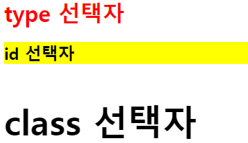

# day 7

## 파이썬 에러 종류

모든 에러를 담을 수는 없지만 자주 발생하는 에러를 담아보았다.

+ ValueError

  1. 부적절한 값을 인자로 받았을 때 : 예를 들어 `int()` 함수로 형 변환을 하려 하는데 `str` 형태의 데이터를 사용하면 에러가 발생함.

     ```python
     num = int('str') # 숫자를 받아야하는데 문자형을 받아 ValueError 발생.
     ```

  2. 참조값이 없다고 할 때.

     ```python
     arr = ['a','b','c']
     arr.index('z') # z라는 인자가 없어서 error 발생
     ```

+ SyntaxError : 문법에 오류가 발생했을 때, 오타가 났을때.

+ NameError : 변수를 찾을 수 없을 때.

  ```python
  a = 1
  b = 2
  print(c)  # c라는 변수를 저장한 적이 없어 NameError 발생
  ```

+ ZeroDivisionError : 0으로 숫자를 나눌 때 발생

+ FileNotFoundError : 특정 파일에 접근하려 할 때 그 파일이 존재하지 않을 때. 경로가 잘못되었을 수도 있다.

+ TypeError : 타입을 잘못 전달했을 때

  ```python
  a = 1 + 'str'  # 연산이 될 수 없는 숫자 + 문자일 경우
  ```

+ AttributeError : 참조나 대입이 제대로 되지 않았을 경우. 클래스 모듈에 들어있는 함수를 잘못 호출했을때 발생

+ KeyError : 존재하지 않는 키 값에 접근

+ OverFlowError : 연산의 결과가 너무 커서 출력이 불가능할 경우. `int` 형에서는 발생하지 않고 `float` 형에서 발생

이외에도 다양한 에러가 존재한다. 에러는 검색해서 찾는게 제일 좋다.


## Folium 라이브러리

folium 라이브러리는 conda prompt를 통해 설치해야한다. 명령어는 다음과 같다

`conda install -c conda-forge folium`

+ 지도 만들기

  `folium.Map()` 함수를 통해 지도를 생성할 수 있다.

  `location` 옵션에 위도와 경도를 지정하여 원하는 위치의 지도를 출력할 수 있다.

  `zoom_start` 옵션은 지도의 크기를 설정해주는 옵션이다.

  ```python
  import folium
  seoul_map = folium.Map(location=[37.55,126.98],zoom_start=12)
  seoul_map.save('./seoul.html')  # 지도를 .html 파일로 생성
  seoul_map	# 지도를 편집기 상에 출력
  ```

+ 지도 스타일 적용

  `tiles = ` 옵션을 이용해 지도의 스타일을 변경할 수 있다.

  ```python
  # 지도 스타일 적용
  seoul_map2 = folium.Map(location=[37.55,126.98], tiles = 'Stamen Terrain', zoom_start=12)
  seoul_map3 = folium.Map(location=[37.55,126.98], tiles = 'Stamen Toner', zoom_start=15)
  seoul_map2.save('./seoul2.html')
  seoul_map3.save('./seoul3.html')
  ```

+ 서울의 대학교 위치를 마커로 표시

  `foilum.Marker()` 함수를 이용해 마커를 생성할 수 있다. `for` 문을 통해 `df` 에 담겨있는 정보를 순차적으로 불러온다.

  `[lat,lng]` 는 리스트로 마커의 위치, 즉 위도와 경도 정보를 받아온다.

  `popup` 옵션은 마커를 클릭했을때 작은 창으로 위치에 대한 정보를 표시해주는 옵션이다. `popup = name` 이면 그 설명창에 `name`이 들어간다. `name`은 `df.학교` 인데 이 정보는 데이터 안에 학교 이름에 대한 정보를 담고있다.

  `foilum.Marker().add_to(seoul_map)` 구문을 통해 생성한 마커를 `seuol_map`에 추가할 수 있다.

  `zip()` 함수는 같은 길이의 리스트를 같은 인덱스끼리 잘라서 리스트로 반환해주는 함수이다. 쉽게말해, `df`라는 데이터프레임의 각각의 행은 리스트 형태인데, `name` 에는 `df.학교`를, `lat` 에는 `df.위도` 를, `lng` 에는 `df.경도`를 넣어주게된다.

  ```python
  import pandas as pd
  import folium
  
  # 대학교 리스트를 데이터프레임으로 변환.
  df = pd.read_excel('파일경로/파일이름')
  
  # 서울 지도 만들기
  seoul_map = folium.Map(location=[37.55,126.98], tiles = 'Stamen Terrain', zoom_start=12)
  
  # 대학교 위치 정보를 Marker로 표시
  for name, lat, lng in zip(df.학교, df.위도, df.경도):
      folium.Marker([lat,lng],popup = name).add_to(seoul_map)
  
  seoul_map
  ```

+ 마커를 원형마커로 표시

  `folium.CircleMarker()` 함수를 통해 원형 마커를 그릴 수 있다.
  
  `radius` 옵션으로 원형 마커의 크기를 설정할 수 있다.
  
  `color` `fill` `fill_color` `fill_opacity` 옵션으로 마커의 라인색, 채움색, 투명도 등등을 결정할 수 있다.
  
  ```python
  import pandas as pd
  import folium
  
  # 대학교 리스트를 데이터프레임으로 변환.
  df = pd.read_excel('파일경로/파일이름')
  
  # 서울 지도 만들기
  seoul_map = folium.Map(location=[37.55,126.98], tiles = 'Stamen Terrain', zoom_start=12)
  
  for name, lat, lng in zip(df.학교, df.위도, df.경도):
      folium.CircleMarker([lat,lng],radius=10 ,color = 'brown',fill = True, fill_color = 'coral',fill_opacity = 1, popup=name).add_to(seoul_map)
  
  seoul_map
  ```
  


## 데이터 수집

### 네트워크

IOT(Internet Of Things) 는 세상의 모든 사물들이 인터넷으로 연결되어있다는 의미이다. 요즘 개발되는 IT의 모든 기술들은 네트워크에 연결되어 있다는 것을 기본으로 한다. 

네트워크는 디바이스들이 통신으로 연결되어있다는 의미이다.

웹은 하나의 사이트가 또다른 사이트와 거미줄처럼 복잡하게 연결되어있다. 하이퍼링크를 통해 웹들이 서로 연결되어있다. 웹은 네트워크로 연결되어있다.

+ 클라이언트와 서버

  서비스를 제공하는 쪽을 서버, 서비스를 받는 쪽을 클라이언트라고 한다. 보통은 웹 브라우저가 클라이언트의 역할을 한다. 페이스북, 카카오톡과 같은 어플도 클라이언트의 역할을 한다. cmd 창에서 사용하는 명령어들도 클라이언트의 한 종류라고 볼 수 있다. 

  서버는 리퀘스트가 오면 정보를 제공하는 주체이다. 서버는 요청에 따른 적당한 기능을 수행한다.

  서버에 어떤 요청을 하고 무언가를 받아오는 것이 클라이언트라고 할 수 있다. 클라이언트는 컴퓨터, 태블릿, 핸드폰과 같은 디바이스를 통해서 설치된다. 

  서버와 클라이언트의 관계는 데이터를 주고 받는 관계이다.

+ http

  데이터를 전송하고 받는 규약을 http(hyper text transfer protocol)라고한다. https는 보안이 강화된 전송 규약이다.

### HTML

html의 태그는 열린태그와 닫힌태그, 속성, 속성값으로 구분된다

#### html 기본 태그

`<html>` 은 html의 시작과 끝을 의미한다. `</html>`로 끝을 표현한다. 어떤 태그를 사용하던지 `</tag>` 와 같이 `/` 를 이용해 닫아줘야한다.

```html
<html>
    
</html>
```

`<head>` 는 머리부분이다.`<title>` 로 감싸게 되면 창의 머리부분이 바뀌게된다.

```html
<html>
    <head>
        <title>빅데이터 분석가 과정.</title>
    </head>
</html>
```


`<body>` 는 본문을 의미한다.

```html
<html>
    <head>
        <title>빅데이터 분석가 과정.</title>
    </head>
    <body>
        
    </body>
</html>
```

`<a href = "링크">` 를 사용하면 링크 삽입이 가능하다. `<a>` 는 앵커를 의미한다. `href` 는 하이퍼텍스트 레퍼런스의 약자이다. `title` 속성을 사용하면 링크에 마우스를 올려두었을때 정보를 미리 보여주는 역할을 한다. `target="_blank"` 은 새 창을 통해 링크로 이동하는 속성이다. 만약 새창으로 띄우길 원하지 않으면 생략하거나 `_blank` 를 `_self` 로 변경하면된다.

```html
<html>  
    <head>
        <title>빅데이터 분석가 과정.</title>
    </head>

    <body>
        링크로 이동
        <br>
        <a href="https://www.naver.com" target="_blank" title="네이버로 이동">네이버</a>
        <br>
        <a href='https://daum.net' target="_blank" title="다음으로 이동">다음</a>
        <br>
        <a href='https://google.com' target="_blank" title="구글로 이동">구글</a>
    </body>

</html>
```

위 코드는 링크를 클릭하면 각각 네이버, 다음, 구글로 이동하는 하이퍼링크를 삽입하는 코드이다.


실제 `html` 파일을 실행해보면 다음과같은 창이 나온다. 링크를 클릭하면 설정된 페이지로 이동하게된다.

`` 태그는 열린 태그만 존재한다. `</img>` 는 존재하지 않는 태그다. `src` 속성으로 상대경로를 이용해 이미지를 불러온다. `alt` 는 alternative text의 약자로이미지가 제대로 뜨지 않았을 경우 대체해서 나타나게 하는 텍스트이다.

```html

```

`<h1>` ~ `<h6>` 태그는 제목과 같이 강조를 해야하는 텍스트에 크기를 변경해주는 태그이다. `<h1>` 태그는 보통 한 문서에 하나만 사용한다.

```html
<h1>h1 text</h1><br>
<h2>h2 text</h2><br>
<h3>h3 text</h3><br>
<h4>h4 text</h4><br>
<h5>h5 text</h5><br>
<h6>h6 text</h6><br>
```


`<p> </p>` 태그는 단락을 의미하는 태그이다. `<p> </p>` 태그 안에는 `<span> </span>` 태그를 사용할 수 있다. `color` 속성을 이용해 색을 바꿀 수 있다. `<mark></mark>` 태그를 사용하면 강조하는 듯이 형광펜처럼 태그 안의 문자를 칠할 수 있다.

```html
<p>
	nice to meet you, <span style="color : red;">Mr.Anderson</span><br>
    <mark>사과</mark>는 사과나무의 열매로 세계적으로 널리 재배되는 과일 품종 중 하나이다.
</p>
```


`<ol></ol>` 태그는 ordered list란 뜻으로 `<li></li>` 로 순서가 있는 리스트를 만들 수 있다.

`<ul></ul>` 태그는 unordered list란 뜻으로 `<li></li>` 로 순서가 없는 리스트를 만들 수 있다.

```html
<ol>
    <li>순서가 있는 리스트(1)</li>
    <li>순서가 있는 리스트(2)</li>
    <li>순서가 있는 리스트(3)</li> 
</ol>
<ul>
    <li>순서가 없는 리스트(1)</li>
    <li>순서가 없는 리스트(2)</li>
    <li>순서가 없는 리스트(3)</li>
</ul>
```


#### 닫힌 태그가 없는 태그

`<input>` 태그를 이용해 정보를 입력받을 수 있다. `type` 속성으로 정보를 입력받을 수단을 선택할 수 있다.

```html
<input type="text" value="이름">
<input type="submit" value="제출">
<p>당신의 취미는 무엇입니까?</p>
<input type="checkbox">미식축구
<input type="checkbox">스타크래프트2
<input type="checkbox">메이플스토리
```


`<br>` 은 줄바꿈이다.

https://www.w3schools.com/html/html_form_input_types.asp

위 링크를 들어가면 다양한 태그를 볼 수 있다.

#### html과 레이아웃

웹 사이트 공간을 정의하는 방법으로 `<header></header>` `<section></section>` `<main></main>`  `<footer></footer>` 등을 사용한다.

```html
<html>  
    <head>
        <title>빅데이터 분석가 과정.</title>
        <meta charset="UTF-8">
        <meta name="description" content="Web Tutorial">
        <meta name="Keywords" content="HTML, CSS">
        <meta name="authot" content="LSH">
    </head>

    <body>
        <header>
            <h1>
                
            </h1>
            <nav>
                <ul>
                    <li>순서가 없는 리스트(1)</li>
                    <li>순서가 없는 리스트(2)</li>
                    <li>순서가 없는 리스트(3)</li>
                </ul>
            </nav>
        </header>
        <section>
            <h2>SERVICE</h2>
            <aside>
                <p>내용내용</p>
            </aside>
            <article>
                <h3>E-C</h3>
            </article>
            <aside>
                <p>내용내용</p>
            </aside>
        </section>
        <footer>
            bye
        </footer>
    </body>

</html>
```

+ 레이아웃 오픈소스

  레이아웃은 디자인의 영역이다. 오픈소스를 활용해서 사이트를 디자인하는것이 좋다.

#### CSS

html 문서에 입력된 정보나 공간에 css효과를 적용하는데는 3가지 방법이 있다.

1. 인라인 방식

   html 태그 안에 style 속성을 추가하여 적용하는 방식. 태그 안에 꾸미는 방법이다.

   ```html
   <h1 style="background-color: yellow;">Hello</h1>
   ```

2. 인터널 방식

   `<h1>` 의 색을 `red` 로 지정하는 `<style>` 태그를 만들 수 있다.

   다음 코드는 빨간 글씨의 노란 배경색을 만드는 코드이다. 

   ```html
   <html>  
       <head>
           <title>빅데이터 분석가 과정.</title>
           <meta charset="UTF-8">
           <meta name="description" content="Web Tutorial">
           <meta name="Keywords" content="HTML, CSS">
           <meta name="authot" content="LSH">
           <style>
               h1{
                   color: red;
               }
           </style>
       </head>
   
       <body>
           <h1 style="background-color: yellow;">Hello</h1>
       </body>
   
   </html>
   ```

   

3. 익스터널 방식

   `style.css` 파일을 만든다. 외부에서 `css` 파일을 불러와서 사용하는 방식이다.

   `<link rel = "stylesheet" href="css/stlye.css">` 구문을 삽입하여 외부 파일을 연동한다.

   `css` 파일에 다음 코드를 작성한다.

   ```css
   h1{
       color : red;
   }
   
   #bg{
       background-color: yellow;
   }
   
   .size{
       font-size: 50px;
   }
   ```

   `h1` 은 타입 선택자이다.  `<h1></h1>` 태그를 사용할 때 `red` 색을 적용한다는 의미이다.

   `#bg` 는 id 선택자이다. 속성으로 `id = "bg"` 를 쓸 때 적용하는 구문이다.

   `.size` 는 class 선택자이다. 속성으로 `class = "size"` 를 쓸 때 적용한다.

   ```html
   <html>
       <head>
           <title>웹프로그래밍 기초</title>
   
           <link rel="stylesheet" href="style.css">
       </head>
       <body>
           <h1>type 선택자</h1>
           <h2 id="bg">id 선택자</h2>
           <h3 class="size">class 선택자</h3>
       </body>
   </html>
   ```

   

   `class` 선택자는 `id` 선택자와 다르게 여러개를 동시에 사용할 수 있다.

   ```css
   .size{
       font-size : 50px;
   }
   .color{
       color : blue;
   }
   ```

   다음과 같이 2개의 `class`를 지정하고 `<h3 class="size color"> ` 구문을 실행하면 다음과 앞서 선언한 `size` `color` 두 개의 `class`가 모두 사용된다.

   

   

