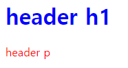
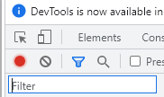
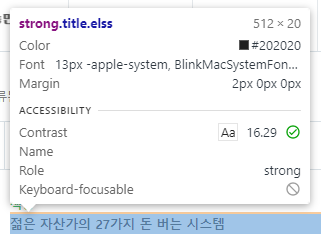
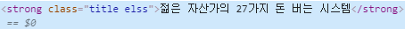
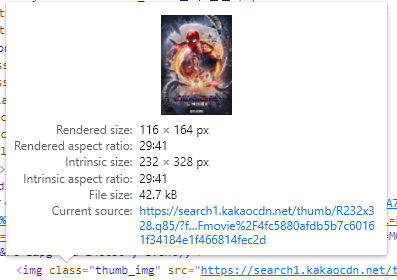

# day 8

## HTML

### CSS

#### CSS 속성

+ 부모 자식간의 css 상속

  `css`는 다음과 같다.

  ```css
  header{
      color : red;
  }
  h1<{
      color : blue;
  }
  ```

  다음과 같은 코드에 `css` 가 어떻게 반영되는지 살펴보면

  ```html
  <header>
  	<h1>header h1</h1>
      <p>header p</p>
  </header>
  ```

  

  다음과 같은 결과가 나온다. "header h1" 이라는 문구에는 `header` 와 `h1` 태그가 동시에 붙어있다. 하지만 그 중에서 `h1` 태그의 `css` 만이 상속되었다.

  부모 <`header`> 에게만 `color` 를 적용하면 빨간색으로 출력되지만, 부모와 자식<`h1`>에게 `color` 를 적용하면 자식은 자식의 태그로 반영된다.

  `header h1` <- `color :red`  `color :blue` 가 같이 적용되지만 최종적으로는 `color :red` 만 적용

  `header p` <- `color :red` 적용.

+ width 와 height 속성

  ```css
  .place{
  width : 500px;
  height : 500px;
  background-color: yellow;
  }
  ```

  `width` 와 `height` 속성을 이용해 공간을 지정해준다.

+ font 속성

  글씨를 다양하게 꾸며주는 폰트를 설정하는 속성이다

  ```css
  .font{
  font-size :50px;
  font-family: Arial,Times,sans-seriff;
  font-style: italic;
  font-weight: bold;
  }
  ```

+ background 속성

  ```css
  .background{
      width : 500px;
      height : 500px;    
      background-color: yellow;
      background-image: url("mountain.png");
      background-repeat: no-repeat;
      background-position: left;
  }
  ```


## 웹 크롤링

### 크롤링 사전 지식

다음은 크롤링에 필요한 사전지식들이다.

+ 스크래핑 : 다운로드한 웹페이지에서 필요한 정보를 추출하는 작업

+ 크롤링 : 웹 페이지의 하이퍼링크를 순회하념서 웹 페이지를 다운로드 하는 작업

+ 크롤러 : 크롤링을 하는 소프트웨어

+ HTML tag

+ 크롬 개발자 도구

  `f12` 를 누르면 개발자 도구를 볼 수 있다.

  + Elements Tab : css selector, xpath

    홈페이지를 구성하는 `html` 태그를 볼 수 있다.

    

    개발자 도구 왼쪽 위에 화살표를 클릭하면 홈페이지 요소를 클릭하면서 해당하는 `tag`를 볼 수 있다.

    이때, 개발자 도구 상에서 `tag`를 수정할 수 있는데, 이는 나의 클라이언트에서만 수정된 것으로, 서버에서 다시 정보를 받아오면 수정한 사항은 원래대로 돌아가게된다.

  + Network Tab

    각각의 요소들이 네트워크와 연결되어있는걸 볼 수 있다.

#### 크롤링 주소 받기

크롤링을 하기 위해서는 주소를 받아와야 한다.

1. 개발자 도구 왼쪽 위 화살표를 클릭한다.

   

2. 다음과 같이 내가 크롤링을 하길 원하는 링크를 선택한다.

   

3. 개발자 도구 상에 링크에 관련된 주소가 나온다.

   

4. 해당 주소를 마우스 우클릭하여 `copy` 를 선택, 주소를 가져온다.

   이때 주소는 3가지 방법으로 가져와 사용한다. `copy` 를 누른 후 다음 3개중 하나를 선택한다.

   1. full xpath
   2. xpath
   3. selector

#### 크롤링 예시

+ 구글 크롤링 봇
+ 쇼핑몰
+ OPEN API

#### 주의사항

+ 대상 웹 페이지 조건 확인 : /robots.txt

  ex) 다양한 형태로 조건이 나타나게된다.

  User-agent : *  -> 모든 유저 (규칙이 적용되는 로봇의 이름)

  Disallow : /  -> 허락하지 않겠다.  ///  Allow : /s  -> 허락하겠다.

+ 크롤러 상태 유무 : 상태유무, javaScript 유무
+ Request 요청 시 서버 부하 고려
+ 콘텐츠 저작권
+ 페이지 구조 변경 가능성 고려


### 스크래핑 입문

anaconda prompt에서 `pip install request` 명령어를 사용하여 설치한다.

#### requests

+ 연결 확인

  `res.status_code` 는 `requests` 한 주소를 연결했을때 나오는 코드이다. `requests.codes.ok` 는 정상적으로 연결되었을 경우의 코드가 저장되어있다. 

  ```python
  import requests
  
  res = requests.get("https://www.naver.com")
  
  if res.status_code == requests.codes.ok:
      print("정상")
  else :
      print("오류 : ", res.status_code)
  ```

+ 스크래핑 문서 출력

  `raise_for_status()` 함수는 프로세스 진행중에 에러가 발생했을 때 `HTTPError Object` 를 반환한다.

  `res.text` 는 `requests`한 주소의 소스코드를 의미한다.

  ```python
  import requests
  
  res = requests.get("https://www.naver.com")
  
  res.raise_for_status()
  print("정상입니다.")
  print(len(res.text))
  print(res.text)
  ```

+ stauts code

  4로 시작하는 code는 클라이언트 에러이다. 클라이언트 에러는 내가 직접 수정해야한다.

  5로 시작하는 에러는  서버 에러이다.


### 크롤러 만들기

#### urllib 패키지

+ 첫 페이지 가져오기

  `urlopen(url)` 함수를 통해 `url` 에 저장된 주소를 연결해놓는다. 연결을 해 놓은 상태에서 `read()` 함수를 통해 정보를 가져온다.

  ```python
  from urllib.request import urlopen
  
  url = "https://www.naver.com"
  html = urlopen(url)
  print(html.read())
  ```

+ Error 처리

  웹에서는 에러가 굉장히 자주 발생하기 때문에 에러처리를 해주어야한다.

  다음 코드는 `try` 구문에서 `urlopen()` 함수를 통해 `html` 객체를 주소와 연결시켜준다. `HTTPError` 가 발생할 경우 에러메세지를 출력한다. 만약 `URLError` 가 발생하면 "The server could not be found." 를 출력한다. 아닌경우 성공을 출력한다.

  `URLError` : url이란 `https://~~~.com/` 까지의 주소를 말한다. 해당 주소와 연결이 되지 못한다면 `URLError`가 발생한다.

  `HTTPError` : url까지 연결이 되고 이후 주소의 문서를 찾을 수 없을 경우 `HTTPError`가 발생한다.

  ```python
  from urllib.request import urlopen
  from urllib.request import URLError
  from urllib.request import HTTPError
  
  try :
      html = urlopen("https://www.dddsdf.com/kim.html")
  except HTTPError as e:
      print(e)
  except URLError as e:
      print("The server could not be found.")
  else :
      print("성공")
  ```

#### beautifulsoap 패키지

파싱 : 필요한 정보만 추출하는 것. bs4 패키지는 파싱을 해주는 패키지이다.

`bs4.BeautifulSoup()` 함수는 `html` 문서를 오브젝트화 시켜주는 문서이다. `find()` 함수를 사용해 원하는 태그를 파싱할 수 있다. `findAll()` 함수를 사용하여 해당 태그를 사용하는 모든 라인을 리스트로 받아올 수 있다.\

+ 파싱

  `parser객체.text` 를 사용하면 태그를 뺀 내용만을 가져올 수 있다.

  `html.paeser` 파싱을 도와주는 라이브러리다.

  ```python
  import bs4
  
  html_str = '''
  <html>
      <body>
          <ul>
              <li>hello</li>
              <li>bye</li>
              <li>welcome</li>
          </ul>
      </body>
  </html>
  '''
  bs_obj = bs4.BeautifulSoup(html_str,"html.parser")
  ul = bs_obj.find("ul")
  li = ul.find('li')
  lis = ul.findAll("li")
  print(li.text)
  print(lis[1].text)
  ```

+ class속성을 이용해 데이터 뽑기

  `find()` 함수는 해당 태그의 첫 줄만을 긁어오기 때문에 원하는 정보만을 가져오지 못할수도있다. 이럴 때, `html` 의 속성이 `class` 를 이용해서 분류되어있으면, `find()` 함수에 `{"class":"해당하는 클래스 이름"}` 옵션을 사용해서 원하는 `class`의 정보만을 가져올 수 있다.

  ```python
  import bs4
  
  html_str = """
  <html>
      <body>
          <ul class = "greet">
              <li>hello</li>
              <li>bye</li>
              <li>welcome</li>
          <ul class = "reply">
              <li>ok</li>
              <li>no</li>
              <li>sure</li>
          </ul>
      </body>
  </html>
  """
  bs_obj = bs4.BeautifulSoup(html_str,"html.parser")
  ul = bs_obj.find("ul", {"class" : "reply"})
  print(ul)
  ```

+ 속성값 뽑아내기

  `url` 정보같은 경우 속성으로 들어가지만 굉장히 중요한 내용이라고 볼 수 있다. 따라서 속성값을 따로 불러와야 할 때도 있다.

  `find()` 함수를 사용해 특정 태그의 정보를 파싱한 다음, `파싱객체.["속성값"]` 을 이용하여 특정 속성값을 불러올 수 있다.

  ```python
  import bs4
  
  html_str = """
  <html>
      <body>
          <ul class = "ko">
              <li>
                  <a href="https://www.naver.com">naver</a>
              </li>
              <li>
                  <a href="https://www.google.com">google</a>
              </li>
          </ul>
          <ul class = "sns">
              <li>
                  <a href="https://facebook.com">facebook</a>
              </li>
          </ul>
      </body>
  </html>
  """
  bs_obj = bs4.BeautifulSoup(html_str,"html.parser")
  atag = bs_obj.find("a")
  print(atag["href"])
  ```

#### 이미지 가져오기 실습

우선 `requests` 패키지와 `bs4` 패키지를 불러온다.

```python
import requests
import bs4
```

daum에서 영화를 검색해 역대 관객순위 상위 5개의 작품을 불러와보고자 한다. 2021년 탭을 눌러 2021년 가장 많이본 영화를 열어본다. 그 `url`을 가져와서 저장한 후 `requests.get()` 함수를 이용해 정보를 불러온다

```python
url = 'https://search.daum.net/search?w=tot&q=2021%EB%85%84%EC%98%81%ED%99%94%EC%88%9C%EC%9C%84&DA=MOR&rtmaxcoll=MOR'
res = requests.get(url)
res.raise_for_status()
```

홈페이지의 개발자 도구를 사용해 다운받을 이미지의 태그를 확인해본다. 속성값을 확인해보니 `img` 태그가 `thumb_img` 라는 속성값을 가지고 있다.



`bs4` 패키지를 이용해 파싱한다. `find_all("a", {"class" : "thumb_img"})` 코드를 사용하여 `thumb_img` 라는 속성값을 가지고 있는 모든 정보를 가져오고 `imgs` 객체에 정보를 저장한다.

```python
bs_obj = bs4.BeautifulSoup(res.text,"html.parser")
imgs = bs_obj.find_all("a", {"class" : "thumb_img"})
```

`imgs` 는 리스트형태로 데이터가 들어오는데, `eunmerate()` 함수를 사용하여 인덱스와 값을 분리하고, `for` 문을 돌려준다.

`imgs` 리스트에 첫 번째 `url` 을 `img_url = imgs["src"]` 로 저장해준다. 그 후 저장된 `url` 이 `//` 로 시작할 경우 앞부분에 `https:` 를 붙여줘서 http를 사용할 수 있도록 만들어준다.

```python
for idx, imgs in enumerate(imgs):
    img_url = imgs["src"]
    if img_url.startswith("//"):
        img_url = "https:" + img_url
```

그 후, 다시한번 `request.get()` 을 사용하여 정보를 불러온다.

```python
    img_res = requests.get(img_url)
    img_res.raise_for_status()
```

`open()` 함수를 이용해 파일을 생성한다. `"wb" ` 옵션은 파일이 없으면 생성하는 옵션이고, 바이너리 파일이기 b를 붙인다.

`.content` 를 사용하여 이미지를 가져온다.

```python
    with open("movie{}.jpg".format(idx+1),"wb") as f:
        f.write(img_res.content) 
```

전체 코드를 보면 다음과 같다.

```python
import requests
import bs4

url = 'https://search.daum.net/search?w=tot&q=2021%EB%85%84%EC%98%81%ED%99%94%EC%88%9C%EC%9C%84&DA=MOR&rtmaxcoll=MOR'
res = requests.get(url)
res.raise_for_status()

# 파싱, "thumb_img"의 속성값을 가져옴
bs_obj = bs4.BeautifulSoup(res.text,"html.parser")
imgs = bs_obj.find_all("img", {"class" : "thumb_img"})

# 이미지 가지고오기.
for idx, imgs in enumerate(imgs):
    img_url = imgs["src"]
    if img_url.startswith("//"):
        img_url = "https:" + img_url
    
    img_res = requests.get(img_url)
    img_res.raise_for_status()

    with open("movie{}.jpg".format(idx+1),"wb") as f:
        f.write(img_res.content)
        
# 5개의 이미지만을 가져오고 싶으므로 idx가 4보다 커지면 break
    if idx >=4:
        break
```

이를 응용하여 5년치 이미지, 총 25장의 이미지를 받아올 수 있다.

`for` 문을 이용하여 연도별 정보를 바꿔주면서 `url` 을 변경해준다.

```python
for i in range(5):
    year = 2021 - i 
    url = 'https://search.daum.net/search?w=tot&q={}%EB%85%84%EC%98%81%ED%99%94%EC%88%9C%EC%9C%84&DA=MOR&rtmaxcoll=MOR'.format(year)
    res = requests.get(url)
    res.raise_for_status()

    bs_obj = bs4.BeautifulSoup(res.text,"html.parser")
    imgs = bs_obj.find_all("img", {"class" : "thumb_img"})

    for idx, imgs in enumerate(imgs):
        img_url = imgs["src"]
        if img_url.startswith("//"):
            img_url = "https:" + img_url
    
        img_res = requests.get(img_url)
        img_res.raise_for_status()

        with open("C:/sh/study/Study Everyday/Python study/4. 데이터 수집/이미지크롤링실습 이미지폴더/movie{} {}.jpg".format(year,idx+1),"wb") as f:
            f.write(img_res.content)

        if idx >=4:
            break 
```


