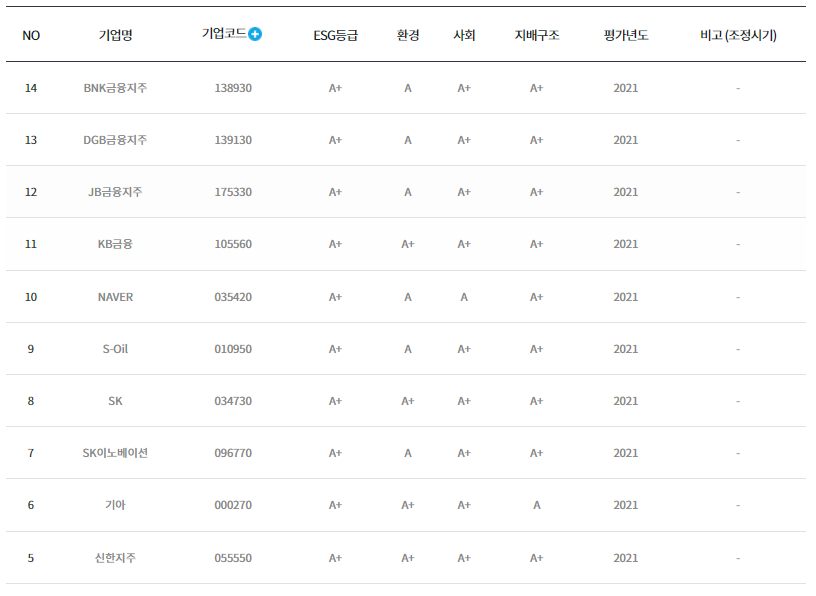

# day 9

## 웹 크롤링

### 크롤러 만들기

#### 지능형 리스트 만들기

지능형 리스트는 길이가 n인 리스트를 반복문을 사용해서 만드는 것이다.

```python
a = [ 0 for i in range(10)]
```

위 코드를 실행하면 길이가 10이고 각 원소의 개수가 0인 리스트를 만들 수 있다.

이를 응용하여 2차원 리스트를 만들 수 있다.

```python
a = [[] for i in range(10)]
```

이 코드는 10개의 빈 리스트를 만드는 코드이다. `[]` 또한 0과 같기 때문에 리스트 `a` 의 길이는 10이된다.

`a` 에 데이터를 추가하고싶으면 `a[0].append(n)` 과같이 이중 리스트에 값을 추가할 수 있다.

지능형 리스트를 사용하여 테이블 데이터를 가져와보도록 하겠다.

#### 테이블 데이터 가져오기 실습

 [한국 기업 지배 구조원 ESG 평가](http://www.cgs.or.kr/business/esg_tab04.jsp?pg=1&pp=10&skey=&svalue=&sfyear=2020&styear=2020&sgtype=TOTAL&sgrade=A%EF%BC%8B#ui_contents) 링크에 들어가보면 등급 조회를 할 수 있다.



다음과 같은 테이블을 데이터로서 긁어오도록 해보자.\

개발자 도구를 사용하여 `html` 구조를 확인해보자.


테이블 아래에 `<thead>` 와 `<tbody>` 로 나누어져 있다. `<thead>` 는 NO, 기업명과 같은 열 이름이고 `<tbody>` 는 그에 따른 데이터다.

원하는 데이터는 `<tbody>` 에 있기 때문에 해당 데이터를 불러와보겠다.

우선 필요한 패키지를 불러온다.

다음 `url` 정보를 저장하고 `requests.get(url)` 함수를 사용해서 정보를 불러온다. `bs4.BeautifulSoup()` 함수를 이용해 파싱한다.

```python
import requests
import bs4

url = 'http://www.cgs.or.kr/business/esg_tab04.jsp?pg=1&pp=10&skey=&svalue=&sfyear=2020&styear=2020&sgtype=TOTAL&sgrade=A%EF%BC%8B#ui_contents'

res = requests.get(url)
res.raise_for_status()

bs_obj = bs4.BeautifulSoup(res.text,"html.parser")
```

오브젝트에 저장된 부분중 원하는 부분인 `<tbody>` 를 `find()` 함수를 이용해 찾아준다.

원하는 데이터는 `<tbody>` 안에 `<tr>` 태그 안에 존재하기 때문에 `findAll()` 함수를 이용해 모든 `<tr>` 태그를 찾아온다.

```python
tbody = bs_obj.find("tbody")
tr = tbody.findAll("tr")
```

`<tr>` 태그로 감싸져있는 부분은 테이블의 행과 같은 역할을 한다. `tr` 객체에는 총 10개의 `<tr>` 태그가 리스트 형태로 저장된다. 즉, 지금 우리가 불러온 데이터는 1차원 리스트에 저장되어있는 2차원리스트나 마찬가지다. 이제 1차원 리스트, `tr` 에 저장되어 있는 각 원소들을 리스트로 만들어 2차원 리스트를 만들어야한다.

그러기 위해서 우선 빈 2차원 리스트를 만들어야한다. 이때, 2차원 리스트의 길이는 `tr` 과 같은 길이여야한다. 지능형 리스트를 사용하여 `tr` 과 같은 길이의 빈 이차원 리스트를 생성한다.

```python
data = [[] for i in range(len(tr))]
```

이제 `tr` 의 각각의 원소에 저장되어 있는 데이터를 풀어서 리스트 형태로 받아야한다. 이중 반복문을 사용한다. 첫 번째 반복은 `tr` 의 각 원소를 불러온다. 그 다음 `findAll()` 함수를 사용해 `<tr>` 태그 안에 `<td>` 태그를 모두 찾아온다.


반복문 안에서는 `tr[i]` 에 대해서만 정보를 처리하기 때문에 해당 정보만을 불러온다.

이렇게 불러온 `td` 또한 리스트 형태로 정보를 가져오게된다. 따라서 각각의 원소를 `data` 리스트에 저장하기 위해서는 다시 한번 반복문을 사용하여 각각의 원소를 가져온다. 이때, 태그를 제외한 정보만을 가져오기 원하므로 `td[s].text` 함수를 사용해 태그를 제외한 정보만을 가져온다.

`text.strip()` 함수는 공백을 제거하는 함수다.

```python
for i in range(len(tr)):					# tr의 길이만큼 반복
    td = tr[i].findAll("td")				# tr[i] 안에서 모든 <td>태그를 불러와 td 리스트에 저장
    for s in range(len(td)):				# td의 길이만큼 반복
        data[i].append(td[s].text.strip())	# td[s] 의 text 정보만을 data 리스트에 저장. 이때 이중 리스트로 저장
```

전체 코드는 다음과 같다

```python
import requests
import bs4

url = 'http://www.cgs.or.kr/business/esg_tab04.jsp?pg=1&pp=10&skey=&svalue=&sfyear=2020&styear=2020&sgtype=TOTAL&sgrade=A%EF%BC%8B#ui_contents'

res = requests.get(url)
res.raise_for_status()

bs_obj = bs4.BeautifulSoup(res.text,"html.parser")

tbody = bs_obj.find("tbody")
tr = tbody.findAll("tr")

data = [[] for i in range(len(tr))]

for i in range(len(tr)):
    td = tr[i].findAll("td")
    for s in range(len(td)):
        data[i].append(td[s].text.strip())

for i in range(len(data)):
    print(data[i])
```


#### 다양한 크롤링 방법.

+ 처음으로 나오는 태그 받아오기.

  ```python
  soup = bs4.BeautifulSoup(res.text,"html.parser")
  print(soup.a)	# 처음으로 나오는 <a> 태그를 가져옴
  ```

+ 다음 요소 가져오기

  `next_sibling` 함수 사용

  ```python
  r1 = soup.find("li",{"class":"rank01"})
  r2 = r1.next_sibling.next_sibling
  ```

  `find_next_sibling()` 함수 사용

  ```python
  r1 = soup.find("li",{"class":"rank01"})
  r2 = r1.find_next_sibling("li")
  ```

+ 리스트로 목록 가져오기

  `webtoons` 에 `title` 을 클래스로 갖는 모든 `<a>` 태그를 저장. `for` 문을 이용해 출력

  ```python
  webtoons = soup.findAll("a",{"class":"title"})
  for webtoon in webtoons:
      print(webtoon.text)
  ```

  
