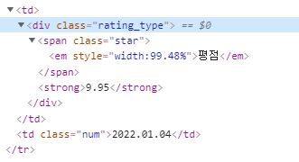

# day 10

## 웹 크롤링

### 크롤러 만들기

#### 네이버 웹툰 별점 가져오기

**[네이버 웹툰 : 스파이더맨](https://comic.naver.com/webtoon/list?titleId=786537)** 사이트의 개발자도구를 보면 별점은 다음과 같은 태그로 감싸져있다



이를 읽어오기 위해서 우선 `rating_type` 을 속성으로 같은 `<div>` 태그를 읽어온다.

```python
import requests
import bs4

url = "https://comic.naver.com/webtoon/list?titleId=786537"
res = requests.get(url)
res.raise_for_status()

soup = bs4.BeautifulSoup(res.text,"html.parser")

rate = soup.findAll("div",{"class":"rating_type"})
```

내가 원하는 정보는 `<strong>` 태그의 내용이다. `<strong>` 태그는 `<div>` 의 자식이기 때문에 `rate.strong.text` 을 이용해서 `<strong>` 의 정보만을 가져올 수 있다. `star` 리스트에 `for` 문을 이용해서 저장한다.

```python
star=[]
for row in rate:
    star.append(row.strong.text)
```


## 사이트 자동화

### Selenium

자바스크립트가 동적으로 만든 데이터를 크롤링하기 위해 사용한다.

1. `pip install selenium` 을 사용해 설치한다.

2. chromedriver 설치. 자신의 크롬과 동일한 버전의 드라이버를 받아야한다.

#### 파이썬으로 chromedriver 사용

```python
from selenium import webdriver

url = "https://www.daum.net"
driver = webdriver.Chrome("크롬드라이버 설치 경로/chromedriver.exe")
```

다음 코드를 사용하면 `url` 에 저장된 주소를 이용해 크롬을 열 수 있다.

개발자 도구를 활용해 검색창을 확인하고 `find_element_by_id("찾고자 하는 속상")` 함수를 사용하여 검색창에 원하는 문구를 입력할 수 있다. `send_keys()` 함수는 입력을 가능하게 해준다. `from selenium.webdriver.common.keys import Keys` 패키지의 `Keys.ENTER` 함수는  Enter키를 입력하는 것과 같은 효과를 발휘한다.

아래 코드는 다음에서 "인기영화" 라는 키워드를 검색하는 코드이다.

```python
from selenium import webdriver
from selenium.webdriver.common.keys import Keys

url = "https://www.daum.net"
driver = webdriver.Chrome("크롬드라이버 설치 경로/chromedriver.exe")

driver.get(url)

element = driver.find_element_by_id("q")
element.send_keys("인기영화")
element.send_keys(Keys.ENTER) # Enter
```

만약 클릭으로 해결하고싶으면 다음과 같이 코드를 작성하면 된다. `xpath` 를 이용해 버튼을 찾는다.`id='daumSearch'` 를 찾아 그 아래에 있는 버튼을 찾으면된다. `button[2]` 는 2번째 `button` 을 의미한다. 

```python
element = driver.find_element_by_xpath("//*[@id='daumSearch']/fieldset/div/div/button[2]")
element.click()
```

#### 자동 로그인하기

위를 응용하여 자동으로 로그인하는 코드를 작성할 수 있다. 개발자 도구를 사용하여 로그인 화면의 `input` 을 찾아 `id` 를 사용하면된다.

사이트의 보안때문에 자동로그인은 되지 않는다.

```python
from selenium import webdriver

url = 'https://www.naver.com'
driver = webdriver.Chrome("크롬드라이버 설치 경로/chromedriver.exe")

try:
    driver.get(url)
    # 로그인 버튼 클릭
    element = driver.find_element_by_class_name("link_login")
    element.click()
    # 로그인 하기
    driver.find_element_by_id("id").send_keys("아이디")
    driver.find_element_by_id("pw").send_keys("비밀번호")
    driver.find_element_by_id("log.login").click()
except Exception as e:
    print(e)
```

이를 우회하려면 다음과 같은 방법을 사용해야한다.

1. `pyperclip` 패키지를 사용해 클립보드에 아이디와 비밀번호를 저장한다.
2. `send_keys` 함수로 `ctrl + v` 해서 넣는다.

코드는 다음과같다.

```python
from selenium import webdriver
from selenium.webdriver.common.keys import Keys
import pyperclip

url = 'https://www.naver.com'
driver = webdriver.Chrome("크롬드라이버 설치 경로/chromedriver.exe")

try:
    driver.get(url)
    element = element = driver.find_element_by_class_name("link_login")
    element.click()

    # 틀린 id,pw 입력
    pyperclip.copy("아이디")
    driver.find_element_by_id("id").send_keys(Keys.CONTROL,"v")
    pyperclip.copy("비밀번호")
    driver.find_element_by_id("pw").send_keys(Keys.CONTROL,"v")
    driver.find_element_by_id("log.login").click()

except Exception as e:
    print(e)
finally:
    print("success")
```


### 네이버 항공권 자동예약 시스템

#### 전체 코드

```python
from selenium import webdriver
import time

url = 'https://flight.naver.com/'
driver = webdriver.Chrome("C:/sh/study/Study Everyday/chromedriver.exe")

try:
    driver.get(url)
    time.sleep(1)
    # 출발지 선택
    driver.find_element_by_xpath('//*[@id="__next"]/div/div[1]/div[4]/div/div/div[2]/div[1]/button[1]').click()
    driver.find_element_by_class_name('autocomplete_input__1vVkF').send_keys("인천")
    time.sleep(2)
    driver.find_element_by_class_name('autocomplete_search_item__2WRSw').click()
    time.sleep(2)
    
    # 도착지 선택
    driver.find_element_by_xpath('//*[@id="__next"]/div/div[1]/div[4]/div/div/div[2]/div[1]/button[2]').click()
    driver.find_element_by_class_name('autocomplete_input__1vVkF').send_keys("파리")
    time.sleep(2)
    driver.find_element_by_class_name('autocomplete_search_item__2WRSw').click()
    time.sleep(2)

    # 가는날 선택
    driver.find_element_by_xpath('//*[@id="__next"]/div/div[1]/div[4]/div/div/div[2]/div[2]/button[1]').click()
    time.sleep(2)
    driver.find_element_by_xpath('//*[@id="__next"]/div/div[1]/div[10]/div[2]/div[1]/div[2]/div/div[2]/table/tbody/tr[5]/td[7]/button').click()
    time.sleep(2)
    
    # 오는날 선택
    driver.find_element_by_xpath('//*[@id="__next"]/div/div[1]/div[10]/div[2]/div[1]/div[2]/div/div[3]/table/tbody/tr[2]/td[5]/button').click()
    time.sleep(2)

    # 항공권 검색
    driver.find_element_by_class_name('searchBox_search__2KFn3').click()
    time.sleep(20)
    

    # 최저가 검색

except Exception as e:
    print(e)

while True:
    pass
```


