# day 11

## 데이터베이스

### MYSQL

#### 환경설정

+ MySQL Workbench를 설치하고 path를 설정해준다. `cmd` 를 관리자모드로 키고 설정한다.

  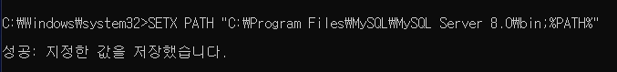

+ 패스 설정 후 재부팅한다.

+ 관리자 모드로 `cmd` 를 키고 원하는 프로젝트 폴더로 이동한다. `cd` 명령어 사용

+ 프로젝트 폴더의 경로에서 `mysql -u root -p` 명령어를 사용해 데이터를 데이터베이스로 푸쉬한다.

  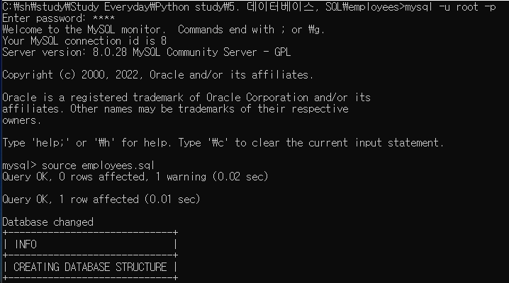

  다음과 같은 화면이 나온다면 성공

+ `source 파일이름` 으로 데이터를 가져온다.

  

### SQL 문법

#### USE

+ show

  + show databases;

    서버에 어떤 데이터베이스가 있는지 보여주는 명령어이다.

  + show table status;

    

+ descrive

  데이터베이스에 어떤 테이블이 있는지 확인하는 명령어이다.

  ```sql
  describe employees;
  ```

+ use

  특정 데이터베이스를 사용하는 방법이다.

  ```sql
  use emplyees;
  ```

#### SELECT

`select ~ from ~~;` 로 사용한다. `from ~~` 에서 특정한 요소를 가져오는것이다. 다음 코드는 `employees` 에서 모든 데이터 (`*`) 를 가져오는 코드이다.

```sql
select * from employees;
```

+ 특정 데이터베이스의 열을 찾을때

  `데이터베이스.열이름` 의 형식을 사용한다.

  ```sql
  select * from employees.titles;
  ```

+ 특정 열을 가져오기

  `*` 은 모든 열을 의미한다. `*` 가 들어가는 부분에 특정 열 이름을 입력하면 해당 열을 가져올 수 있다.

  ```sql
  select first_name, last_name, gender from employees;
  ```

  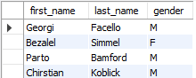

+ AS 별칭

  데이터베이스에 저장되어있는 이름이 아니라 이름을 따로 지정해주는 것이다.

  ```sql
  select first_name as 이름, gender 성별, hire_date '회사 입사일' from employees;
  ```

  3 가지 방법으로 사용할 수 있다.

  1. `열이름 as 별칭`
  2. `열이름 별칭`
  3. `열이름 별칭`

  결과는 다음과 같이 출력된다.

  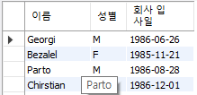

#### 데이터베이스 생성

+ 스키마 생성.

  schemas에 빈 필드를 우클릭하고 Create Schema를 선택한다.

  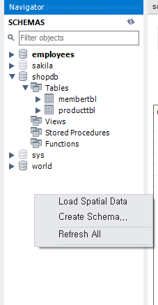

  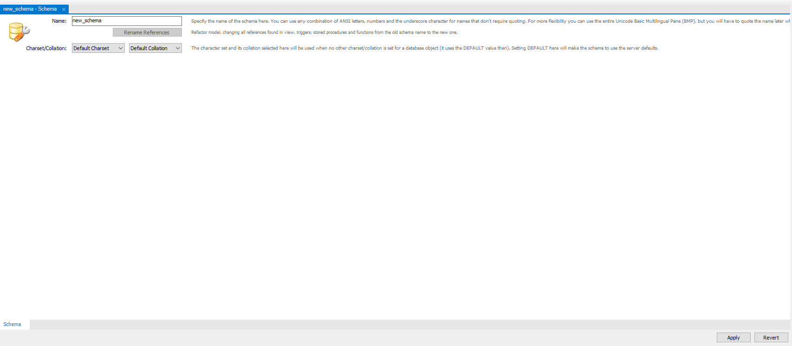

  이름을 설정하고 apply 클릭하면 다음 화면이 나온다

  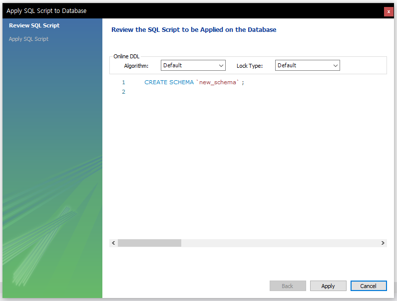

  apply를 누르면 스키마가 생성된다.

+ 테이블 생성

  create table을 눌러서 테이블을 생성한다.

  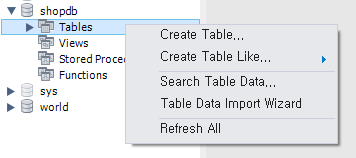

  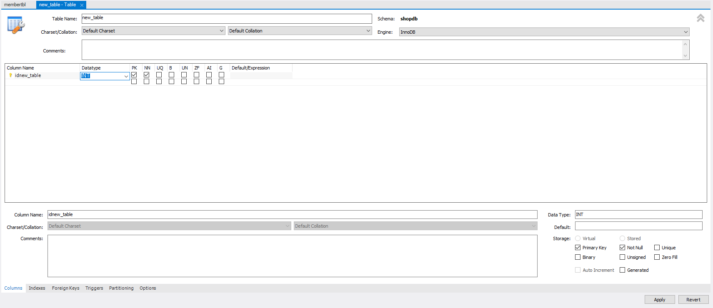

  테이블 이름과 열을 설정한 후 apply 하면 다음과 같은 화면이 나온다.

  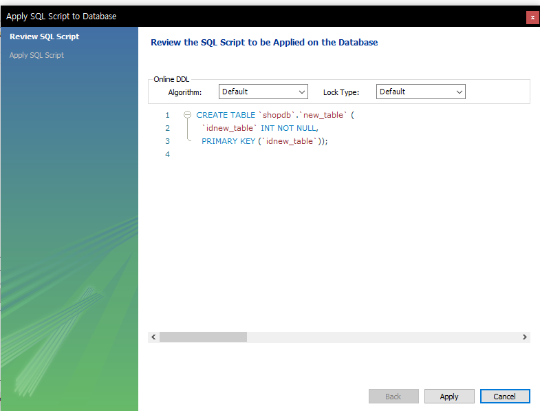

  마찬가지로 apply를 눌러서 테이블을 생성한다.

+ 데이터 입력

  select rows를 클릭

  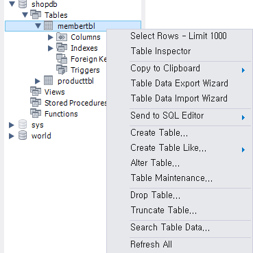

  테이블을 눌렀을 때 나오는 화면에서 데이터를 입력할 테이블의 빈 곳을 더블클릭하고 데이터 입력 후 apply

  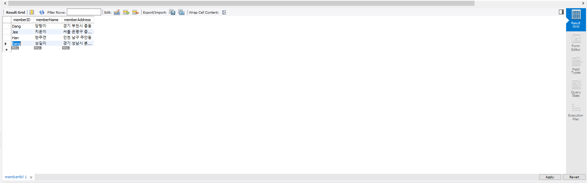