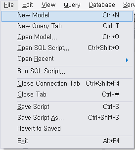
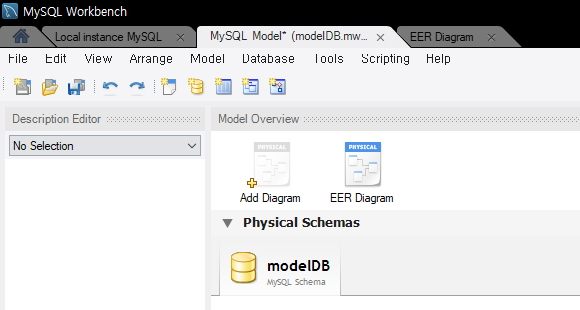
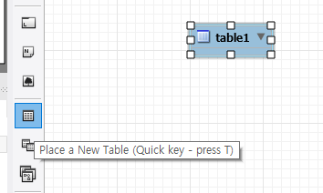
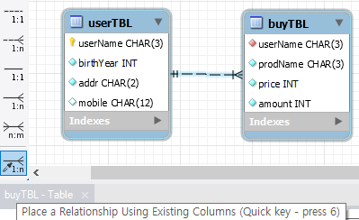

# day 12

## 데이터베이스

### SQL 문

#### DML

Data Manipulation Language의 약자로 데이터 조작 언어를 의미한다.

SELECT, INSERT, UPDATE, DELETE

#### DDL

Data Definition Language의 약자로 데이터 정의 언어를 의미한다.

CREATE, DROP, ALTER

#### DCL

Data Control Language의 약자로 데이터 제어 언어를 말한다. 사용자에게 어떠한 권한을 부여하거나 뺏을 때 사용하는 명령어다.

GRANT, REVOKE, DENY


### 다이어그램 만들기



file -> New Model 을 통해 모델을 생성한다.



Add Diagram 버튼으로 다이어그램을 만든다.

생성한 다이어그램에서 Database -> Forward Engineer 를 선택하면 다이어그램에서 생성하는 요소가 데이터베이스에 반영된다.

#### 테이블 생성



Place a New Table 버튼을 누르고 빈 공간을 클릭하여 테이블을 생성한다.

테이블을 더블클릭하면 테이블 요소를 추가할 수 있다.

+ 소스코드 활용

  `create table 테이블이름` 구문을 이용해 테이블을 선언하고, 그 뒤에 괄호를 사용해 테이블의 column을 설정한다.

  `열이름 데이터형식` 순서로 문법을 사용한다. `not null` 은 필수적으로 입력되어야 하는 값을 의미한다. `primary key` 는 주키로 선언함을 의미한다.

  `auto_increment` 

  `foreign key (이름) references 테이블이름(열이름)` 구문은 FK를 설정하는 구문이다. 테이블 선언시 만들어진 column중에서 하나를 선택해 `foreign key (이름)` 구문을 작성한다. `references` 는 어떤 다른 테이블과 연결되는지 설정하는 구문이다. 

  ```sql 
  CREATE TABLE usertbl (
      userId CHAR(8) NOT NULL PRIMARY KEY,
      name VARCHAR(10) NOT NULL,
      birthday INT NOT NULL,
      addr CHAR(2) NOT NULL,
      mobile1 CHAR(3),
      mobile2 CHAR(8),
      height SMALLINT,
      mDate DATE
  );
  
  CREATE TABLE buytbl (
      num INT AUTO_INCREMENT NOT NULL PRIMARY KEY,
      userID CHAR(8) NOT NULL,
      prodName CHAR(6) NOT NULL,
      groupName CHAR(4),
      price INT NOT NULL,
      amount SMALLINT NOT NULL,
      FOREIGN KEY (userID)
          REFERENCES usertbl (userID)
  );
  ```

+ 관계 설정

  

  1:1, 1:n 관계를 설정할 수 있다. 가장 밑에 버튼을 누르면 FK를 설정할 수 있다.

  FK로 설정하고자 하는 열을 먼저 선택하고 그 다음 PK와 연결한다.

#### 데이터 입력

+ INSERT

  `INSERT INTO 테이블이름 VALUES(~~~)` 형식으로 사용한다.

  `VALUES(~)` 구문에 해당하는 값을 넣으면 된다.

  만약 입력을 원하지 않을경우 `NULL` 로 처리하면 된다.

  `INSERT` 구문으로는 한번에 한 행에 대한 데이터만을 입력가능하기 때문에 한 행씩 사용해야한다.

  ```sql
  INSERT INTO usertbl VALUES('JYP','조용필',1950,'경기','011','44444444',166,'2009-4-4');
  INSERT INTO usertbl VALUES('SSK','성시경',1979,'서울',NULL,NULL,186,'2013-12-12');
  ```

#### 데이터 조회

+ SELECT

  `SELECT ~ FROM ~~~` 의 형식으로 사용하며, ~~~ 에서 ~ 을 조회한다는 의미이다.

  ```SQL
  SELECT * FROM usertbl;
  SELECT * FROM buytbl;
  ```

+ WHERE

  조건문을 사용하여 데이터를 조회할 수 있다. `usertbl` 에서 `name` 이 `'김경호'` 인 사람을 출력하는 구문이다.

  ```sql
  SELECT * FROM usertbl WHERE name = '김경호'
  ```

  관계연산자를 사용해서 출력할 수 있다. `usertbl` 에서 `userID` 와 `Name` 을 출력하는데 `irthday > 1970 AND height > 182` 이 조건을 만족하는 데이터만을 출력하겠다는 구문이다.

  ```sql
  SELECT userID, Name FROM usertbl WHERE birthday > 1970 AND height > 182;
  ```

+ WHERE 뒤에 올 수 있는 구문들.

  + BETWEEN ... AND

    `BETWEEN a AND b` 로 사용하는 구문으로, a 와 b 사이라는 조건을 의미한다.

    ```sql
    SELECT userID, Name FROM usertbl WHERE height BETWEEN 180 AND 183;
    ```

  + IN

    `a IN b` 로 사용하는 구문으로, a라는 항목이 b안에 들어있으면 출력하는 조건이다. 아래 코드는 `('경남','전남','경북')` 안에 `addr` 항목이 있을 경우 해당 `addr` 를 가진 데이터를 뽑아낸다.

    ```sql
    SELECT userID, Name FROM usertbl WHERE addr IN ('경남','전남','경북');
    ```

  + LIKE

    문자열을 검색할 수 있다. `x%` 일 경우 `x` 로 시작하는 문구를 의미한다. 만약 `_` 를 사용한다면 특정 1글자만을 의미한다. `_kk` 는 akk와 같이 한 글자 이후 kk가 오는 문자를 의미한다.

    다음 구문은 `김` 으로 시작하는 이름을 찾는 코드와 앞에 한글자 이후 `종신` 이 오는 글자를 찾는 코드이다.

    ```sql
    SELECT userID, Name FROM usertbl WHERE name LIKE '김%';
    SELECT userID, Name FROM usertbl WHERE name LIKE '_종신';
    ```

    만약 `_종%` 과 같이 사용한다면 맨 첫글자가 존재하고 그 다음 `종` 이오며 뒤에 다른 문자열이 오는 문자를 찾는 것이다.

    예를들어 `윤종신` `김종명` `k종aksjd` 과같은 데이터가 해당 조건을 만족할것이다.

+ 서브쿼리

  쿼리문 안에 쿼리문을 삽입할 수 있다.

  `ANY, ALL` 의 구문을 사용하여 서브쿼리를 불러올 수 있다. `ANY` 는 서브쿼리의 결과중 하나라도 만족시키는 경우를 의미하고, `ALL` 은 서브쿼리의 결과를 모두 만족시키는 경우만을 의미한다.

  ```sql
  SELECT Name, height FROM usertbl
  	WHERE height >= ANY (SELECT height FROM usertbl WHERE addr = '경남')
  SELECT Name, height FROM usertbl
  	WHERE height >= ALL (SELECT height FROM usertbl WHERE addr = '경남')
  ```

+ ORDER BY 

  원하는 순서대로 정렬하여 출력해준다. `DESC` 는 내림차순을 의미한다. 기본값은 오름차순이고 `ASC` 로 표현한다.

  ```SQL
  SELECT Name, mDate FROM usertbl ORDER BY mDate DESC;
  ```

  정렬은 자주 사용하면 성능이 떨어질 수 있기 때문에 꼭 필요한 경우에만 사용해야 한다.

+ DISTINCT

  중복된 것들에 대한 제거를 수행해주는 구문이다.

  ```sql
  SELECT DISTINCT addr FROM usertbl;
  ```

+ LIMIT N

  출력하는 개수를 제한한다. 다음 코드를 사용하면 출력 결과가 5개로 나오게된다.

  ```sql
  SELECT Name, mDate FROM usertbl ORDER BY mDate DESC
  	LIMIT 5;
  ```

+ 