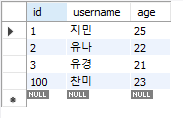
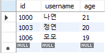
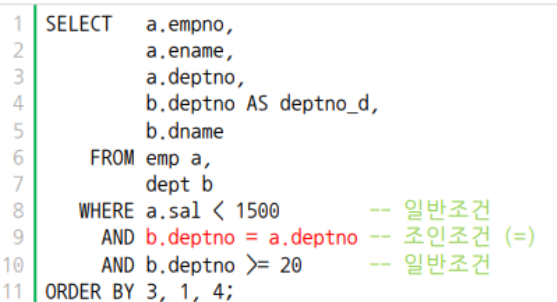
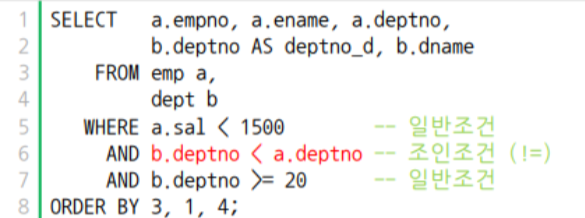

# day 13

## 데이터베이스

### SQL문

#### 서브쿼리

쿼리문 작성 시 조금 더 유연하게 쿼리문을 사용하기 위해 서브쿼리를 사용한다. 서브쿼리는 쿼리 안에 괄호를 사용한다.

`name = 김경호` 인 사람의 키가 177일 경우  다음 두 쿼리는 같은 정보를 반환한다.

```sql
# 일반적인 쿼리 작성
SELECT name, height FROM usertbl
	WHERE height > 177

# 서브쿼리
SELECT name, height FROM usertbl
	WHERE height > (SELECT height FROM usertbl WHERE name = '김경호')
```

#### GROUP BY, HAVING, 집계함수

+ `GROUP BY ~~` 는 어떤 그룹을 기준으로 묶어주는 쿼리다. 예를 들어 `GROUP BY userID` 라 하면 `user ID` 를 기준으로 그룹화한다.

  ```sql
  SELECT userID, avg(amount) as '평균 구매 개수' FROM buytbl GROUP BY userID;
  ```

  위 쿼리는 `amount` 의 평균값을 구하는 쿼리지만, `userID` 에 따라서 그룹화한다.

+ 집계함수

  평균 : `AVG()` 

  최소, 최대값`MIN()` `MAX()` 

  행의 개수, 중복없는 행의 개수 : `COUNT()` `COUNT(DISTINCT)` 

  표준편차, 분산 : `STDEV()` `VAR_SAMP()`

  + 서브쿼리를 이용한 집계함수 활용

    가장 작은키와 큰 키의 회원 출력

    ```sql
    SELECT name, height FROM usertbl
    	WHERE height = (SELECT MAX(height) FROM usertbl)
    		OR height = (SELECT MIN(height) FROM usertbl);
    ```

+ HAVING

  `WHERE` 절에는 집계함수를 사용할 수 없다. 집계함수를 조건으로 사용하고싶다면 `HAVING` 절을 사용해야한다. `HAVING` 은 `GROUP BY` 다음에 와야한다.

  다음 쿼리는 사용자별 총 구매액을 `GROUP BY` 로 묶은 다음 총 구매액이 1000 이상인 행을 출력한다.

  ```sql
  SELECT userID as 사용자 , SUM(price*amount) as 총구매액
  	FROM buytbl
      GROUP BY userID
      HAVING SUM(price*amount) > 1000;
  ```

  위 쿼리문과 같이 `HAVING` 절은 `GROUP BY` 로 그룹화한 이후 조건절을 사용하고자 할 때 사용한다.

+ WITH ROLLUP

  총합 또는 중간 합계 시 사용한다. 

  ```sql
  SELECT num, groupName, SUM(price * amount) as 비용
  	FROM buytbl
      GROUP BY groupName
      WITH ROLLUP;
  ```

  각 그룹별 총합을 알 수 있다.

#### INSERT

`INSERT` 문은 테이블에 데이터를 넣을 때 사용한다. 다음과 같이 사용하며 `INTO` 다음에 테이블의 열을 생략하면 모든 열에 대해서 데이터가 들어간다.

```sql
INSERT INTO 테이블[(열1, 열2...)] VALUES (값1, 값2....)
```

+ 테이블 생성

  다음과 같이 생성된 테이블이있다.

  ```sql
  CREATE TABLE testtbl1 (id int, username char(3), age int);
  ```

  이 테이블에 `INSERT` 를 사용하여 데이터를 입력한다.

+ 기본

  테이블 이후에 열이름을 생략하면 테이블을 생성할 때 순서와 같은 순서대로 데이터가 입력된다.

  ```sql
  INSERT INTO testtbl1 VALUES (1, '홍길동', 25);
  ```

  테이블 이후에 열이름을 넣으면 해당하는 열에 대해 데이터가 입력된다.

  ```sql
  INSERT INTO testtbl1(id, username) VALUES (2, '설현');
  ```

  열 이름에 따라서 데이터 순서가 달라져도 된다.

  ```sql
  INSERT INTO testtbl1(age, id, username) VALUES (22,2, '설현');
  ```

+ 자동증가 AUTO_INCREMENT

  PK로 지정한 인덱스를 데이터가 삽입되면서 자동으로 증가하게 해주는 문구이다. 테이블 생성시 선언하며 `INSERT` 문 사용시 해당 열은 `NULL` 로 입력한다.

  ```sql
  CREATE TABLE testtbl2 (id int AUTO_INCREMENT PRIMARY KEY, username char(3), age int);
  INSERT INTO testtbl2 VALUES (NULL, '지민', 25);
  INSERT INTO testtbl2 VALUES (NULL, '유나', 22);
  INSERT INTO testtbl2 VALUES (NULL, '유경', 21);
  ```

  + ALTER

    테이블을 수정할 때 사용하는 쿼리문이다. `AUTO_INCREMENT` 를 수정할 수 있다. `AUTO_INCREMENT = 100` 으로 설정하고나면 다음에 입력되는 데이터부터 적용된다. `찬미` 의 `id` 는 100으로 입력된다.

    ```sql
    ALTER TABLE testtbl2 AUTO_INCREMENT = 100;
    INSERT INTO testtbl2 VALUES (NULL, '찬미', 23);
    ```

    

  + @@auto_increment_increment

    자동증가되는 인덱스의 크기를 결정한다. `@@auto_increment_increment = 3` 이면 3씩 인덱스가 증가한다.

    ```sql
    CREATE TABLE testtbl3 (id int AUTO_INCREMENT PRIMARY KEY, username char(3), age int);
    ALTER TABLE testtbl3 AUTO_INCREMENT = 1000;
    SET @@auto_increment_increment=3;
    INSERT INTO testtbl3 VALUES (NULL, '나연', 21);
    INSERT INTO testtbl3 VALUES (NULL, '정연', 20);
    INSERT INTO testtbl3 VALUES (NULL, '모모', 19);
    ```

    

+ 대량의 샘플데이터 생성

  `INSERT` 문에서 `SELECT` 를 사용하여 다른 데이터베이스의 데이터를 가져올 수 있다.

  ```sql
  CREATE TABLE testtbl4 (id int, Fname varchar(50), Lname varchar(50));
  INSERT INTO testtbl4
  	SELECT emp_no, first_name, last_name
  		FROM employees.employees;
  ```

  서브쿼리를 사용하여 바로 데이터를 가져올 수 있다.
  
  ```sql
  CREATE TABLE testtbl5
  	(SELECT emp_no, first_name, last_name FROM employees.employees);
  ```
  
  첫번째 쿼리는 `id` `Fname` `Lname` 으로 열 이름이 지정한 이후 데이터를 입력하여 해당 열 이름을 사용하지만, 두 번째 쿼리는 가져오는 열 이름을 사용한다.

#### UPDATE

`UPDATE` 문은 데이터를 변경할 때 사용하며 다음과 같이 사용한다. 만약 `WHERE` 절을 사용하지 않으면 모든 데이터가 변경될 수 있으니 `WHERE` 절을 사용하는 습관을 가져야한다.

```sql
UPDATE 테이블이름
	SET 열1 = 값1 ...
	WHERE ...
```

다음은 `Fname = 'Kyoichi'` 인 행의 `Lname` 을 `'없음'` 으로 변경하는 쿼리이다.

```sql
UPDATE testtbl4
	set Lname = '없음'
    WHERE Fname = 'Kyoichi';
```

#### DELETE

`DELETE` 문은 데이터를 삭제할 때 사용한다. 마찬가지로 `WHERE` 를 사용하는 습관을 가져야 한다.

다음은 ` Fname = 'Aamer'` 인 데이터를 삭제하는 쿼리이다.

```sql
DELETE FROM testtbl4 WHERE Fname = 'Aamer';
```


### 데이터베이스 활용

#### 인덱스

데이터베이스 튜닝은 데이터베이스의 성능을 향상시키거나 응답 시간을 단축시키는 것을 말한다. 쿼리에 대한 응답시간을 줄이기 위한 방법중 하나가 인덱스이다. 인덱스의 활용으로 인해 성능의 차이가 크게 나타날 수 있다.

#### 뷰

뷰는 실제 데이터가 아닌 테이블의 데이터를 받아온 가상의 데이터이다. 사용자가 테이블에 직접 접근할 경우 테이블을 수정하거나 삭제 혹은 새로운 데이터를 입력할 수도 있다.  따라서 테이블에 직접 접근하지 않고 데이터를 읽을 수만 있게 하기 위해서 사용하는 것이 뷰(view)이다.

뷰를 사용하면 테이블의 데이터를 복사해서 읽기만 가능하도록 가져온다. 사용자가 테이블에 직접접근을 막으면서 데이터를 볼 수 있게 해준다.


### 조인

여러 테이블의 행을 기본 키 및 외래 키 열에 존재하는 값에 따라 한 테이블의 행을 다른 테이블에 논리적(수평적)으로 연결.

#### 등가 조인

조인 조건이 모두 `=` 일 경우



#### 비등가 조인

조인 조건중 하나라도 `=` 이 아닐 경우




## 파이썬으로 데이터베이스 조작

파이썬으로 데이터베이스에 접근하여 데이터베이스를 조작할 수 있다.

```python
import pymysql
import csv

# 데이터베이스와 연결
conn, cur = None,None
sql = ""
conn = pymysql.connect(host='localhost',user = 'root', password='1111',db='mulcam',charset='utf8')
cur = conn.cursor()

# 테이블 생성
cur.execute("CREATE TABLE IF NOT EXISTS userTable (name char(4), sex char(1), class char(1), attend char(1))")

# 데이터 입력
f = open('파일경로/파일이름')
data = csv.reader(f)
next(data)
for row in data:
    cur.execute("INSERT INTO userTable VALUES('{}','{}','{}','{}')".format(row[0],row[1],row[2],row[3]))

# 데이터 출력
cur.execute("SELECT * FROM userTable")
while (True) :
    row = cur.fetchone()
    if row== None :
        break
    data1 = row[0]
    data2 = row[1]
    data3 = row[2]
    data4 = row[3]
    print("%s   %s   %s   %s" % (data1, data2, data3, data4))

conn.commit()
conn.close()
```

