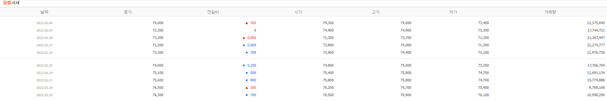

# day 14

## 네이버 주가정보 크롤링 프로젝트

[한국 상장사 데이터](http://kind.krx.co.kr/corpgeneral/corpList.do?method=download&searchType=13)를 받으면 한국에 상장되어 있는 상장사에 관한 데이터를 얻을 수 있다. 상장명과 상장 코드에 관련된 데이터인데, 이 데이터를 가지고 네이버 금융정보 일별시세 데이터를 모아올 계획이다.

[삼성전자 일별 시세](https://finance.naver.com/item/sise_day.nhn?code=005930&page=1)를 들어가보면 삼성전자의 주가 정보를 확인할 수 있다. 다음과 같이 일별시세를 볼 수 있는 웹에서 데이터를 크롤링해올 예정이다.




### 상황 분석

기본적인 순서에 대해서 먼저 확인해야한다.

[한국 상장사 데이터](http://kind.krx.co.kr/corpgeneral/corpList.do?method=download&searchType=13) 링크에 연결되어있는 데이터를 다운받아서 저장하고, 이를 데이터베이스에 입력한다. 그 다음 데이터베이스에서 상장사 데이터를 가져와 네이버 주가 일별 시세 데이터를 크롤링한다.

즉, 해결해야할 문제는 다음과 같다.

1. 상장사 정보를 크롤링
2. 크롤링한 정보를 데이터베이스에 푸쉬
3. 데이터베이스에서 상장사 정보 가져오기
4. 네이버 주가 일별시세 크롤링
5. 데이터베이스에 일별시세 정보 푸쉬

#### 데이터베이스

우선 데이터베이스에 대해서 확인해야한다. 

데이터베이스의 이름은 `INVESTAR` 로 정한다.

그 다음 테이블이 필요한데, 테이블은 상장사정보를 저장할 테이블과 주가 정보를 저장할 테이블 2개가 필요하다.

##### 상장사 정보 테이블

테이블명은 `company_info` 로 정한다. 테이블의 열은 총 2개가 필요하다. 상장사 이름과 상장코드가 저장될 열만 있으면 된다. 

따라서 상장사 정보 테이블은 다음 쿼리문으로 만든다.

```sql
CREATE TABLE IF NOT EXISTS company_info (cname char(15), ccode char(6))
```

##### 주가 정보 테이블

주가 정보 테이블의 이름은 `daily_price` 로 정한다. 

테이블의 열은 총 9개를 사용한다. 먼저 인덱스를 지정해 주키로 설정한다. 그다음 회사이름, 날짜, 종가(cp), 전일비(ade), 시가(mp), 고가(hp), 저가(rp), 거래량(tv)의 9개의 열을 만든다. 주키인 인덱스는 `int` 형으로 지정해주며 나머지 데이터는 `varchar` 로 지정해준다.

따라서 주가 정보 테이블은 다음 쿼리문으로 만든다.  

```sql
CREATE TABLE IF NOT EXISTS daily_price (idx int NOT NULL PRIMARY KEY,companyName VARCHAR(15), date VARCHAR(15), cp VARCHAR(15), ade VARCHAR(15), mp VARCHAR(15), hp VARCHAR(15), rp VARCHAR(15), tv VARCHAR(15))
```


#### 클래스

데이터베이스를 조작할 클래스를 생성한다. 클래스 이름은 `SQLmanagement` 로 정한다.

클래스 선언시 db와 password를 입력받으며 db를 생성한다.

클래스에는 쿼리문을 작성할 수 있게 만들어주는 함수, db와 연결을 맺고 끊는 함수, 그리고 테이블의 모든 데이터를 가져오는 함수를 만들어둔다.


### 코드 작성

#### 클래스

##### 클래스 선언

클래스의 첫 부분인 선언부의 코드이다. 데이터베이스의 이름과 패스워드를 입력받는다. 데이터베이스와 연결하고 커서를 생성한 뒤 `CREATE DATABASE IF NOT EXISTS {}` 구문을 이용해 데이터베이스를 생성한다. 생성이 끝나면 `conn.commit()` , `conn.close()` 를 이용해 연결을 끝마친다.

```python
# 클래스 선언시 데이터베이스 이름과 패스워드가 필요하며, 데이터베이스가 없을 시 생성한다.
def __init__(self,dbname,passwords):
    self.password = passwords
    self.dbname = dbname
    conn, cur = None,None
    conn = pymysql.connect(host='localhost',user = 'root', password=self.password ,charset='utf8')
    cur = conn.cursor()
    cur.execute("CREATE DATABASE IF NOT EXISTS {}".format(self.dbname))
    conn.commit()
    conn.close()
```

##### 데이터베이스 연결

`pymysql` 패키지의 `connect` 함수를 이용해 데이터베이스와 연결하고 커서를 설정해준다.

```sql
def openDB(self):
	self.conn = None
	self.cur = None
	self.conn = pymysql.connect(host='localhost',user = 'root', password=self.password ,db =
                                    self.dbname,charset='utf8')
	self.cur = self.conn.cursor()
```

##### 데이터베이스 연결 종료

`commit()` 함수와 `close()` 함수로 데이터베이스 연결을 종료시킨다.

```sql
def closeDB(self):
    self.conn.commit()
    self.conn.close()
```

##### 쿼리 작성

쿼리를 작성하여 데이터베이스에 적용할 수 있게하는 함수이다. `cursor.execute()` 함수와 같지만, 커서를 클래스의 함수인 `openDB` 함수에서 설정하였기 때문에 클래스 내부에서 `cursor.execute()` 함수를 실행해 `useQuery` 라는 새로운 함수를 만들어서 사용한다.

```sql
def useQuery(self,queries):
    self.query = queries
    self.cur.execute(self.query)
```

##### 데이터 로드

테이블 이름을 입력하면 테이블의 모든 정보를 가져오는 함수이다. `useQuery` 함수를 사용해 `SELECT * FROM tablename` 쿼리를 실행한다.

`while` 문에서는 테이블의 모든 행을 읽어오는 코드를 실행한다.

```sql
def selectTableData(self,tablename):
    data = []
    self.useQuery("SELECT * FROM {}".format(tablename))
    while (True) :
        row = self.cur.fetchone()
        if row == None :
            break
        data.append(row)
    return data
```


#### 함수

##### 데이터 튜닝

상장 코드를 확인해보면 3자리수부터 6자리수까지 다양하게 코드가 존재한다. 기존의 코드는 모두 6자리지만, 첫글자에 `0` 이 들어갈경우 데이터를 `html` 파일에서 가져오는 과정에서 누락되어서 3자리수~5자리수로 나타나게된다.

따라서 코드를 다시 6자리의 `str` 형식의 데이터로 만들어줘야한다.

`if` `elif` 조건문을 사용하여 데이터의 길이에 따라 각각 6자리수의 코드로 변경해준 다음 `stockdata` 에 저장하고 반환한다.

```python
def codeTune(data):
    stockdata = []
    for i in range(len(data)):
        if len(data[i][1]) == 3:
            code = '000' + data[i][1]
        elif len(data[i][1]) == 4:
            code = '00' + data[i][1]
        elif len(data[i][1]) == 5:
            code = '0' + data[i][1]
        else :
            code = data[i][1]
        stockdata.append([data[i][0],code])
    return stockdata
```

##### 여러 페이지에서 데이터 불러오기.

`getPages` 함수는 인자로 `data #상장코드` `page #몇페이지까지 데이터를 가져올것인지` `url #금융정보를 가져올 사이트` `header` 정보로 되어있다. 헤더에 대한 내용은 [후술](# header)한다.

이 함수는 특정 페이지에서 데이터를 가져오는 함수은 `getPageData` 함수를 `page` 만큼 반복시켜주고 그 데이터를 `pagedata` 객체에 저장해주는 함수이다.

```python
def getPages(data,page,url,header):
    pagedata = []
    for i in range(page):
        pagedata.append(getPageData(data,i+1,url,header))
    return pagedata
```

##### 페이지에서 정보 긁어오기

`getPageData` 함수는 인자로 `data #상장코드` `page #어느페이지에서 데이터를 가져올것인지` `url #금융정보를 가져올 사이트` `header` 를 받는다.

데이터를 가져오려는 `url` 은 정보에서 상장코드와 page정보를 변경해주면 다른 페이지로 이동이 가능하다. 이 또한 [후술](# header)한다.

`res = requests.get(url2,headers=header)` 코드를 사용해 `url` 의 정보를 가져온다.

그 아래 코드는 데이터를 크롤링하는 코드이다.

```python
def getPageData(data,page,url,header):
    url2 = url.format(data,page)
    res = requests.get(url2,headers=header)
    res.raise_for_status() 

    # 객체 생성
    bs = bs4.BeautifulSoup(res.text,"html.parser")

    # 주가정보 긁어오기
    table = bs.find("table",{"class":"type2"})
    tr = table.findAll("tr",{"onmouseover":"mouseOver(this)"})

    # tr의 길이만큼의 이중 지능리스트 생성
    data = [ [] for i in range(len(tr))]

    # 모든 텍스트 정보 가져오기
    for i in range(len(tr)):
        td = tr[i].findAll("td")
        for s in range(len(td)):
            data[i].append(td[s].text.strip())
    return data
```


#### 메인 코드

##### 모듈과 데이터베이스 정보

데이터베이스의 정보를 입력한다. 미리 객체에 지정해놓아서 코드 수정을 용이하게한다.

```python
import stockproject as sp
import pandas as pd

# 사용할 데이터베이스 정보.
db = 'INVESTAR'
pw = '1111'
table = 'company_info'
table2 = 'daily_price'
```

##### 클래스 선언

클래스 선언과 동시에 `__init__` 함수를 실행하여 db를 생성한다.

```python
# 클래스 선언과 동시에 db생성
st = sp.SQLmanagement(db,pw)
```

##### 테이블 생성

`openDB()` 함수로 데이터베이스와 연결하고, `closeDB()` 함수로 데이터베이스와 연결을 해제한다.

`useQuery` 함수를 통해 테이블을 생성하는 쿼리를 작성하고 실행한다.

테이블 구조는 [데이터베이스](# 데이터베이스)에 자세히 설명해두었다.

```python
# 상장사 데이터를 넣을 테이블 만들기
st.openDB()
st.useQuery('CREATE TABLE IF NOT EXISTS {} (cname char(15), ccode char(6))'.format(table))
st.closeDB()

# 주가 데이터를 넣을 테이블 만들기
st.openDB()
query = "CREATE TABLE IF NOT EXISTS {} (idx int NOT NULL PRIMARY KEY,companyName VARCHAR(15), date VARCHAR(15), cp VARCHAR(15), ade VARCHAR(15), mp VARCHAR(15), hp VARCHAR(15), rp VARCHAR(15), tv VARCHAR(15));"
st.useQuery(query.format(table2))
st.closeDB()
```

##### 테이블에 데이터 넣기

데이터베이스를 연결하고 데이터를 다운받을 `url`을 저장한다. `read_html` 함수를 이용해 데이터를 저장하면 길이가 1인 리스트 형태로 저장된다. 따라서 `tables[0]` 을 이용하여 리스트 안에 들어가있는 데이터프레임을 꺼내온다. (`리스트[ 데이터프레임 ])` 의 형태로 데이터가 감싸져있다.

그 다음 `useQuery` 함수로 데이터를 입력해준다.

```python
# 테이블에 데이터 넣기
st.openDB()
url = "http://kind.krx.co.kr/corpgeneral/corpList.do?method=download&searchType=13"
tables = pd.read_html(url)
comp_data = tables[0][['회사명','종목코드']]
for i in range(len(comp_data)):
    st.useQuery("INSERT INTO {} VALUES('{}','{}')".format(table, comp_data.iloc[i][0], comp_data.iloc[i][1]))
st.closeDB()
```

##### 데이터 읽어오기

데이터베이스에 데이터를 입력하얐으니 이제 데이터베이스에서 데이터를 가져올 차례이다. `selectTableData` 함수를 사용해 데이터를 가져온다.

그 다음 [데이터 튜닝](#데이터-튜닝)을 진행한다.

```python
# 데이터 읽기
st.openDB()
comp_data = st.selectTableData(table)
st.closeDB()

# 코드 바꾸기
comp_data = sp.codeTune(comp_data)
```

##### header

다음은 데이터를 가져오기 위한 정보이다. 

먼저 `url` 정보이다. 이 주소는 `code` 값과 `page` 의 값이 달라지면 다른 화면을 가지고온다. `code` 는 상장코드에 해당하는 내용이며, `page` 몇번째 페이지인지를 의미한다. 따라서 아래에 `page` 객체에 3을 저장해주면, 3페이지까지 데이터를 가지고오게된다.

`header` 는 user-agent 정보를 담고있는 객체다. user-agent란 자동으로 데이터를 긁어오게 되면 사이트 자체적인 보안때문에 데이터를 가져올 수 없는데, 이를 방지하고자 사용자의 정보를 보내어 우회하는 방법이다. user-agent 정보는 [What is my user agent?](https://www.whatismybrowser.com/detect/what-is-my-user-agent) 사이트에서 확인할 수 있다.

```python
header = {'User-Agent':'useragent정보'}
url = "https://finance.naver.com/item/sise_day.nhn?code={}&page={}"
page = 3
```

##### 데이터 가져오고 넣기

마지막은 데이터를 가져오고 넣는 코드이다. 앞서 함수와 클래스를 정의했기 때문에 코드는 매우 단순하다.

데이터베이스와 연결해주고 `idx = 0` 으로 초기화한다.

`comp_data` 는 상장사 정보이기 때문에, 상장사의 개수만큼 반복문을 진행한다. 반복문 안에서는 `stdata` 에 각각의 페이지에서 정보를 크롤링해온 이중리스트를 저장해놓는다. 즉, `stdata` 는 삼중 리스트의 형태를 띄게된다.

그 다음 `p` 는 페이지 수 만큼, `i` 는 한 페이지에 데이터를 담고 있는 개수인 10번만큼 반복하여 데이터베이스에 정보를 입력한다.

`idx` 는 매 정보가 입력될때마다 하나씩 늘려서 입력한다.

```python
st.openDB()
idx = 0
for row in range(len(comp_data)):
    stdata = sp.getPages(comp_data[row][1],page,url,header) # 데이터 크롤링
    for p in range(page):
        for i in range(10):
            st.useQuery("INSERT INTO {} VALUES({}, '{}', '{}', '{}', '{}', '{}', '{}', '{}', '{}')".
                format(table2, idx, comp_data[row][0], stdata[p][i][0], stdata[p][i][1], stdata[p][i][2], stdata[p][i][3], stdata[p][i][4], stdata[p][i][5], stdata[p][i][6]))
            idx += 1
st.closeDB()
```


### 최종 코드

#### stockproject.py

메인 코드에 앞서 함수와 클래스를 정의해놓은 모듈의 전체 코드를 삽입한다.

```python
import requests
import bs4
import pymysql

################
#클래스 부분
################

# 클래스 선언
class SQLmanagement :
    # 클래스 선언시 데이터베이스 이름과 패스워드가 필요하며, 데이터베이스가 없을 시 생성한다.
    def __init__(self,dbname,passwords):
        self.password = passwords
        self.dbname = dbname
        conn, cur = None,None
        conn = pymysql.connect(host='localhost',user = 'root', password=self.password ,charset='utf8')
        cur = conn.cursor()
        cur.execute("CREATE DATABASE IF NOT EXISTS {}".format(self.dbname))
        conn.commit()
        conn.close()

    # 데이터베이스와 연결하는 함수. useQuery(), dataLoad() 함수를 쓰기전 사용해야함.
    def openDB(self):
        self.conn = None
        self.cur = None
        self.conn = pymysql.connect(host='localhost',user = 'root', password=self.password ,db = self.dbname,charset='utf8')
        self.cur = self.conn.cursor()

    # opneDB()를 사용하고 난 이후에 꼭 사용해야함. DB를 닫아줘야 에러가 나지 않음.
    def closeDB(self):
        self.conn.commit()
        self.conn.close()

    # 함수 안에 쿼리문을 작성하면 실행시켜주는 함수.
    def useQuery(self,queries):
        self.query = queries
        self.cur.execute(self.query)

    # 테이블 안에 모든 데이터를 불러오는 함수. 리스트를 반환한다.
    def selectTableData(self,tablename):
        data = []
        self.useQuery("SELECT * FROM {}".format(tablename))
        while (True) :
            row = self.cur.fetchone()
            if row == None :
                break
            data.append(row)
        return data

################
#함수 부분
################

# 주가 코드가 6자리가 아닐경우 6자리로 만들기 위한 코드.
def codeTune(data):
    stockdata = []
    for i in range(len(data)):
        if len(data[i][1]) == 3:
            code = '000' + data[i][1]
        elif len(data[i][1]) == 4:
            code = '00' + data[i][1]
        elif len(data[i][1]) == 5:
            code = '0' + data[i][1]
        else :
            code = data[i][1]
        stockdata.append([data[i][0],code])
    return stockdata

# 페이지별로 데이터를 가져오는 함수 page는 몇 페이지까지 데이터를 받아올 것인가.
def getPages(data,page,url,header):
    pagedata = []
    for i in range(page):
        pagedata.append(getPageData(data,i+1,url,header))
    return pagedata

# 특정 페이지의 주식정보를 가져오는 함수. data는 코드를 의미, page는 현재 페이지를 의미
def getPageData(data,page,url,header):
    url2 = url.format(data,page)
    res = requests.get(url2,headers=header)
    res.raise_for_status() 

    # 객체 생성
    bs = bs4.BeautifulSoup(res.text,"html.parser")

    # 주가정보 긁어오기
    table = bs.find("table",{"class":"type2"})
    tr = table.findAll("tr",{"onmouseover":"mouseOver(this)"})

    # tr의 길이만큼의 이중 지능리스트 생성
    data = [ [] for i in range(len(tr))]

    # 모든 텍스트 정보 가져오기
    for i in range(len(tr)):
        td = tr[i].findAll("td")
        for s in range(len(td)):
            data[i].append(td[s].text.strip())
    return data

```

#### main

코드가 실질적으로 작동하는 메인 부분이다.

```python
import stockproject as sp
import pandas as pd

# 사용할 데이터베이스 정보.
db = 'INVESTAR'
pw = '1111'
table = 'company_info'
table2 = 'daily_price'

# 클래스 선언과 동시에 db생성
st = sp.SQLmanagement(db,pw)

# 상장사 데이터를 넣을 테이블 만들기
st.openDB()
st.useQuery('CREATE TABLE IF NOT EXISTS {} (cname char(15), ccode char(6))'.format(table))
st.closeDB()

# 주가 데이터를 넣을 테이블 만들기
st.openDB()
query = "CREATE TABLE IF NOT EXISTS {} (idx int NOT NULL PRIMARY KEY,companyName VARCHAR(15), date VARCHAR(15), cp VARCHAR(15), ade VARCHAR(15), mp VARCHAR(15), hp VARCHAR(15), rp VARCHAR(15), tv VARCHAR(15));"
st.useQuery(query.format(table2))
st.closeDB()


# 테이블에 데이터 넣기
st.openDB()
url = "http://kind.krx.co.kr/corpgeneral/corpList.do?method=download&searchType=13"
tables = pd.read_html(url)
comp_data = tables[0][['회사명','종목코드']]
for i in range(len(comp_data)):
    st.useQuery("INSERT INTO {} VALUES('{}','{}')".format(table, comp_data.iloc[i][0], comp_data.iloc[i][1]))
st.closeDB()

# 데이터 크롤링해서 저장
# 데이터 읽기
st.openDB()
comp_data = st.selectTableData(table)
st.closeDB()

# 코드 바꾸기
comp_data = sp.codeTune(comp_data)

# 데이터를 가져오기 위한 정보
header = {'User-Agent':'useragent정보'}
url = "https://finance.naver.com/item/sise_day.nhn?code={}&page={}"
page = 3

# 데이터 가져오고 넣기.
st.openDB()
idx = 0
for row in range(len(comp_data)):
    stdata = sp.getPages(comp_data[row][1],page,url,header) # 데이터 크롤링
    for p in range(page):
        for i in range(10):
            st.useQuery("INSERT INTO {} VALUES({}, '{}', '{}', '{}', '{}', '{}', '{}', '{}', '{}')".
                format(table2, idx, comp_data[row][0], stdata[p][i][0], stdata[p][i][1], stdata[p][i][2], stdata[p][i][3], 					stdata[p][i][4], stdata[p][i][5], stdata[p][i][6]))
            idx += 1
st.closeDB()
```

