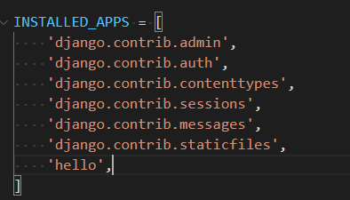
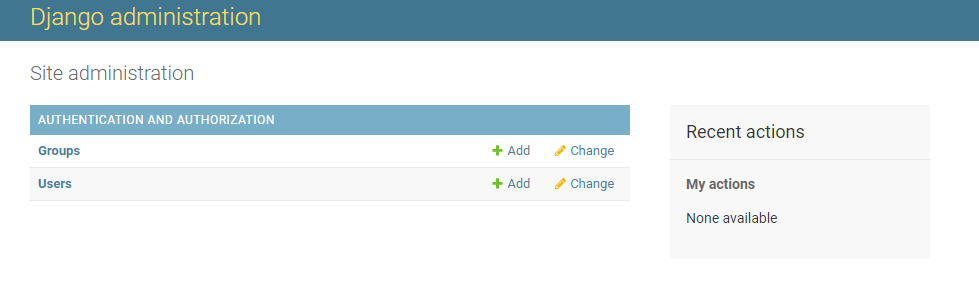
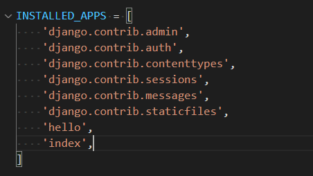
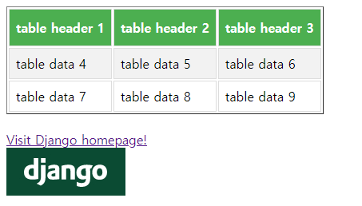
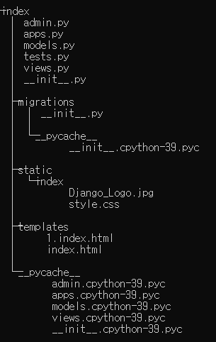
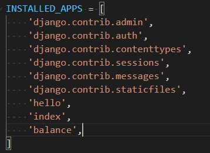

# day 17

## django

파이썬 기반의 웹 프레임워크이다.

쟝고 설치 : `pip install django` 

### 장고 프로젝트 시작

쟝고 프로젝트를 시작하기 전에 cmd 창의 경로를 프로젝트 폴더로 지정해줘야한다.

그 이후 다음 단계를 시작한다.

+ 장고 프로젝트 실행

  `django-admin startproject projectname` 

  쟝고의 기본 스켈레톤 파일들을 생성해준다.

+ 쟝고 서버 실행

  + cmd의 경로를 프로젝트 폴더로 지정해준다.
  
  + 서버 등록 : `pyhton manage.py migrate`
  + 서버 구동 : `python manage.py runserver 0.0.0.0:8000` 입력 -> 인터넷 브라우저에서 `localhost:8000` 을 접속해보면 서버가 돌아가는 것을 확인할 수 있다.

#### 쟝고 어플리케이션

`python manage.py startapp hello` 명령어를 사용해 시작한다.

등록 : `python manage.py migrate`

+ 정규 표션식으로 매핑

  프로젝트 폴더 내의 `investar` 폴더 안의 `settings.py` 파일 내부에 다음과같이 `'hello'` 를 추가해준다

  `hello` 는 명령어를 이용해 만들어낸 어플리케이션이다.

  

  다음 `investar` 폴더 내부의 다른 파일인 `urls.py` 에서 다음과 같은 코드를 추가해준다.

  ```python
  urlpatterns = [
      path('admin/', admin.site.urls),
      re_path(r'^(?P<name>[A-Z][a-z]*)$',views.sayHello), # 새로 추가할 라인
  ]
  ```

  `urlpatterns` 리스트가 기본적으로 생성되어있는데, 여기에 새로운 라인을 추가해준다.

  + 정규 표현식의 의미

    `[A-Z][a-z]*` 는 `[A-Z]` 에는 대문자가 무조건 있어야하고, `[a-z]*` 에는 소문자가 와도 되고 오지 않아도 된다는 의미이다.

    즉, 첫 글자는 무조건 대문자여야한다는 의미이다.

  그 다음 프로젝트 폴더 내부의 `hello` 폴더의  `views.py` 파일에 다음과 같은 함수를 추가해준다.

  ```python
  from django.http import HttpResponse
  
  def sayHello(request,name):
      html = "<h1>Hello {}.<h1>".format(name)
      return HttpResponse(html)
  ```

+ 서버 실행

  `python manage.py runserver 0.0.0.0:8000` 를 실행한다.

  웹 브라우저에서 `localhost:8000/Django` 주소로 이동하면 다음과 같은 화면이 나온다.

  

  만약 `/Django` 에서 `D` 를 소문자다 다른 숫자로 바꾸면 정규표현식에 걸려 에러가 발생한다.


#### 관리자 계정

cmd 상에서 `python manage.py createsuperuser` 명령어를 사용하면 관리자 계정을 생성할 수 있다.

그 다음 브라우저에서 `localhost:8000/admin` 에 접속하여 생성한 계정을 입력하면 관리자 화면에 들어갈 수 있다.



### 장고 인덱스 페이지

cmd상에서 이루어지는 대부분의 명령어는 프로젝트 파일 경로를 지정한 이후에 사용한다.

#### index 어플리케이션 생성

+ `python manage.py startapp index` 으로 어플리케이션 생성

+ `settings.py` 의 `installed_apps` 에 어플리케이션 추가

  

+ url conf 추가

  `urlpatterns` 리스트에 새로운 라인을 추가한다.

  ```python
  from index import views as index_views
  
  urlpatterns = [
      path('admin/', admin.site.urls),
      re_path(r'^(?P<name>[A-Z][a-z]*)$',views.sayHello), 
      path('index/',index_views.main_view),  # 새로 추가할 라인
  ]
  ```

+ index 폴더의 `views.py` 에 함수 추가

  ```python
  def main_view(request):
      return render(request,'index.html')
  ```

+ 탬플릿 작성

  `index` 폴더 안에 `templates` 폴더를 생성하고, 그 안에 `index.html` 파일을 작성한다. `views.py` 의 함수에 `index.html` 로 파일을 작성했기 때문에 파일이름을 똑같이 해주어야한다.

  ```html
   
  <html>
      <head>
          <title>This is title.</title> 
  		<link rel="stylesheet" href= />
      </head>
      <body>
          <h1>This is heading1 text.</h1>
          <h2>This is heading2 text.</h2>
          <h3>This is heading3 text.</h3>
          <p>This is a paragraph.</p>
          This is plain text.<br /> 
          <b>This is bold text.</b><br />
          <i>This is Italic text.</i><br />
          <s>This is strike text.</s><br />
          <ol>
              <li>the first orderd list</li>
              <li>the second orderd list</li>
              <li>the third orderd list</li>
          </ol>
          <ul>
              <li>unorderd list</li>
              <li>unorderd list</li>
              <li>unorderd list</li>
          </ul>
          <table border=1>
              <tr>
                  <th>table header 1</th>
                  <th>table header 2</th>
                  <th>table header 3</th>
              </tr>
              <tr>
                  <td>table data 4</td>
                  <td>table data 5</td>
                  <td>table data 6</td>
              </tr>
              <tr>
                  <td>table data 7</td>
                  <td>table data 8</td>
                  <td>table data 9</td>
              </tr>
          </table><br />
          <a href="https://www.djangoproject.com">Visit Django homepage!<br />
          </a>
      </body>
  </html>
  
  ```

  

그 다음 cmd에서 `python manage.py runserver 0.0.0.0:8000` 명령어로 서버를 실행시킨 뒤 웹브라우저를 통해 `localhost:8000/index` 주소를 들어가면 웹사이트를 확인할 수 있다.

#### 캐스캐이딩 스타일 시트

index 폴더 내부에 새로운 폴더를 추가한다. `index/static/index` 다음과 같은 경로가 구성되게 폴더를 생성한다.

그 다음 `style.css` 파일을 생성한다.

```python
/* 테이블 데이터와 테이블 헤더에 대한 스타일 지정*/
table td, table th{
    border: 1px solid #ddd;
    padding: 8px; 
}

/* 테이블 행이 짝수번째일 경우 색상지정*/
table tr:nth-child(even){background-color : #f2f2f2;}

/* 테이블 행에 마우스 커서를 올렷을 경우 색상 지정*/
table tr:hover {background-color: #ddd;}

/* 테이블 헤더에 대한 스타일 지정*/
table th{
    padding-top: 12px;
    padding-bottom: 12px;
    text-align: left;
    background-color: #4caf50;
    color: white
}
```

그럼 다음과같은 화면이 나온다



#### 구성

index 폴더는 다음과 같은 구성을 가진다.



서버에 접속하면, template 폴더의 `index.html` 이 실행되어 `html` 파일이 나타난다.

`static` 폴더의 `index` 의 `style.css` 는 `index.html` 에 의해 실행된다.


### 웹으로 계좌 잔고 확인하기

#### 어플리케이션 생성

1. cmd 상의 프로젝트 폴더 경로에서 `python manage.py startapp balance` 명령어로 어플을 생성한다.

2. `settings.py` 파일에서 어플리케이션을 추가한다.

   

3. `urls.py` 폴더에서 경로를 지정해준다.

#### 현재가 구하기

[네이버 주가정보](https://finance.naver.com/item/sise.naver?code=005930) 사이트에서 개발자 도구를 사용하여 현재가, 등락률 정보를 가져온다.

그리고 `balance_view.py` 파일을 생성하여 다음과 같은 코드를 작성한다.

```python
from django.shortcuts import render
from bs4 import BeautifulSoup as bs
from urllib.request import urlopen

# Create your views here.
def get_data(symbol):
    url="https://finance.naver.com/item/sise.naver?code={}".format(symbol)
    with urlopen(url) as doc:
        soup = bs(doc,"lxml",from_encoding="euc-kr")
        cur_price = soup.find('strong',id = '_nowVal')
        cur_rate = soup.find('strong',id = '_rate')
        stock = soup.find('title')
        stock_name = stock.text.split(':')[0].strip()
        return cur_price.text, cur_rate.text.strip(), stock_name

def main_view(request):
    querydict = request.GET.copy()
    mylist = querydict.lists()
    rows = []
    total = 0

    for x in mylist:
        cur_price, cur_rate, stock_name = get_data(x[0])
        price = cur_price.replace(',','')
        stock_count = format(int(x[1][0]),',')
        sum = int(price) * int(x[1][0])
        stock_sum = format(sum,',')
        rows.append([stock_name,x[0],cur_price,stock_count,cur_rate,stock_sum])

    total_amount = format(total,',')
    values = {'rows':rows, 'total': total_amount}
    return render(request, 'balance.html',values)
```

