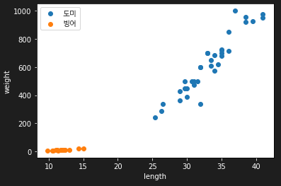
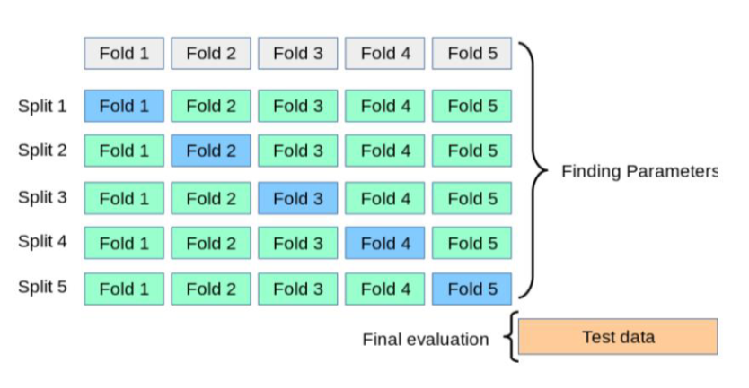

# day 19

## 머신러닝 연습

### 생선 데이터 예측

30cm가 넘는 생선은 도미, 그 아래는 빙어라고 예측을 한다고 가정하고 머신러닝 모델을 생성한다.

#### 데이터

도미의 길이와 무게, 빙어의 길이와 무게의 샘플데이터를 설정했다.

```python
# 생선 종류 : 도미, 빙어
# 생선이 30이 넘으면 도미

# 도미 데이터
bream_length = [25.4, 26.3, 26.5, 29.0, 29.0, 29.7, 29.7, 30.0, 30.0, 30.7, 31.0, 31.0, 31.5, 32.0, 32.0, 32.0, 33.0, 33.0, 				33.5, 33.5, 34.0, 34.0, 34.5, 35.0, 35.0, 35.0, 35.0, 36.0, 36.0, 37.0, 38.5, 38.5, 39.5, 41.0, 41.0]
bream_weight = [242.0, 290.0, 340.0, 363.0, 430.0, 450.0, 500.0, 390.0, 450.0, 500.0, 475.0, 500.0, 500.0, 340.0, 600.0, 					600.0, 700.0, 700.0, 610.0, 650.0, 575.0, 685.0, 620.0, 680.0, 700.0, 725.0, 720.0, 714.0, 850.0, 1000.0, 					920.0, 955.0, 925.0, 975.0, 950.0]

# 빙어 데이터
smelt_length = [9.8, 10.5, 10.6, 11.0, 11.2, 11.3, 11.8, 11.8, 12.0, 12.2, 12.4, 13.0, 14.3, 15.0]
smelt_weight = [6.7, 7.5, 7.0, 9.7, 9.8, 8.7, 10.0, 9.9, 9.8, 12.2, 13.4, 12.2, 19.7, 19.9]
```

+ 데이터 시각화

  ```python
  # 도미와 빙어 데이터 시각화
  import matplotlib.pyplot as plt
  
  plt.scatter(bream_length, bream_weight, label = '도미')
  plt.scatter(smelt_length, smelt_weight, label = '빙어')
  plt.rc('font',family = 'Malgun Gothic') # 한글폰트설정
  plt.xlabel('length', color = 'white')
  plt.ylabel('weight', color = 'white')
  plt.tick_params(color = 'white',colors = 'white')
  plt.legend()
  plt.show()
  ```

  

+ 데이터 전처리

  도미의 무게와 빙어의 무게 리스트를 하나로 묶어 무게 리스트생성, 마찬가지로 길이 리스트를 생성하고 리스트 컴프레션을 통해 길이를 0번째열에, 무게를 1번째 열에 두는 2차원 배열을 생성한다. 이는 feature에 해당한다.

  그 다음 알아내고자 하는 데이터인 도미는 1, 빙어는 0으로 한 정답레이블을 만들어낸다. 이는 target에 해당한다.

  ```python
  # 훈련 데이터 생성
  # 리스트 컴프레션, 2개의 리스트를 받아서 각각을 열로 만들기
  length = bream_length + smelt_length
  weight = bream_weight + smelt_weight
  fish_data = [ [l,w] for l,w in zip(length, weight)]
  print(fish_data)
  
  # 정답(label) 데이터 생성, 알고자하는것은 1, 아닌것은 0
  fish_target = [1] * 35 + [0] * 14
  print(fish_target)
  ```

#### 모델 생성

`sklearn` 패키지에서 `knn` 모델을 생성할 수 있는 패키지를 가져온다.

`kn` 객체에 `KNeighborsClassifier` 함수를 저장하여 `knn` 기법을 사용한다.

`kn.fit` 함수는 feature와 target을 이용해 예측 모델을 생성한다.

`KNeighborsClassifier` 함수에서 `n_neighbor` 파라미터를 조정하면 k값을 조정할 수 있다. 디폴트는 5이다.

```python
# 머신러닝 모델 생성
from sklearn.neighbors import KNeighborsClassifier

kn = KNeighborsClassifier()

# fit은 주어진 데이터를 훈련하는 것.
kn.fit(fish_data,fish_target)
```

#### 평가

```python
# score는 정확도를 보는 분류 지표
print(kn.score(fish_data,fish_target))

# 새로운 데이터 예측
print(kn.predict([[30,600]]))
```

#### 샘플링

주어진 데이터를 train set 과 test set으로 나누어서 모델을 생성할 수 있다.

인덱스를 가지고 두 데이터 셋을 나눈다. train set으로 생성한 모델을  test set을 통해 검증한다.

```python
# 샘플링
np.random.seed(56)
index = np.arange(49)
np.random.shuffle(index)
print(index)

# 인덱스를 기준으로 원본데이터 뽑아오기
# 랜덤셔플된 인덱스를 가지고 원본 데이터셋에서 트레인데이터 출력.
train_input = input_arr[index[:35]]
train_target = target_arr[index[:35]]

# 테스트데이터 
test_input = input_arr[index[35:]]
test_target = target_arr[index[35:]]

# train set으로 knn
kn = KNeighborsClassifier()
kn.fit(train_input,train_target)
kn.score(test_input,test_target)

# predict
print(kn.predict(test_input))
print(test_target)
```


### iris data 예측

의사결정 나무를 이용해 iris dataset에 대한 예측을 수행한다.

#### 패키지 로드

`load_iris` : iris 데이터를 불러오기 위한 패키지

`DecisionTreeClassifier` : 의사결정트리를 사용하기 위한 패키지

`train_test_split` : 데이터셋을 나누기 위한 패키지

`accuracy_score` : 모델 평가를 위한 패키지

```python
# 패키지 불러오기
from sklearn.datasets import load_iris
from sklearn.tree import DecisionTreeClassifier
from sklearn.model_selection import train_test_split
from sklearn.metrics import accuracy_score

import pandas as pd
```

#### 데이터 준비

feature와 target 데이터를 저장한다. 저장한 데이터를 train과 test set으로 분리한다. `random_state` 파라미터는 seed를 설정해주는 파라미터이다.

```python
# 데이터 셋 로딩
iris = load_iris()

# iris feature
iris_data = iris.data

# iris target
iris_label = iris.target

# train, test split
x_train, x_test, y_train, y_test = train_test_split(iris_data,iris_label,test_size=0.2,random_state=11)
```

#### 모델 생성 및 평가

```python
# decision tree 생성
dt_clf = DecisionTreeClassifier(random_state=11)

# 학습 수행
dt_clf.fit(x_train,y_train)

# 예측 수행
pred = dt_clf.predict(x_test)

# 평가 수행
print(accuracy_score(y_test,pred))
```

accuracy는 0.9333이 나온다. `DecisionTreeClassifier` 함수로 모델을 생성하고, `fit` 함수를 사용해 학습한다. 그 다음 feature들의 test set에 대해서 `predict` 함수로 예측을 실시하고 해당 예측 결과를 `pred` 객체에 저장한다.

`accuracy_score` 함수로 target의 test set에 대해 예측 결과를 검증한다.


## Model Selection

### 교차검증

data의 수가 적을 경우 overfitting이 발생할 수 있다. 같은 데이터셋으로만 훈련시키면 vias가 증가한다. 이를 줄이기 위해 validation set을 사용하여 1차 평가를 한 뒤에 최종적으로 test data에 대해서 검증한다.

train set을 다시 train set과 vaildation set으로 나눈다. 그 다음 나눈 train set으로 모델을 학습시키고 validation set으로 모델의 성능을 검증한다.

#### k-fold cross validation

1. train dataset을 k개의 fold(묶음)로 나눈다.
2. 첫번째 fold를 validation set으로 정하고 나머지 fold를 train set으로 정한다
3. 모델을 훈련시킨 다음 validation set으로 평가를 하고 이를 반복한다.
4. 반복할 때마다 vaildation set을 변경한다.



+ 데이터 준비

  `KFold` 패키지는 cv를 할수 있게 해주는 패키지이다.

  ```python
  # k-fold cross validtaion
  from sklearn.tree import DecisionTreeClassifier
  from sklearn.metrics import accuracy_score
  from sklearn.model_selection import KFold
  import numpy as np
  
  # 데이터 로드
  iris = load_iris()
  features = iris.data
  label = iris.target
  dt_clf = DecisionTreeClassifier()
  
  # 5개의 fold set으로 분리하는 kfold 객체와 fold set별 정확도를 담을 리스트 객체 생성
  kfold = KFold(n_splits=5)
  cv_accuracy = []
  ```

+ 모델 생성

  ```python
  # KFold 객체를 split()으로 호출하면 폴드 별 train, test의 row index를 array로 반환
  for train_index, test_index in kfold.split(features):
      
      # train set과 validation set 설정. validation set을 test라는 이름으로 저장함
      x_train, x_test = features[train_index], features[test_index]
      y_train, y_test = label[train_index], label[test_index]
  	
      # 모델 생성 및 예측
      dt_clf.fit(x_train,y_train)
      pred = dt_clf.predict(x_test)
      
      # 정확도 평가
      accuracy = np.round(accuracy_score(y_test,pred),4)
      cv_accuracy.append(accuracy)
  
  # cv의 결과로 나온 정확도의 평균값 출력.
  print(np.mean(cv_accuracy))
  ```

  `accuracy = np.round(accuracy_score(y_test,pred),4)` 구문에서 `round` 함수는 반올림을 해주는 함수이다. `accuracy_score(y_test),4` 의 의미는 해당 값을 소수점 4자리수까지 반올림해주는 의미이다.

#### Stratified K - fold

k-fold의 단점을 보완한 것으로 불균형한 분포도를 가진 데이터 집합을 고려하여 원본 데이터 레이블 분포를 고려한 뒤 데이터 세트를 분배하는 것이다.

`StratifiedKFold` 를 사용하면 라벨 데이터가 균등한 분포를 가진 상태로 fold가 나뉘게된다. 따라서 불균형한 데이터에서 발생하는 제대로 학습되지 않는 문제가 해결된다.

`StratifiedKFold` 함수도 기본적인 구조는 일반적인 `KFold` 와 동일하다. 다만 `StratifiedKFold` 객체의 `split` 함수는 feature, label 두 가지 인자를 받아야한다. `KFold` 의 경우 데이터의 분포를 신경쓰지 않고 fold를 나누기 때문에 feature만을 인자로 받을 수 있지만, `StratifiedKFold` 는 label의 분포를 고려해야 하기 때문에 `split` 함수를 실행할 때 인자로 넣어줘야 한다.

```python
# stratified k-fold
from sklearn.model_selection import StratifiedKFold
from sklearn.tree import DecisionTreeClassifier
from sklearn.metrics import accuracy_score
import numpy as np

dt_clf = DecisionTreeClassifier(random_state=56)

skfold = StratifiedKFold(3)
cv_accuracy = []

for train_index, test_index in skfold.split(features,label):
    x_train, x_test = features[train_index], features[test_index]
    y_train, y_test = label[train_index], label[test_index]

    dt_clf.fit(x_train,y_train)
    pred = dt_clf.predict(x_test)

    accuracy = np.round(accuracy_score(y_test,pred),4)
    cv_accuracy.append(accuracy)

print(np.mean(cv_accuracy))
```

