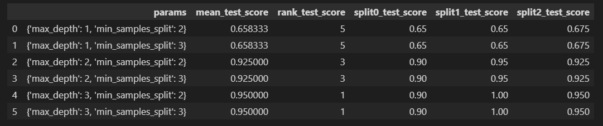
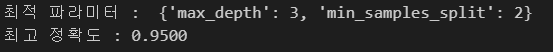
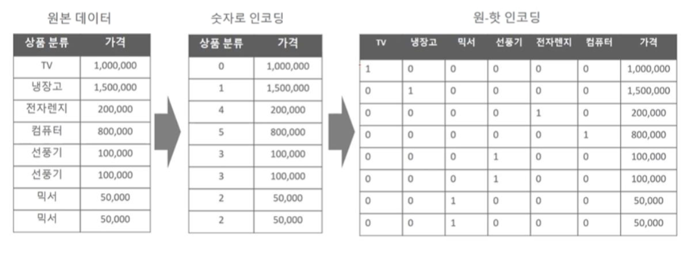
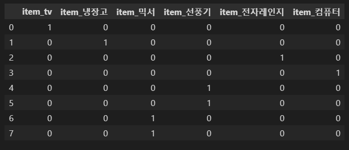

# day 20

## Model Selection

### 교차검증

#### 간편한 교차검증 : cross_val_score()

분석 알고리즘과 데이터 그리고 cv 횟수를 입력하면 간단하게 교차검증을 해줄수 있는 함수이다.

```python
from sklearn.tree import DecisionTreeClassifier
from sklearn.model_selection import cross_val_score, cross_validate
from sklearn.datasets import load_iris
import numpy as np

# data load
iris_data = load_iris()
data = iris_data.data
label = iris_data.target

# decision tree 사용
dt_clf = DecisionTreeClassifier(random_state=56)

# 성능 지표는 정확도, cv = 3
scores = cross_val_score(dt_clf,data,label,scoring='accuracy',cv=3)

print('교차검증별 정확도 : ',np.round(scores,4))
print('평균 검증 정확도 : ',np.round(np.mean(scores)),4)
```

#### GridSearchCV : 교차검증 + 하이퍼 파라미터 튜닝

`parameters` 객체에 파라미터를 저장하여 사용한다. `GridSearchCV` 함수의 `param_grid` 속성에 넣어서 사용한다. 그러면 파라미터에 저장된 것이 순차적으로 돌아가면서 교차검증을 하게된다. `refit` 옵션은 디폴트값이 `True` 이며, 가장 좋은 파라미터 설정으로 재학습시키는 것을 의미한다.

다음 코드는 `max_depth` 와 `min_sapmles_split` 이 선택되면서 총 6개의 파라미터에 대해 교차검증을 시행한다.

주의할점은 `parameters` 객체의 키를 입력할 때, `grid_dtree.get_params().keys()` 함수를 실행하여 나오는 키 이름을 사용해야 에러가 나지 않는다. 만약 키 값을 임의로 지정할 경우 `Invalid parameter` 에러가 발생한다.

```python
from sklearn.datasets import load_iris
from sklearn.tree import DecisionTreeClassifier
from sklearn.model_selection import GridSearchCV
from sklearn.model_selection import train_test_split
import pandas as pd

# data load
iris_data = load_iris()
X_train, X_test, y_train, y_test = train_test_split(iris_data.data,iris_data.target,test_size=0.2,random_state=56)

# 분석 알고리즘
dtree = DecisionTreeClassifier()

# parameter setting
parameters = {'max_depth':[1,2,3], 'min_samples_split' : [2,3]}

# cross validation
grid_dtree = GridSearchCV(dtree, param_grid=parameters, cv=3, refit= True)
grid_dtree.get_params().keys()

# 학습
grid_dtree.fit(X_train,y_train)

scores = pd.DataFrame(grid_dtree.cv_results_)
scores[['params','mean_test_score','rank_test_score','split0_test_score','split1_test_score','split2_test_score']]
```

다음과 같이 파라미터가 돌아가면서 교차검증을 시행한다. `cv = 3` 이기 때문에 `split` 부분이 3개이다. `mean_test_score` 는 `cv` 를 통한 `validation set` 에서 구한 성능평가 점수의 평균이다. `rank_test_score` 는 성능의 등수를 의미한다.



`best_params_` 와 `best_score_` 를 사용해 최적 파라미터와 최고 정확도를 찾아낼 수 있다.

```python
print('최적 파라미터 : ',grid_dtree.best_params_)
print('최고 정확도 : {0:.4f}'.format(grid_dtree.best_score_))
```



최종적으로 학습된 최적 모델을 불러와 테스트셋에 대한 정확도를 측정해본다.

```python
from sklearn.metrics import accuracy_score

# refit으로 학습된 estimator 반환
estimator = grid_dtree.best_estimator_

# 최적파라미터로 학습된 모델로 예측
pred = estimator.predict((X_test))  # 테스트 데이터에 대해서 예측
print('테스트 정확도 : {0:.4f}'.format(accuracy_score(y_test,pred))) # 실제값과 예측치의 정확도 측정
```


## 데이터 전처리

### 개별 변수 정제 방법

#### 결측치 처리

`NaN`, `NULL` 값들은 허용되지 않기 때문에 고정된 다른 값으로 변환해야 한다. 결측치가 적다면 평균값등으로 대체할 수 있지만 결측치가 많거나 대부분이라면 삭제하는 것도 좋다. 일정 수준의 결측치는 대체 혹은 삭제가 애매하다. 왜냐하면 예측 왜곡을 불러올 수 있기 때문이다. 따라서 업무 로직을 다시 고려하여 결측치를 없애는 방법을 생각해야한다.

#### 데이터 인코딩

문자열 값은 입력값으로 허용되지 않는다. 따라서 숫자형으로 변환해야한다.

카테고리형 피쳐는 코드값으로 표현하는것이 적합하다. 텍스트 피쳐는 피쳐 벡터화 기법으로 벡터화 혹은 불필요할 경우 삭제하는 것이 좋다.

+ 레이블 인코딩

  카테고리 피쳐를 코드형 숫자로 변환한다. 

  `fit()` 함수와 `tansform()` 함수를 사용하여 변환한다.

  ```python
  from sklearn.preprocessing import LabelEncoder
  
  items = ['tv','냉장고','전자레인지','컴퓨터','선풍기','선풍기','믹서','믹서']
  
  # LabelEncoder 객체를 생성한 후 fit()와 transform()으로 레이블 인코딩 수행
  encoder = LabelEncoder()
  encoder.fit(items)
  labels = encoder.transform(items)
  print('인코딩 변환값 : ',labels)
  ```

  + 레이블 인코딩의 문제점

    숫자의 크고 작음이 있는 값으로 변환되면서 특정 머신러닝 알고리즘에서 가중치가 더 부여될 가능성이 있다.

    선형회귀 알고리즘에서 문제가 발생한다.

+ 원 핫 인코딩

  레이블 인코딩에서 가중치가 부여될 수 있다는 문제점을 해결한 인코딩 방식이다.

  레이블 인코딩을 실행한 이후 각각의 요소를 하나의 컬럼으로 만든다. 즉, 1차원 데이터를 2차원으로 늘리고 각각의 원소를 0과 1로 표현함으로써 인코딩 이후 서열이 생기는 문제를 해결한다.

  

  원 핫 인코딩은 다음과 같은 순서로 실행된다.

  1. 레이블 인코딩 실행
  2. 2차원 데이터로 변환
  3. 원 핫 인코딩 적용

  원 핫 인코딩도 `fit()` 함수와 `transform()` 함수를 이용해 변환한다.

  `reshape` 함수에서 `-1` 의 의미는 해당 열 혹은 행의 길이를 가변적으로 결정한다는 의미이다. 즉, `-1` 이 있는 행 또는 열은 `-1` 이 아닌 다른 행 또는 열에 의해서 정해진다는 의미이고, 모든 데이터가 유동적으로 적당히 들어가질 수 있게 추정하여 들어간다는 의미이다. 현재 코드에서는 `reshape(-1,1)` 인데, 행 부분에 `-1` 이 있기 때문에 행은 있는 데이터에 대해서 알아서 행이 늘어난다. 열 부분은 `1` 이기 때문에 무조건 열의 개수는 1이다.

  `toarray()` 함수를 사용하면 결과를 출력할 수 있다.

  ```python
  from sklearn.preprocessing import OneHotEncoder
  import numpy as np
  
  items = ['tv','냉장고','전자레인지','컴퓨터','선풍기','선풍기','믹서','믹서']
  
  # 레이블 인코딩 실행
  encoder = LabelEncoder()
  encoder.fit(items)
  labels = encoder.transform(items)
  
  # 2차원 데이터로 변환
  labels = labels.reshape(-1,1)
  
  # 원 핫 인코딩 적용
  oh_encoder = OneHotEncoder()
  oh_encoder.fit(labels)
  oh_labels = oh_encoder.transform(labels)
  
  # 결과 출력
  print(oh_labels.toarray())
  print(oh_labels.shape)
  ```

+ 원 핫 인코딩 : 판다스

  `pandas` 를 이용하면 간편하게 원 핫 인코딩을 실행할 수 있다.

  ```python
  import pandas as pd
  
  df = pd.DataFrame({'item':['tv','냉장고','전자레인지','컴퓨터','선풍기','선풍기','믹서','믹서']})
  pd.get_dummies(df)
  ```

  

#### Feature 스케일링

변수가 여러개일 경우 각각의 변수의 크기가 전부 다를 수 있다. 이때, 두 변수 간 차이가 너무 클 경우 가중치가 불균형하게 학습될 가능성이 있기 때문에 각각의 변수를 스케일링, 즉 범위를 비슷하게 만들어줘야한다.

+ 표준화

  데이터의 피쳐 평균이 0이고 분산이 1인 가우시안 정규 분포를 가진 값으로 만드는 일.

  + StandardScaler : 스케일러 객체를 생성하고 `fit()` `transform()` 으로 변환한다.

    ```python
    from sklearn.preprocessing import StandardScaler
    
    # 스케일러 객체 생성
    sclaer = StandardScaler()
    
    # 데이터 셋 변환.
    scaler.fit(iris_df)
    iris_scaled = scaler.transform(iris_df)
    ```

+ 정규화

  서로 다른 피쳐의 크기를 통일하기 위해 크기를 변환하는 개념

  + MinMaxScaler

    ```python
    from sklearn.preprocessin import MinMaxScaler
    
    # 스케일러 객체 생성.
    sclaer = MinMaxScaler()
    
    # 데이터 셋 변환.
    scaler.fit(iris_df)
    iris_scaled = scaler.transform(iris_df)
    ```

+ train data와 test data 간의 스케일링 차이

  1. 가능하다면(거의무조건) 스케일링을 하고 데이터를 분할한다
  2. 테스트 데이터 변환시에는 `.fit()` 함수를 사용하지 않고 이미 `.fit()` 이 적용된 객체로 `.transform()` 만을 사용한다.


## 실습 : 타이타닉 생존자 예측

### 프로세스

1. 문제 정의
2. 데이터 수집
3. 데이터 전처리
4. ML 알고리즘 적용
5. 성능평가

### 데이터 준비

#### 문제 정의

타이타닉에 탑승했던 승객들의 데이터를 활용하여 생존여부를 `True / False` 로 예측을 해본다.

#### 데이터 수집

[kaggle titanic data](https://www.kaggle.com/c/titanic/data) 에서 데이터를 받아온다.

#### 데이터 전처리

```python
# 데이터 전처리 함수
from sklearn import preprocessing

# 결측값 채우기
def fillna(df):
    df['Age'].fillna(df['Age'].mean(), inplace = True)
    df['Cabin'].fillna('N', inplace = True)
    df['Embarked'].fillna('N', inplace = True)
    df['Fare'].fillna(0, inplace = True)
    return df

# 불필요한 열 삭제
def drop_features(df):
    df.drop(['PassengerId','Name','Ticket'],axis =1 ,inplace = True)
    return df

# 레이블 인코딩 수행
def encode_features(df):
    df['Cabin'] = df['Cabin'].str[:1]
    features = ['Cabin','Sex','Embarked']
    for feature in features:
        le = preprocessing.LabelEncoder()
        le = le.fit(df[feature])
        df[feature] = le.transform(df[feature])
    return df

def transfrom_features(df):
    df = fillna(df)
    df = encode_features(df)
    df = drop_features(df)
    return df
```

데이터 준비

```python
# 데이터 준비
from sklearn.preprocessing import LabelEncoder
from sklearn.model_selection import train_test_split
import pandas as pd

titanic_df = titanic_df = pd.read_csv('C:/sh/study/Study Everyday/data files/titanic/train.csv')
y_titanic_df = titanic_df['Survived']
x_titanic_df = titanic_df.drop('Survived',axis = 1)

x_titanic_df = transfrom_features(x_titanic_df)

# 테스트데이터 분리
x_train, x_test, y_train, y_test = train_test_split(x_titanic_df,y_titanic_df,test_size=0.2,random_state=56)
```


### 모델 학습 및 예측

#### 의사결정나무

```python
# 의사결정나무 모델 학습/예측
from sklearn.tree import DecisionTreeClassifier
from sklearn.metrics import accuracy_score

# 모델 생성
dt_clf = DecisionTreeClassifier(random_state=56)

# 데이터 학습
dt_clf.fit(x_train,y_train)

# 예측
pred = dt_clf.predict(x_test)

# 정확도 출력
print(accuracy_score(y_test,pred))
```

교차검증. 이때, 데이터에 따로 인덱스가 존재하지 않는 2차원 데이터를 사용하기 때문에 `.iloc` 를 사용하여 인덱스를 활용해야한다.

```python
# 교차검증
from sklearn.model_selection import KFold
from sklearn.tree import DecisionTreeClassifier
from sklearn.metrics import accuracy_score
import numpy as np

# 모델 생성
dt_clf = DecisionTreeClassifier(random_state=56)

# fold 나누기
kfold = KFold(5)
cv_accuracy = []

for train_index, test_index in kfold.split(x_titanic_df):
    # .iloc를 활용하여 인덱스 사용
    x_train, x_test = x_titanic_df.iloc[train_index], x_titanic_df.iloc[test_index]
    y_train, y_test = y_titanic_df.iloc[train_index], y_titanic_df.iloc[test_index]

    # 모델 학습
    dt_clf.fit(x_train,y_train)
    pred = dt_clf.predict(x_test)

    # 모델 예측
    accuracy = np.round(accuracy_score(y_test,pred),4)
    cv_accuracy.append(accuracy)

print(cv_accuracy)
print(np.mean(cv_accuracy))
```


