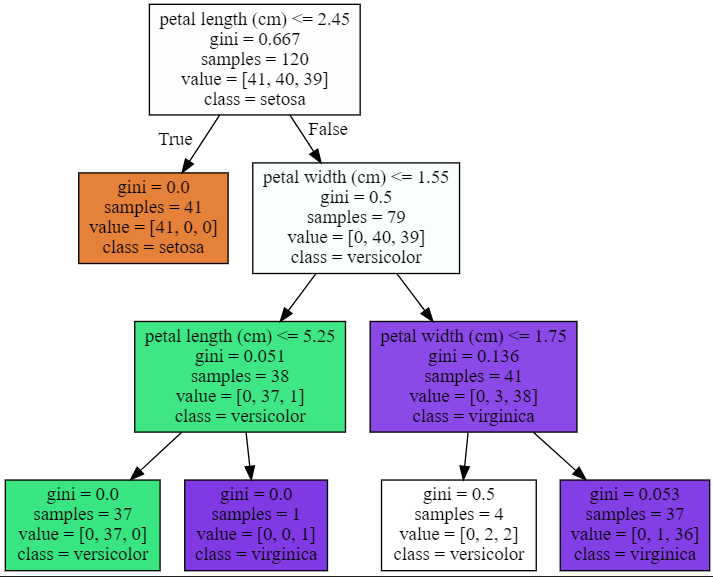

# day 21

## 모델 평가

학습이 완료된 모델의 성능이 얼마나 되는지 숫자로 표현할 수 있다.

학습된 모델은 분류모델(Classification Model)과 회귀모델(Regression Model)로 나뉘며, 두 모델의 평가지표가 다르다.

### 분류 모델 평가

정확도(Accuracy), 정밀도(Precision), 재현율(Recall) 등의 평가 지표가 있다. 이 평가지표는 confusion matrix를 이용해 구할 수 있다.

#### Confusion Matrix

Confusion Matrix : 모델이 예측한것과 실제 값의 조합 4개를 이용해서 만든 표

**TP : True Positive**

**TN : True Negative**

**FP : False Positive**

**FN : False Negative**

모델이 예측한 값이 맞을 경우(예측값과 실제값이 동일한 경우) -> True

모델이 예측한 값이 틀릴 경우(예측값과 실제값이 다른 경우) => False

모델이 참을 예측한 경우 -> Positive

모델이 거짓을 예측한 경우 -> Negative

|               | 모델이 참을 예측 | 모델이 거짓을 예측 |
| ------------- | ---------------- | ------------------ |
| 실제값이 참   | TP               | FN                 |
| 실제값이 거짓 | FP               | TN                 |

#### 평가지표

+ 정확도 (Accuracy)

  전체 경우 중에서 모델이 값을 정확하게 맞춘 경우

  TP + TN / (TP + TN + FP + FN)

+ 정밀도 (Precision)

  모델이 참으로 예측한 경우 중에서 모델이 정확하게 맞춘 경우

  TP / (TP + FP)

+ 재현율 (Recall)

  실제 참인 것 중에서 모델이 정확하게 맞춘 경우

  TP / (TP + FN) -> (FN 은 실제값은 참이지만 모델이 거짓이라 예측한 경우)

#### 스팸메일 예제


True : 스팸메일

False : 일반메일

위의 confusion matrix에서 precision과 recall을 계산해보자

+ precision : 2 / (2+3) = 0.4

  precision은 참으로 예측한 것 중에서 실제로 참인 것을 의미한다. 이 예제에서는 스팸메일이라고 예측한 것이 스팸메일인 경우를 의미한다

  precision이 낮다는 것은 실제로는 일반메일인데 스팸메일로 분류될 확률이 높다는 것을 의미한다.

  반대로 precision이 높으면 일반메일을 스팸메일로 잘못 분류할 확률이 낮은 것이다. (거짓을 참으로 분류할 확률이 낮음)

+ Recall : 2 / (2+0) = 1

  recall은 실제 참인 것 중에서 모델이 참으로 예측한 것을 의미한다. 이 예제에서는 스팸메일인 것을 모델이 정확하게 스팸메일이라 예측한 경우를 말한다.

  recall이 높다는 것은 스팸메일을 스팸메일로 분류할 확률이 높다는 것을 의미한다.

  반대로 recall이 낮으면 스팸메일인데 일반메일로 분류할 확률이 높다는 것을 의미한다. (참을 거짓으로 분류할 확률이 높음)

|               | precision이 높다                                             | precision이 낮다                                             |
| ------------- | ------------------------------------------------------------ | ------------------------------------------------------------ |
| recall이 높다 | 스팸메일을 잘 분류하고 일반메일을 잘못 분류하지 않는다<br />= 정확도가 높다 | 스팸메일을 잘 분류하지만 일반메일을 잘못분류할 확률이 높다   |
| recall이 낮다 | 일반메일을 잘 분류하지만 스팸메일을 잘못 분류할 확률이 높다  | 스팸메일과 일반메일을 잘못 분류할 확률이 높다<br />= 정확도가 낮다 |


## 머신러닝

### 분류 - Classification

#### Decision Tree


루트 노드로부터 규칙 조건마다 규칙노드 기반의 서브트리를 생성한다.

`if ~ else ~ ` 형식으로 데이터에 규칙을 만들어 분류한다. 규칙 노드로 들어간 다음 또다시 분류를 할 수 있으면 분류한다. 더 이상 분류하지 못하는 단계에 이르면 그 노드를 리프노드, 결정된 분류값으로 처리한다.

+ 균일도

  정보의 균일도는 규칙을 만들어내는 기반이 된다. 균일도를 측정하는 방법은 information gain 과 지니 계수가 있다

  + Infomation Gain

    엔트로피라는 개념을 기반으로 주어진 데이터 집합의 혼잡도를 구한다. 서로 다른 값이 섞여잇으면 엔트로피가 높다. 같은 값이 섞여있으면 엔트로피값이 낮다. `information gain 지수 = 1 - 엔트로피 지수` 로 측정한다. information gain 지수가 높은 속성을 기준으로 분할한다.

  + 지니 계수

    경제학에서 불평등 지수를 나타낼 때 사용하는 계수로, 0이 가장 평등하고 1로 갈수록 불평등하다.

    머신러닝에서는 지니계수가 낮을수록 데이터 균일도가 높은 것으로 해석한다. 지니계수가 낮은 속성을 기준으로 분할한다.

+ Decision Tree 장, 단점
  + 장점 : 쉽고 직관적이다. featuer의 스케일링이나 정규화 등의 사전 가공 영향이 작다
  + 단점 : overfitting으로 알고리즘 성능이 떨어진다. 이를 극복하기 위해 트리의 크기를 사전에 제한하는 튜닝이 필요하다.

#### Decision Tree 시각화

`Graphviz` 사용하여 트리를 시각화할 수 있다.

https://graphviz.org/download/ 에 접속하여 `graphviz` 를 다운받을 수 있다.

다운받은 이후, os 환경변수에 path를 추가해주어야 한다.

+ python code

  파이썬과 연결하기 위해 패스를 지정해준다.

  ```python
  import os
  os.environ["PATH"]+=os.pathsep+'C:/Program Files/Graphviz/bin'
  ```

  `iris` 데이터를 이용해 모델을 만들고 학습시킨다.

  ```python
  from sklearn.datasets import load_iris
  from sklearn.tree import DecisionTreeClassifier
  from sklearn.model_selection import train_test_split
  
  import pandas as pd
  # 붓꽃 데이터 세트를 로딩합니다. 
  iris = load_iris()
  
  # iris.data는 Iris 데이터 세트에서 피처(feature)만으로 된 데이터를 numpy로 가지고 있습니다. 
  iris_data = iris.data
  
  # train set, test set으로 분리
  X_train, X_test, y_train, y_test =  train_test_split(iris_data, iris_label, test_size=0.2, random_state=11)
  
  # DecisionTreeClassifier 객체 생성 
  dt_clf = DecisionTreeClassifier(random_state=11)
  
  # 학습 수행 
  dt_clf.fit(X_train, y_train)
  
  pred = dt_clf.predict(X_test)
  ```

+ `export_graphviz` 함수를 사용하여 그래프를 시각화하고 파일로 저장할 수 있다. `graphviz.Source(dot_graph)` 를 통해 저장한 그래프를 시각화할 수 있다.

  ```python
  from sklearn.tree import export_graphviz
  import graphviz
  
  export_graphviz(dt_clf,out_file='tree.dot',class_names=iris.target_names,feature_names=iris.feature_names,impurity=True,filled=True)
  
  with open('tree.dot') as f:
      dot_graph = f.read()
  graphviz.Source(dot_graph)
  ```

  

  그래프의 분류 규칙과 지니계수, 샘플의 개수, 

+ decision tree의 모델을 설정할 때 파라미터를 설정하면 그래프를 다르게 그릴 수 있다.

  ```python
  # max_depth 변경
  dt_clf = DecisionTreeClassifier(max_depth = 3, random_state = 56)
  dt_clf.fit(X_train, y_train)
  
  # graph 출력
  export_graphviz(dt_clf, out_file='tree.dot',class_names=iris.target_names,feature_names=iris.feature_names,impurity=True,filled=True)
  
  with open('tree.dot') as f:
      dot_graph = f.read()
  graphviz.Source(dot_graph)
  ```

  

  ```python
  # min_samples_split 변경
  dt_clf = DecisionTreeClassifier(min_samples_split = 4, random_state = 56)
  dt_clf.fit(X_train, y_train)
  
  # graph 출력
  export_graphviz(dt_clf, out_file='tree.dot',class_names=iris.target_names,feature_names=iris.feature_names,impurity=True,filled=True)
  
  with open('tree.dot') as f:
      dot_graph = f.read()
  graphviz.Source(dot_graph)
  ```

  

  ```python
  # min_samples_leaf 변경
  dt_clf = DecisionTreeClassifier(min_samples_leaf = 4, random_state = 56)
  dt_clf.fit(X_train, y_train)
  
  # graph 출력
  export_graphviz(dt_clf, out_file='tree.dot',class_names=iris.target_names,feature_names=iris.feature_names,impurity=True,filled=True)
  
  with open('tree.dot') as f:
      dot_graph = f.read()
  graphviz.Source(dot_graph)
  ```

  

+ `min_samples_split` 과 `min_samples_leaf` 의 차이점

  지니계수가 0이면 분할하지 않는다. 하지만 지니계수가 0이 아닐 경우 다음 경우에 따라서 분할한다

  + `min_samples_split` 분할

    샘플의 개수가 `min_samples_split` 으로 설정한 수보다 작을 경우 분할한다. 만약 노드의 지니계수가 0이 아니더라도 `min_samples_split` 보다 작은 수의 샘플을 가진다면 분할하지 않는다.

  + `min_samples_leaf` 분할

    `leaf node`가 가질 수 있는 최소의 숫자를 `min_samples_leaf` 를 통해 설정한다. 만약 노드의 샘플 수가 `min_samples_leaf` 보다 작거나 같을 경우 더 이상 분할하지 않는다.

#### Titanic 생존자 Decision Tree 그리기

다음 코드를 사용하여 모델을 만든다.

```python
# 패키지 로드
from sklearn import preprocessing
from sklearn.tree import DecisionTreeClassifier
from sklearn.preprocessing import LabelEncoder
from sklearn.model_selection import train_test_split
import pandas as pd
from sklearn.model_selection import GridSearchCV

# 데이터 전처리 함수
# 결측값 채우기
def fillna(df):
    df['Age'].fillna(df['Age'].mean(), inplace = True)
    df['Cabin'].fillna('N', inplace = True)
    df['Embarked'].fillna('N', inplace = True)
    df['Fare'].fillna(0, inplace = True)
    return df

# 불필요한 열 삭제
def drop_features(df):
    df.drop(['PassengerId','Name','Ticket'],axis =1 ,inplace = True)
    return df

# 레이블 인코딩 수행
def encode_features(df):
    df['Cabin'] = df['Cabin'].str[:1]
    features = ['Cabin','Sex','Embarked']
    for feature in features:
        le = preprocessing.LabelEncoder()
        le = le.fit(df[feature])
        df[feature] = le.transform(df[feature])
    return df

def transfrom_features(df):
    df = fillna(df)
    df = encode_features(df)
    df = drop_features(df)
    return df

# 데이터 준비
titanic_df = titanic_df = pd.read_csv('C:/sh/study/Study Everyday/data files/titanic/train.csv')
y_titanic_df = titanic_df['Survived']
x_titanic_df = titanic_df.drop('Survived',axis = 1)

x_titanic_df = transfrom_features(x_titanic_df)

# 테스트데이터 분리
x_train, x_test, y_train, y_test = train_test_split(x_titanic_df,y_titanic_df,test_size=0.2,random_state=56)

# 모델 생성
dt_clf = DecisionTreeClassifier(random_state=56)

# 파라미터 설정
parameters = {'max_depth' : [2,3,5,10], 'min_samples_split' : [2,3,5], "min_samples_leaf" : [1,5,8]}

# cross validation
grid_dclf = GridSearchCV(dt_clf,param_grid=parameters,scoring='accuracy',cv=5)
grid_dclf.fit(x_train,y_train)

# best estimator 저장
best_est = grid_dclf.best_estimator_
```

`best_est` 객체에 최적의 파라미터로 만든 모델이 저장되었다. 다음 코드로 그래프를 그릴 수 있다.

```python
# 그래프 시각화
import os
os.environ["PATH"]+=os.pathsep+'C:/Program Files/Graphviz/bin'

from sklearn.tree import export_graphviz
import graphviz

export_graphviz(best_est, out_file='tree.dot',class_names=y_titanic_df.name,feature_names=x_titanic_df.columns,impurity=True,filled=True)

with open('tree.dot') as f:
    dot_graph = f.read()
graphviz.Source(dot_graph)
```


#### Decision Tree Hyper Parameter 시각화

feature들 중 중요도를 그래프로 나타낼 수 있다.

```python
import seaborn as sns
import numpy as np
%matplotlib inline

# feature importance를 column별로 시각화 하기
sns.set_style("ticks")
sns.barplot(x = best_est.feature_importances_, y = x_titanic_df.columns)
```

