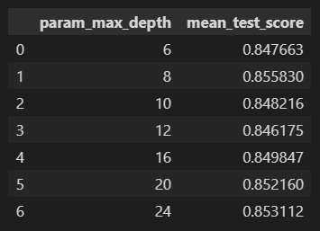

# day 22

## 머신러닝

### 분류

#### Decision Tree 과적합

`decision tree` 를 별 다른 제약없이 나누게 된다면 모든 데이터에 대해서 분류를 시도하기 때문에 과적합이 일어날 수 있다.

이를 그래프로 확인하면 알기 쉽다.


다음과 같은 데이터가 있다고 가정할때, 소스코드는 다음과 같다.

이 그래프를 `decision tree` 로 만들면 다음과 같다.


하나하나의 데이터에 대해서 모두 분류를 진행했기 때문에 과적합되어있는 상태라는걸 알 수 있다.

`min_samples_leaf = 6` 으로 설정하면 다음과 같이 바뀐다.


이처럼 그냥 `decision tree` 를 모델로 만들면 데이터 하나하나에 대해서 모두 분류를 하기 때문에 과적합 되기 쉽다는 것을 알 수 있다. 과적합이되면 새로운 데이터에 대해서 예측성능이 떨어지게된다. 따라서 하이퍼파라미터를 적절히 조절해서 과적합된 모델의 `variance` 를 낮춰주는것이 중요하다.


### 분류모델(Decision Tree) 실습 : 사용자 행동 인식 데이터 셋

30명의 사람에게 스마트 센서를 장착하여 사람의 동작과 관련된 여러가지 `feature` 를 수집한다. 이 데이터를 기반으로 사람의 행동을 예측하는 모델을 만들어본다.

#### feature 확인

`features.txt ` 파일에는 `feature` 들의 인덱스와 이름이 정리되어있다. 이를 `data frame` 으로 로드하여 확인해볼 수 있다.

```python
import pandas as pd

# 데이터 불러오기, \s+ 는 공백이 하나 이상이라는 뜻
feature_name_df = pd.read_csv("../data files/human_activity/features.txt",sep = '\s+', header = None, names = ['column_index','column_name'])

feature_name = feature_name_df.iloc[:,1].values.tolist()

# feature 10개만 추출
print(feature_name[:10])
```

행동 데이터에 대한 `feature` 가 너무 많아서 중복된 이름으로 되어있는 `feature` 가 존재한다. 모델을 학습시킬때, 중복된 `feature name` 은 에러를 불러일으킨다. 따라서 중복된 이름을 바꿔줘야 하고, 중복된 `feature` 의 개수가 얼마나되는지 확인해볼 필요가 있다.

```python
# 중복된 피쳐명 확인
feature_dup_df = feature_name_df.groupby('column_name').count()
print(feature_dup_df[feature_dup_df['column_index']>1].count())
feature_dup_df[feature_dup_df['column_index']>1].head()
```


중복된 이름을 가진  `feature name` 은 42개이다.

#### 데이터 로딩

데이터를 불러오는 과정에서 중복된 `feature name` 을 가지고 있으면 분석 과정에서 에러가 발생한다. 따라서 중복된 이름을 변경해줘야 한다.

다음 함수는 중복된 `feature name` 을 변경해주는 함수이다. `cumcount()` 함수를 통해 중복된 `feature` 가 몇번 중복되었는지 숫자를 센다. `dup_cnt` 열에 해당 정보가 저장된다. 1번 중복되면 `dup_cnt` 값이 1이되고 2번 중복되면 2가된다.

`dup_cnt` 를 생성한 `feature_dup_df` 에 `reset_index()` 함수로 인덱스를 새로 생성해준다. 이 인덱스를 기준으로 `feature name` 이 저장된 `data frame` 과 병합하게된다.

병합된 `data frame`은 `dup_cnt` 에 저장된 값에 따라서 새롭게 `feature name`을 설정한다. 예를들어, 1번째 중복된 `feature`의 경우 `feature_1` 과같이 저장된다. `apply(lambda x :)` 는 앞선 `new_feature_name_df[['column_name','dup_cnt']]` 의 데이터를 가지고 온다는 의미이다. 이 데이터에 `x[0]+'_'+str(x[1]) if x[1] > 0 else x[0]` 함수를 적용시킨다.

```python
# 중복된 feature에 인덱스를 붙여 중복을 피하게 하는 함수 생성
def get_new_feature_name(old_feature_name_df):
    # cumcount 함수를 사용하여 몇번째 중복인지 확인. cumcount는 중복이 발생할경우 1씩 올라간다.
    feature_dup_df = pd.DataFrame(data=old_feature_name_df.groupby('column_name').cumcount(),columns=['dup_cnt'])

    # 인덱스를 새로 추가
    feature_dup_df = feature_dup_df.reset_index()

    # feature name이 들어있는 data frame과 중복 feature 정보가 들어있는 data frame을 index 기준으로 모든 행을 병합
    new_feature_name_df = pd.merge(old_feature_name_df.reset_index(),feature_dup_df,how='outer')

    # 중복되는 feature name에 숫자 부여. 숫자는 dup_cnt에 의해 중복된 순서만큼 부여됨. 예를들어 2번째 중복이면 '_2'가 부여됨
    new_feature_name_df['column_name'] = new_feature_name_df[['column_name','dup_cnt']].apply(lambda x : x[0]+'_'+str(x[1]) if x[1] > 0 else x[0], axis =1)

    # index는 필요없으니 삭제함.
    new_feature_name_df = new_feature_name_df.drop(['index'],axis=1)
    
    # 중복 처리가 완료된 data frame 반환.
    return new_feature_name_df
```

다음으로는 `train set` 과 `test set` 을 만든다. `feature name` 의 중복을 제거한 data frame을 생성한 뒤, `feature` 데이터의 열 이름으로 지정한다.

`label` 데이터는 `action` 으로 열 이름을 지정하고 저장한다.

```python
def get_human_dataset():
    # 각 데이터파일들은 공백으로 분리되어 있기 때문에 공백문자를 sep로 할당.
    feature_name_df = pd.read_csv('../data files/human_activity/features.txt',sep='\s+',header=None,names=['column_index','column_name'])
    
    # 중복된 feature명을 수정
    new_feature_name_df = get_new_feature_name(feature_name_df)

    # data frame에 피처명을 컬럼으로 부여하기위해 리스트 객체로 다시 변환 모든 feature name은 1번째 열에 있음.
    feature_name = new_feature_name_df.iloc[:,1].values.tolist()

    # 학습 feature 데이터 셋과 테스트 feature 데이터를 dataframe으로 로딩. 컬럼은  feature_name 적용
    x_train = pd.read_csv('../data files/human_activity/train/X_train.txt',sep='\s+',names=feature_name)
    x_test = pd.read_csv('../data files/human_activity/test/X_test.txt',sep='\s+',names=feature_name)

    # 학습 label과 테스트 label 데이터를 data frame으로 로딩하고 컬럼명은 action으로 부여
    y_train = pd.read_csv('../data files/human_activity/train/y_train.txt',sep='\s+',names=['action'])
    y_test = pd.read_csv('../data files/human_activity/test/y_test.txt',sep='\s+',names=['action'])

    # 로드된 학습/테스트용 데이터프레임을 모두 반환
    return x_train,x_test,y_train,y_test
```

위 함수를 사용하여 `train data set` 과 `test data set` 을 저장한다.

```python
x_train, x_test, y_train, y_test = get_human_dataset()
```

불러온 데이터의 구조를 확인해볼 수 있다.

```python
print(x_train.info())
```


```python
print(y_train['action'].value_counts())
```


#### Cross Validation

`GridSearchCV` 함수를 이용해 `cross validation` 을 수행해보자. `verbose` 옵션은 각 시행마다 수행결과 메세지를 출력한다. 0이면 출력안함, 1이면 간단한 메세지 출력, 2면 하이퍼 파라미터별 메세지를 출력한다.

```python
from sklearn.tree import DecisionTreeClassifier
from sklearn.model_selection import GridSearchCV
from sklearn.metrics import accuracy_score

# decision tree 객체 생성
dt_clf = DecisionTreeClassifier(random_state=56)

# 하이퍼 파라미터 설정
params = {'max_depth' : [6,8,10,12,16,20,24]}

# grid search cv
grid_cv = GridSearchCV(dt_clf, param_grid= params, scoring='accuracy', cv=5, verbose=1)
grid_cv.fit(x_train,y_train)

print("최적 정확도 수치 : {:.4f}".format(grid_cv.best_score_))
print("최적 파라미터 : ",grid_cv.best_params_)
```


#### 성능평가

각각의 파라미터 별로 어떤 정확도를 보이는지 확인할 수 있다.

```python
# cv의 결과를 data frame으로 생성
cv_result_df = pd.DataFrame(grid_cv.cv_results_)

# max_depth 파라미터 값과 그 때의 정확도
cv_result_df[['param_max_depth','mean_test_score']]
```



완성된 모델을 테스트 데이터셋에 대해 성능평가를 할 수 있다.

```python
from sklearn.metrics import accuracy_score

# 최적 모델을 저장
best_dt_clf = grid_cv.best_estimator_

# test set에 대해서 성능평가
pred1 = best_dt_clf.predict(x_test)
accuracy = accuracy_score(y_test,pred1)
print("decision tree predict accuracy : {:.4f}".format(accuracy))
```


`feature importance` 를 시각화 할 수 있다.

```python
import seaborn as sns
import matplotlib.pyplot as plt
%matplotlib inline

# feature importance 저장
ftr_importance_values = best_dt_clf.feature_importances_

# 정렬과 그래프 표현을 용이하게 하기 위해 시리즈로 변환
ftr_importance_values = pd.Series(ftr_importance_values, index=x_train.columns)

# 중요도값 순으로 정렬 후 그래프 출력
ftr_top20 = ftr_importance_values.sort_values(ascending=False)[:20]
plt.figure(figsize=(8,6))
plt.title("Feature Importance Top 20",color = 'white')
plt.tick_params(color = "white", colors = "white")
sns.barplot(x=ftr_top20, y=ftr_top20.index)
plt.show()
```


## 앙상블

여러개의 분류기를 사용하여 모델의 성능을 향상시킨다. 여러 분류기의 예측 결과를 결합하여 단일 분류기가 가진 성능보다 좋은 성능을 이끌어낸다.

### 특징

1. 단일 모델의 약점을 다수의 모델을 결합하여 보완한다.
2. 뛰어난 성능들만 구성하는 것만이 좋은것은 아니다. 성능이 떨어지는 이질적인 모델을 섞는 것이 더 효과가 좋다
3. 랜덤 포레스트, 뛰어난 부스팅 알고리즘들은 모두 decision tree 알고리즘을 기반으로한다.
4. 과적합 문제를 다수의 분류기를 결합해서 보완, 직관적인 분류기준은 강화한다.

### 보팅, 배깅

보팅과 배깅은 여러 모델을 결합해 최종 예측값을 가지는 부분에서 비슷하나 약간은 다른 모습을 가진다

+ 보팅
  + 각각의 모델이 서로 다른 알고리즘을 사용한다
  + 각각의 모델은 같은 데이터셋을 사용한다
+ 배깅
  + 각각의 모델이 모두 같은 알고리즘을 사용한다.
  + 각각의 모델은 모두 다른 데이터셋을 사용한다. 전체 데이터 셋에서 샘플링한 데이터를 사용한다.

#### 보팅

+ 하드 보팅

  각각의 분류기가 예측한 결과를 모아 아웃풋을 낸다

  + 1, 3, 4 가 A를 예측하고 2가 B를 예측하면 B

+ 소프트 보팅

  각각의 분류기에 `class` 별 확률을 구해서 확률이 가장 높은 아웃풋을 결정한다. 평균적으로 소프트 보팅의 성능이 좋다.

  + 각각의 분류기의 확률을 종합한 결과가 A : 0.65, B : 0.35 이면 A

+ 실습

  유방암 환자 데이터를 토대로 보팅 모델을 생성해본다

  먼저 필요한 패키지와 데이터를 불러와 확인한다.

  ```python
  import pandas as pd
  
  from sklearn.ensemble import VotingClassifier
  from sklearn.linear_model import LogisticRegression
  from sklearn.neighbors import KNeighborsClassifier
  from sklearn.model_selection import train_test_split
  from sklearn.metrics import accuracy_score
  
  from sklearn.datasets import load_breast_cancer
  
  cancer = load_breast_cancer()
  
  data_df = pd.DataFrame(cancer.data, columns= cancer.feature_names)
  data_df.head()
  ```

  `voting classifier` 를 사용해 학습하고 정확도를 예측한다.

  ```python
  # 개별 모델 객체 선언. logistic regression 과 knn
  lr_clf = LogisticRegression()
  knn_clf = KNeighborsClassifier()
  
  # 개별 모델을 소프트 보팅 기반의 앙상블 모델로 구현한 뷴류기
  vo_clf = VotingClassifier(estimators=[('LR',lr_clf),('KNN',knn_clf)],voting='soft')
  x_train, x_test, y_train, y_test = train_test_split(cancer.data,cancer.target,test_size=0.2,random_state=56)
  
  # voting classifier 학습 / 예측 / 평가
  vo_clf.fit(x_train,y_train)
  pred_vo = vo_clf.predict(x_test)
  print('Voting Classifier Accuracy : {:.4f}'.format(accuracy_score(y_test,pred_vo)))
  ```

  

  개별 분류기의 성능도 예측해볼 수 있다.

  ```python
  # 개별모델의 학습 / 예측 / 평가
  classifier = [lr_clf,knn_clf]
  for c in classifier:
      c.fit(x_train,y_train)
      pred = c.predict(x_test)
      class_name = c.__class__.__name__
      print("{} Accuracy : {:.4f}".format(class_name,accuracy_score(y_test,pred)))
  ```

  

+ 성능

  일반적으로 소프트 보팅이 하드보팅보다 성능이 좋지만, 무조건적으로 좋다고 할 수 없다. 마찬가지로 보팅에 사용되는 분류 알고리즘에 수가 많아진다고 하더라도 성능이 좋아진다고 할 수 없다.

#### 배깅 - 랜덤 포레스트

1. 전체 학습데이터를 샘플링해 여러개의 데이터셋을 만들어낸다
2. 각각의 데이터 샘플링은 부트스트래핑 분할한다
3. 분할된 데이터 샘플링들을 기반으로 각각의 모델을 만들고 소프트 보팅으로 결합한다.

+ 실습

  앞서 `decision tree` 에서 사용한 [데이터셋](#데이터 로딩)을 사용한다.
  
  `random forest` 모델을 만들어 사용한다.
  
  ```python
  from sklearn.ensemble import RandomForestClassifier
  from sklearn.metrics import accuracy_score
  import warnings
  warnings.filterwarnings('ignore')
  
  # 랜덤 포레스트 학습 및 별도의 테스트 셋으로 예측성능평가
  rf_clf = RandomForestClassifier(random_state=56)
  rf_clf.fit(x_train,y_train)
  pred_rf = rf_clf.predict(x_test)
  accuracy = accuracy_score(y_test,pred_rf)
  print("Random Forest Accuracy : {:.4f}".format(accuracy))
  ```
  
  
  
+ 하이퍼 파라미터 설정

  하이퍼 파라미터를 설정하여 `GridSearchCV` 를 사용할 수 있다.

  ```python
  # 하이퍼 파라미터 설정
  from sklearn.model_selection import GridSearchCV
  
  params = {'n_estimators' : [100],
            'max_depth' : [6,8,10,12,14,16,18,20], 
            'min_samples_leaf' : [8,12,18,24], 
            'min_samples_split' : [8,16,20,24]
            }
  
  # random forest classifier 객체 생성 후 grid search cv 수행, n_jobs = -1 로 설정하면 모든 cpu의 코어를 사용하여 속도가 빨라짐.
  rf_clf = RandomForestClassifier(random_state=56, n_jobs=-1)
  grid_cv = GridSearchCV(rf_clf,param_grid=params, cv=3, n_jobs= -1)
  grid_cv.fit(x_train,y_train)
  
  print("최적 하이퍼 파라미터 : ",grid_cv.best_params_)
  print("최고 예측 정확도 {:.4f}".format(grid_cv.best_score_))
  ```

  
