# day 23

## Regrseeion

회귀분석은 데이터 값이 평균과 같은 일정한 값으로 돌아가려는 경향을 이용한 통계학 기법이다.

### Linear Regression

선형회귀식은

`Y = W1 * X1 + W2 * X2 + W3 + X3 .... Wn * Xn`

과 같이 종속변수 `Y`, 독립변수 `X` 그리고 회귀계수 `W` 로 이루어져있다.

linear regression은 데이터를 학습시켜 최적의 회귀계수 `W` 를 찾는 과정이다.

#### 회귀 종류

|   독립변수 개수    |   회귀 계수의 결합   |
| :----------------: | :------------------: |
|  1개 : 단일 회귀   |   선형 : 선형회귀    |
| 여러개 : 다중 회귀 | 비선형 : 비선형 회귀 |

|         분류          |  회귀  |
| :-------------------: | :----: |
|      category 값      | 숫자값 |
| 이산값 (두 개중 하나) | 연속값 |

#### 회귀분석

+ 결정적 모형

  완벽한 비례식의 모형. X와  Y의 관계가 오차가 없이 정확하다.

  그러나 현실에서 이런 모형은 거의 존재하지 않는다

+ 오차형 모형

  Y = f(X) + ϵ. ϵ는 오차값

#### Least Mean Square Error

`Y` 를 회귀모델에 대한 예측값이라 할 때, 예측값과 실제값의 차이를 `Error` 라고 말한다. 이 `Error` 값이 작은 모델일수록 좋은 모델이라고 할 수 있다.

`Error` 값은 `h(x) - Y` 로 측정하는데 이때 `h(x)` 는 실제값을 의미한다. `Y` 는 예측값으로, 모델을 의미하며 그래프상의 직선을 의미한다.

`MSE`, `Mean Square Error` 값은 
$$
ϵ = \sum(h(x) - y)^2
$$
다음과 같은 수식으로 표현할 수 있다.

제곱값으로 표현하는 이유는, `h(x) - y` 값이 음수가 나올 수 있기 때문이다. 단순히 `h(x) - y` 값의 총 합으로 계산하면 오류가 날 수 있기 때문이다.

`Error` 가 작은 모델이 좋은 모델이기에, `MSE` 값이 작은 모델이 좋은 모델이고, 이 값을 줄이는 것이 회귀모델의 목적이라 할 수 있다.

+ 경사하강법

  `Y = wX + ϵ` 식에서 가중치 `w` 를 결정하는 방법중 하나이다.

  2차식 포물선 형태의 특정 지점에서 미분하여 그 기울기를 구한다. 그 기울기가 최소가 되는 지점을 구하여 가중치를 결정한다.


### Linear Regression 실습

#### boston housing data

보스턴 지역의 주택가격을 예측해보는 실습을 진행하기 위한 데이터이다.

data set을 불러와 `data frame` 형태로 저장한다.

```python
import pandas as pd
from sklearn.datasets import load_boston
%matplotlib inline

# 데이터셋 로드
boston = load_boston()

# boston 데이타셋 변환
boston_df = pd.DataFrame(boston.data,columns=boston.feature_names)

# boston data set의 target array는 주택 가격이다. 이를 price 형태로 dataframe에 추가
boston_df['PRICE'] = boston.target
boston_df.head()
```

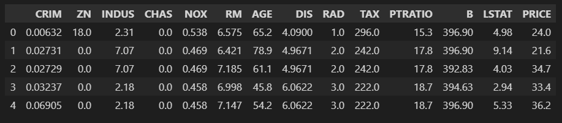

데이터의 구조를 확인해 볼 수 있다.

```python
boston_df.info()
```

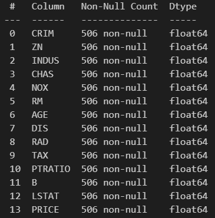

데이타는 모두 `float` 형이고 `null` 값은 존재하지 않는걸 알 수 있다.

#### 데이터 시각화

```python
import matplotlib.pyplot as plt
import seaborn as sns

fig, axs = plt.subplots(figsize = (16,8), ncols = 4, nrows = 2)
lm_features = ['RM','ZN','INDUS','NOX','AGE','PTRATIO','LSTAT','RAD']
sns.set_style("ticks")
for i , feature in enumerate(lm_features):
    row = int(i/4)
    col = i%4
    sns.regplot(x = feature, y = 'PRICE', data=boston_df,ax =axs[row][col])
```


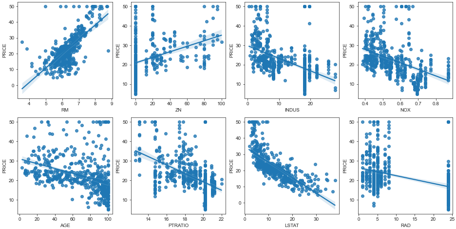

다음과 같이 변수들과 주택 가격간의 상관관계를 확인해볼 수 있다.

`RM` 의 경우 상당한 양의 상관관계를 띄고, `LSTAT` 은 확실한 음의 상관관계를 가진다. 다른 변수들은 크게 두드러지는 상관관계가 잘 보이지 않는다.

#### 모델 학습

`linear regression` 모델을 생성할 수 있다.

```python
from sklearn.model_selection import train_test_split
from sklearn.linear_model import LinearRegression
from sklearn.metrics import mean_squared_error, r2_score
import numpy as np

y_target = boston_df["PRICE"]
x_data = boston_df.drop(["PRICE"],axis=1,inplace=False)

x_train, x_test, y_train, y_test = train_test_split(x_data,y_target,test_size=0.3,random_state=56)

lr = LinearRegression()
lr.fit(x_train,y_train)
pred_lr = lr.predict(x_test)
mse = mean_squared_error(y_test,pred_lr)
rmse = np.sqrt(mse)
print("MSE : {:.3f} \nRMSE : {:.3f}".format(mse, rmse))
print("Valance Score : {:.3f}".format(r2_score(y_test,pred_lr)))
```

해당 모델의 결과로 `MSE` `RMSE` `R Square` 값을 구할 수 있다.

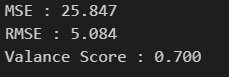

회귀계수를 출력할 수 있다. 

```python
# 회귀계수
coeff = pd.Series(data = np.round(lr.coef_,4),index= x_data.columns)
print(coeff.sort_values(ascending=False))
```

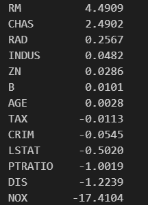

#### Cross Validation

`cross_val_score` 패키지를 통해 교차검증을 시행하고 `MSE` `RMSE` 값을 출력할 수 있다.

```python
from sklearn.model_selection import cross_val_score

y_target = boston_df["PRICE"]
x_data = boston_df.drop(["PRICE"],axis=1,inplace=False)
lr = LinearRegression()

neg_mse_score = cross_val_score(lr,x_data,y_target,scoring = 'neg_mean_squared_error',cv=5)
rmes_scores = np.sqrt(-1*neg_mse_score)
avg_rmse = np.mean(rmes_scores)

print("Negative MSE Scores : ",np.round(neg_mse_score,2))
print("RMSE Score : ",np.round(rmes_scores,2))
print("Average RMSE Score : {:.3f}".format(avg_rmse))
```

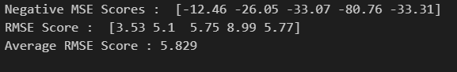


### Ridge Regression

선형회귀에 큰 회귀계수값의 예측 영향도를 감소시키기 위해 회귀계수값을 더 작게 만드는 L2 규제를 추가한 회귀모델

`Ridge Regression` 은 `feature` 의 `coef` 를 0에 가깝게 만들어서 영향력을 줄이는 기법이다. 따라서 모든 `feature` 가 모델에 포함된다.

#### 데이터 준비

앞서 사용한 Boston Housing 데이터를 그대로 사용한다.

```python
import pandas as pd
from sklearn.datasets import load_boston
%matplotlib inline

# 데이터셋 로드
boston = load_boston()

# boston 데이타셋 변환
boston_df = pd.DataFrame(boston.data,columns=boston.feature_names)

# boston data set의 target array는 주택 가격이다. 이를 price 형태로 dataframe에 추가
boston_df['PRICE'] = boston.target
boston_df.head()
```

#### Ridge

`Ridge` 객체를 생성한 후 교차검증을 통해서 `MSE` `RMSE` 값을 구할 수 있다.

```python
from sklearn.linear_model import Ridge
from sklearn.model_selection import cross_val_score

ridge = Ridge(alpha=10)
neg_mse_score = cross_val_score(ridge,x_data,y_target,scoring="neg_mean_squared_error",cv =5)
rmes_scores = np.sqrt(-1*neg_mse_score)
avg_rmse = np.mean(rmes_scores)

print("Negative MSE Scores : ",np.round(neg_mse_score,2))
print("RMSE Score : ",np.round(rmes_scores,2))
print("Average RMSE Score : {:.3f}".format(avg_rmse))
```

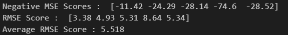

`alpha` 값은 학습데이터 적합 정도와 회귀계수값의 크기를 제어하는 튜닝 파라미터이다. `alpha` 값을 조정해가면서 교차검증을 수행할 수 있다.

```python
# set alpha
alphas = [0,0.1,1,10,100]

for alpha in alphas:
    ridge = Ridge(alpha=alpha)
    neg_mse_score = cross_val_score(ridge,x_data,y_target,scoring="neg_mean_squared_error",cv =5)
    avg_rmse = np.mean(np.sqrt(-1 *neg_mse_score))
    print("Average RMSE Score in alpha {} : {:.3f}".format(alpha,avg_rmse))
```

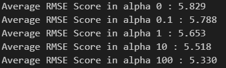

회귀계수를 시각화하여 실제로 어떻게 변화하는지 알 수 있다.

```python
# 회귀계수 시각화
fig, axs = plt.subplots(figsize = (16,8), ncols = 5, nrows = 1)

coeff_df = pd.DataFrame()

for pos,alpha in enumerate(alphas):
    # ridge regression
    ridge = Ridge(alpha=alpha)
    ridge.fit(x_data,y_target)

    # save coef
    coeff = pd.Series(data=ridge.coef_,index=x_data.columns)
    colname = 'alpha'+str(alpha)
    coeff_df[colname] = coeff

    # visualization
    coeff = coeff.sort_values(ascending=False)
    axs[pos].set_title(colname)
    axs[pos].set_xlim(-3,6)
    sns.barplot(x=coeff.values,y=coeff.index,ax=axs[pos])

plt.show()
```

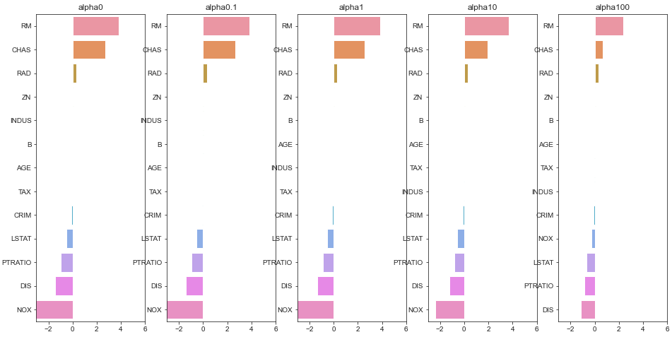

비정상적으로 큰 회귀계수들이 줄어든 것을 확인할 수 있다.


### Lasso Regression

`feature` 들의 상관계수를 0으로 만들어 실제 모델에 넣지 않는 기법이다.

#### get_linear_reg_model

`Ridge` `Lasso` `ElasticNet` 3가지 종류의 모델을 선택해서 모델의 `coef` 값을 출력하는 함수를 만들 수 있다.

```python
# 회귀계수를 반환하는 함수
from sklearn.linear_model import Lasso, ElasticNet

def get_linear_reg_eval(model_name, params =None, Xdata = None, ytarget=None,verbose = True, return_coeff = True):
    coeff_df = pd.DataFrame()
    if verbose : print(model_name)
    for param in params:
        if model_name == 'Ridge' : model = Ridge(alpha=param)
        elif model_name == 'Lasso' : model = Lasso(alpha=param)
        elif model_name == 'ElasticNet' : model = ElasticNet(alpha=param)
        neg_mse_score = cross_val_score(model,Xdata,ytarget,scoring="neg_mean_squared_error",cv =5)
        avg_rmse = np.mean(np.sqrt(-1 *neg_mse_score))
        print("Average RMSE Score in alpha {} : {:.3f}".format(param,avg_rmse))

        model.fit(Xdata,ytarget)
        if return_coeff :
            coeff = pd.Series(data=model.coef_,index = Xdata.columns)
            colname = 'alpha' + str(alpha)
            coeff_df[colname] = coeff
    return coeff_df
```

#### Lasso

`Lasso Regression` 의 `coef` 값을 출력할 수 있다.

```python
# set alpha
lasso_alpha = [0.07,0.1,0.5,1,3]
coeff_lasso_df = get_linear_reg_eval('Lasso',params = lasso_alpha,Xdata = x_data,ytarget = y_target)
```

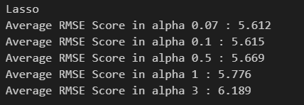

`coef` 값을 출력할 수 있다.

```python
sort_column = 'alpha'+str(lasso_alpha[0])
coeff_lasso_df.sort_values(by = sort_column,ascending=False)
```

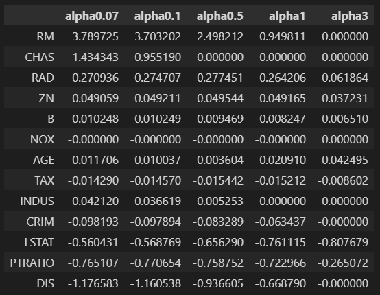

`CHAS` `NOX` 등의 `feature` 는 0으로 처리되어 실제 모델에 적용되지 않는 `feature` 라는 것을 알 수 있다.

이처럼 `Lasso Regression` 은 `feature` 의 `coefficient` 값을 0으로 만들어서 모델의 예측력을 향상시킨다.

### ElasticNet

`Lasso` 와 `Ridge` 의 특성을 합친 것이 `ElasticNet` 이다.

```python
# elasticnet
elastic_alpha = [0.07,0.1,0.5,1,3]
coeff_lasso_df = get_linear_reg_eval('ElasticNet',params = elastic_alpha,Xdata = x_data,ytarget = y_target)
```

`coef` 값을 출력해볼 수 있다.

```python
sort_column = 'alpha'+str(elastic_alpha[0])
coeff_elastic_df.sort_values(by = sort_column,ascending=False)
```

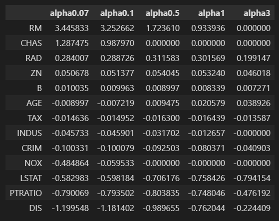

### 시계열 분석

시계열 분석을 위해 `conda install -c conda-forge pystan` 과 `conda install -c conda-forge fbprophet` 명령어를 통해 패키지를 설치한다.

[kaggle 아보카도 가격 데이터][https://www.kaggle.com/neuromusic/avocado-prices] 를 다운로드 받아 데이터를 사용한다.

#### 데이터 확인

