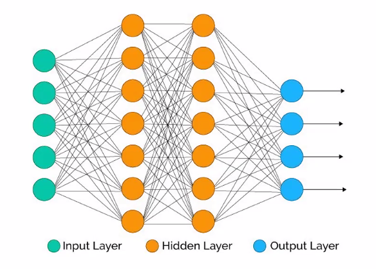

# day 24

## 딥러닝

### 프레임워크

#### 장,단점

+ 장점 
  + API의 사용법만 알면 딥러닝 알고리즘을 쉽고 빠르게 구현 가능
  + 최적화를 신경쓰지 않아도 프레임워크가 내부적으로 최적화
  + 구동되는  기기에 종속되지 않는 코드 작성 가능
  + 수치 연산 상의 문제로부터 안전한 구현 가능
+ 단점
  + API에서 제공하지 않는 기능은 구현하기 어려움
  + 프레임워크가 제공하는 수준 이상의 최적화 어려움
  + API버전에 따라 동일한 코드의 동작이 다를 수 있음
  + API에 버그가 있을경우 대응이 어려움

#### 종류

+ 텐서플로 : 가장 인기있는 딥러닝 프레임워크로, 저수준 라이브러리로 유연성이 뛰어남.
+ 파이토치 : 유연성과 모델 제작의 단순함을 추구. 토치를 파이썬으로 구현한 것이 파이토치
+ 케라스 : 단순한 API의 고수준 딥러닝 라이브러리로 사용, 확정성은 부족
+ 카페 : 자체적인 스크립트 언어로 딥러닝 모델 구현

### 모델

딥러닝도 머신러닝의 일부이기 때문에 모델을 만든다. 데이터를 가지고 알고리즘을 학습시키는 것이다. 

#### 퍼셉트론

퍼셉트론은 인공신경망을 구성한다.

인공신경망은 인간의 신경세포 뉴런이 자극을 받아서 정보를 전달하는 일련의 과정을 모방한다.

이러한 인공신경망이 복잡하게 연결되어 깊어지는것을 딥러닝(Deep Learning) 이라 말한다.

뉴런과 퍼셉트론은 동일하다.

#### Neural Network

`input layer`, `hidden layer`, `output layer`로 구성되어있다. 또한 `layer`마다 가중치 `w` 를 부여해서 굉장히 복잡한 모델을 만들 수 있다. 하지만 이렇게 훈련데이터로 복잡한 모형을 훈련시키면 과적합 문제가 일어날 수 있다.

+ CNN(Convolutional Neural Network) 

  이미지 처리에 주로 사용되는 알고리즘. 사진에 대한 특징을 잡아내어 학습한다. 사진을 픽셀로 나누어 수천개의 피쳐를 가지고 학습한다.

  이를 `graphical feature` 를 추출한다고 한다.

#### 다양한 분야

+ object detection
+ image resolation
+ auto encoder

