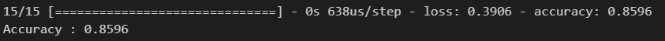
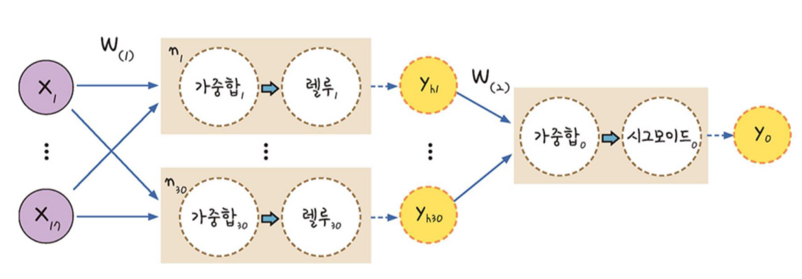
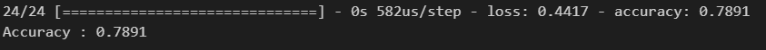
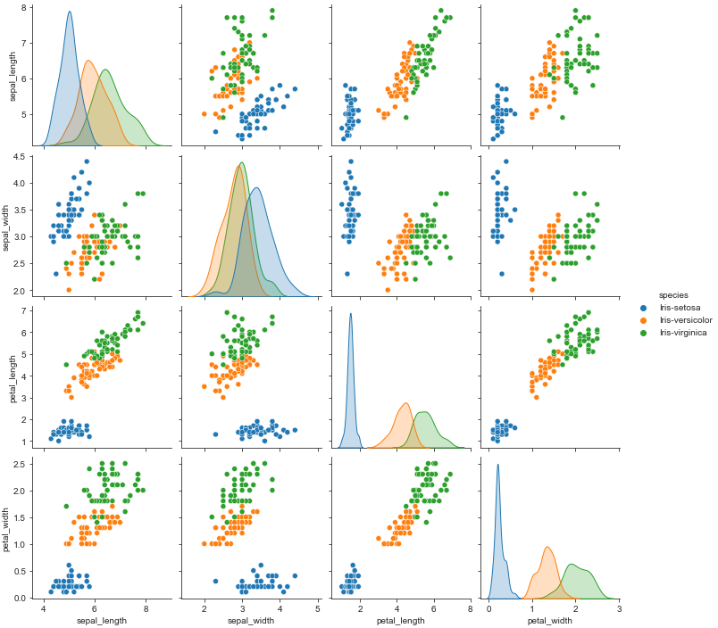
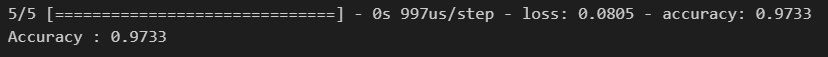

# day 25

## 딥러닝 실습

### 폐암 수술 환자 생존율 예측

#### 코드

+ 모듈

  `keras` 패키지를 로드한다.

  ```python
  from keras.models import Sequential
  from keras.layers import Dense
  ```

+ 데이터 로드

  데이터는 17개의 열과 1개의 라벨로 이루어져있다.

  ```python
  import numpy as np
  import tensorflow as tf
  
  # 반복 시행에서 같은 결과를 얻기 위한 시드값 설정
  np.random.seed(56)
  tf.random.set_seed(56)
  
  dataset = np.loadtxt('../data files/ThoraricSurgery.csv',delimiter=',')
  
  X = dataset[:,0:17]
  Y = dataset[:,17]
  ```

+ 딥러닝

  `Sequential` 함수로 딥러닝 틀을 생성한다.

  `add` 함수로 모델에 `input layer` 와 `hidden layer` 를 설정한다. `Dense` 함수의 첫번째 인자는 첫번째 `hidden layer` 의 수를 의미한다. `input_dim` 은 `input layer` 의 수를 의미한다. `activation` 은 기울기 소실 문제를 해결하는 함수를 결정한다. 해당 함수에 데이터를 입력하여 결과를 받는다는 의미이다.

  현재 모델에서는 `activation` 함수로 `relu` 와`sigmoid` 함수를 사용한다.

  ```python
  model = Sequential() 
  # Dense를 사용해 층 생성,input_dim은 입력데이터 열수만큼 지정, 그 다음 층의 수가30개
  model.add(Dense(30,input_dim = 17, activation='relu')) 
  # 그 다음 노드는 이전 출력이 input이되어 input_dim은 생략, 노드는 1개
  model.add(Dense(1,activation='sigmoid'))
  
  # 즉 이 구조는 17 -> 30 ->  1 의 구조
  ```

+ `binary_crossentropy` 는 이진분류기로, `True` or `False` 를 분류할 수 있다. 손실함수는 예측값과 실제값이 같으면 0이나와야 한다. `binary_crossentropy` 는 예측값과 실제값이 같을 때 0을 출력하고, 아닐 경우 다른 수를 출력하여 이진분류를 시행한다.

  `epoch` 는 전체 데이터를 학습시키는 횟수를 의미한다. 즉, `epoch = 100` 이면 전체데이터를 100번 학습시킨다.

  `batch_size` 옵션을 설정하면 데이터를 적절히 나눠서 넣는다. 10일경우 10개씩 나눠서 데이터를 넣는다.

  ```python
  # compile은 loss, optimizer, metrics를 설정
  model.compile(loss='binary_crossentropy',optimizer='adam',metrics=['accuracy'])
  model.fit(X,Y, epochs=100,batch_size=10)
  ```

결과를 출력해보면 다음과 같은 정확도를 확인할 수 있다.

```python
print("Accuracy : {:.4f}".format(model.evaluate(X,Y)[1]))
```



#### 구조



17개의 입력층을 지나 `relu` 함수를 통해 30개의 은닉층으로 간다. 그 다음 `sigmoid` 함수를 적용해 출력한다.


### 피마인디언 데이터 분석

#### 코드

+ 모듈 로딩

  ```python
  from keras.models import Sequential
  from keras.layers import Dense
  import numpy as np
  import tensorflow as tf
  
  # seed 값 생성
  np.random.seed(56)
  tf.random.set_seed(56)
  ```

+ 데이터 로딩

  ```python
  # 데이터 로딩
  dataset = np.loadtxt('../data files/pima-indians-diabetes.csv',delimiter=',')
  
  X = dataset[:,0:8]
  Y = dataset[:,8]
  ```

+ 모델 생성

  ```python
  # 딥러닝 틀 생성
  model = Sequential()
  
  # set input layer 
  model.add(Dense(12,input_dim = 8, activation='relu'))
  
  # set hidden layer
  model.add(Dense(8, activation = 'relu'))
  
  # set output layer
  model.add(Dense(1,activation = 'sigmoid'))
  ```

+ 모델 학습

  ```python
  # set loss, optimizer, metrics
  model.compile(loss='binary_crossentropy',optimizer='adam',metrics=['accuracy'])
  
  # set epochs, batch size and fit
  model.fit(X,Y, epochs=200,batch_size=10)
  ```

+ 정확도 출력

  ```python
  # show accuracy
  print("Accuracy : {:.4f}".format(model.evaluate(X,Y)[1]))
  ```

  


### 아이리스 데이터 분석

#### 시각화

```python
import pandas as pd
import seaborn as sns
import matplotlib.pyplot as plt

# 데이터 로드
data = pd.read_csv("../data files/iris.csv",names = ['sepal_length','sepal_width','petal_length','petal_width','species'])
print(data.head())

# 시각화
sns.set_style('ticks')
sns.pairplot(data,hue='species')
plt.show
```



#### 딥러닝 모델

+ 모듈

  ```python
  from keras.models import Sequential
  from keras.layers import Dense
  import numpy as np
  import tensorflow as tf
  from sklearn.preprocessing import LabelEncoder
  
  # seed 값 생성
  np.random.seed(56)
  tf.random.set_seed(56)
  ```

+ 데이터 전처리

  ```python
  # 데이터를 feature와 target으로 분리
  X = data.iloc[:,0:4]
  Y = data.iloc[:,4]
  
  # str로 되어있는 target data를 라벨인코딩
  encoder = LabelEncoder()
  encoder.fit(Y)
  Y_encoded = encoder.transform(Y)
  Y_labels = tf.keras.utils.to_categorical(Y_encoded)
  ```

+ 딥러닝 모델 생성

  ```python
  # 딥러닝 틀 생성
  model = Sequential()
  
  # set input layer 
  model.add(Dense(16,input_dim = 4, activation='relu'))
  
  # set output layer
  model.add(Dense(3,activation = 'softmax'))
  
  # set loss, optimizer, metrics
  model.compile(loss='categorical_crossentropy',optimizer='adam',metrics=['accuracy'])
  ```

+ 모델 학습

  ```python
  # set epochs, batch size and fit
  model.fit(X,Y_labels, epochs=50,batch_size=1)
  ```

+ 정확도 확인

  ```python
  # show accuracy
  print("Accuracy : {:.4f}".format(model.evaluate(X,Y_labels)[1]))
  ```

  