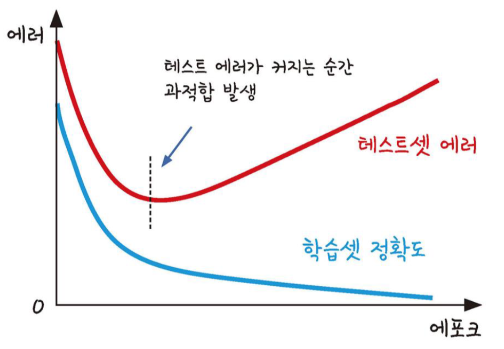
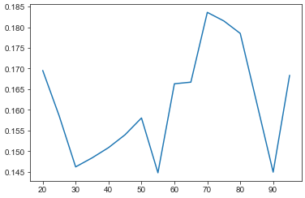
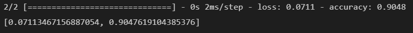
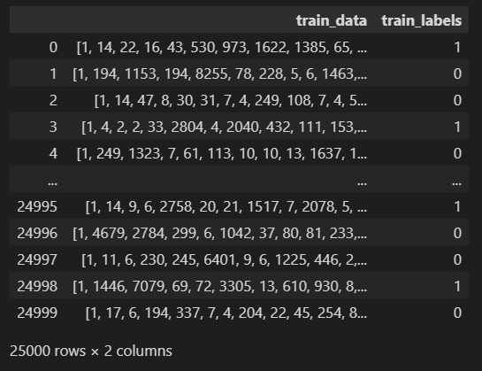
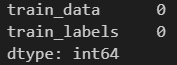
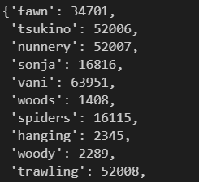
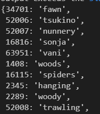
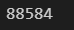
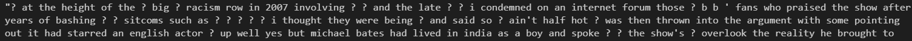

# day 26

## 딥러닝 실습

### 초음파 광물 예측

#### 과적합 방지

모델에 데이터를 학습시키다 보면, 너무 과다하게 학습을 시켜 모델에 과적합이 일어날 수 있다.

이 경우 학습 데이터에 대해서는 예측력이 좋지만, 실제 데이터에 대한 예측력이 떨어질 수 있다.

따라서 과적합을 방지해주기 위해서는 테스트 데이터를 활용해 모델을 검증해야한다.



테스트 데이터에 대한 에러가 커지면 과적합이 발생한다.

#### find best epoch

+ 모듈 및 데이터 로드

  ```python
  # cross validation을 통한 과적합 방지
  import pandas as pd
  from keras.models import Sequential, load_model
  from keras.layers import Dense
  import numpy as np
  import tensorflow as tf
  from sklearn.preprocessing import LabelEncoder
  from sklearn.model_selection import StratifiedKFold
  
  # seed 값 생성
  np.random.seed(56)
  tf.random.set_seed(56)
  
  # 데이터 로딩
  df = pd.read_csv('../data files//sonar.csv',header=None)
  ```

+ 데이터 전처리

  ```python
  # 전처리, 전체 데이터셋을 feature와 target으로 나눔
  dataset = df.values
  X = dataset[:,0:60].astype(float)
  Y_obj = dataset[:,60]
  
  # target data label encoding
  e = LabelEncoder()
  e.fit(Y_obj)
  Y = e.transform(Y_obj)
  ```

+ find best epoch

  테스트 셋에 대한 에러가 높아지는 `epoch` 를 찾기 위해 20~100 까지 5씩 올려가며 모델을 학습시켜본다.

  각각의 `epoch` 에 대한 결과를 저장하고 출력한다.

  ```python
  from sklearn.model_selection import train_test_split
  
  X_train, X_test, Y_train, Y_test = train_test_split(X,Y,test_size=0.3,random_state=56)
  a = []
  
  for i in range(20,100,5):
      model = Sequential()
      model.add(Dense(24,input_dim = 60, activation='relu'))
      model.add(Dense(10,activation='relu'))
      model.add(Dense(1,activation='sigmoid'))
      model.compile(loss='mean_squared_error',optimizer='adam',metrics=['accuracy'])
      model.fit(X_train,Y_train,epochs=i,batch_size=5)
      a.append(model.evaluate(X_test,Y_test))
  ```

  출력

  ```python
  ep = 20
  for i in range(len(a)):
      print("epoch : {}    mse : {:.4f}   accuracy : {:.4f}".format(ep,a[i][0],a[i][1]))
      ep += 5
  ```

  

  출력 결과를 시각화하면 다음과 같다.

  ```python
  import seaborn as sns
  
  ep_arr = [i for i in range(20,100,5)]
  result = []
  for i in range(len(a)):
      result.append(a[i][0])
  
  sns.set_style('ticks')
  sns.lineplot(x=ep_arr,y=result)
  ```

  

  `epoch` 가 30, 55, 90일 때, 모델이 좋은 성능을 보인다. 이중 최소값의 `epoch` 인 55를 이용해 교차검증을 시행한다.

#### epoch에 대한 검증

`epoch` 는 30, 55, 90일 때 `mse` 가 낮아진다. `test data` 에 대한 `mse` 값이 올라가는 순간이 과적합된 순간이라고 볼 수 있다. 하지만 이 그래프에서는 3번 `mse` 가 상승한다. 모델의 문제일수도 있고, 표준화가 덜 되었을 수도 있고 데이터의 문제일 수도 있다.

이렇게 여러 부분에서 `epoch` 에 대한 `mse` 값이 왔다갔다 거릴때에는 나는 가장 정확도가 높은 `epoch` 값을 선택했다. 따라서 `best epoch` 값을 55로 설정했다.

#### 교차검증

```python
# k-fold
skf = StratifiedKFold(n_splits=10,shuffle=True,random_state=56)

# 학습실행
accuracy = []

for train, test in skf.split(X,Y):
    model = Sequential()
    model.add(Dense(24,input_dim = 60, activation='relu'))
    model.add(Dense(10,activation='relu'))
    model.add(Dense(1,activation='sigmoid'))
    model.compile(loss='mean_squared_error',optimizer='adam',metrics=['accuracy'])
    model.fit(X[train],Y[train],epochs=55,batch_size=5)
    k_accuracy = "%.4f"%(model.evaluate(X[test],Y[test])[1])
    accuracy.append(k_accuracy)
```

```python
# 모델 저장/삭제 후 불러와서 재실행
model.save('my_model.h5')
del model
model = load_model('my_model.h5')
model.evaluate(X_test,Y_test)
```




## 영화 데이터 분류

영화에 대한 리뷰 데이터에 대해서 분석을 실시한다.

### 데이터

#### 데이터 로드

`keras` 모듈에 저장된 데이터를 활용한다. `num_words` 옵션은 단어의 수를 의미한다.

`imdb` 에 저장된 데이터는 숫자로 된 이중 리스트이다. 이 숫자는 단어를 의미한다. 단어의 집합은 전체 리뷰에 사용된 단어들 중 가장 많이 사용된 순서로 정렬되어있다. 

```python
from keras.datasets import imdb

(train_data, train_labels), (test_data, test_labels) = imdb.load_data(num_words = 10000)
```

훈련데이터 25000개, 테스트데이터 25000개로 이루어져있다.

다음으로 데이터를 `DataFrame` 형식으로 변환해준다.

```python
import pandas as pd

train_data_df = pd.DataFrame(train_data)
train_labels_df = pd.DataFrame(train_labels)

movie_df = pd.DataFrame(train_data_df)
movie_df.columns = ['train_data']
movie_df['train_labels'] = train_labels_df
movie_df
```



데이터에 `Null` 값이 있는지 확인한다.

```python
# dataframe 에 null값이 있는지 확인.
movie_df.isnull().sum()
```



숫자와 맵핑된 단어를 찾는다. 먼저 단어 딕셔너리를 받아온다.

```python
# 숫자와 맵핑된 단어 찾기
word_index = imdb.get_word_index()
word_index
```



위와같이 단어가 키로, 숫자가 값으로 들어가있다. 숫자로 단어를 찾아야 하기 때문에 딕셔너리의 키와 값을 바꿔준다.

```python
# 딕셔너리의 키와 값 서로 바꾸기
word_dict = dict([(value, key) for (key,value) in word_index.items()])
word_dict
```



전체 단어의 수를 출력해본다.

```python
len(word_dict)
```



전체 단어 수는 88584개이다.

#### 리뷰 확인

데이터는 단어가 숫자로 바뀌어있는 상태이다. 리뷰를 확인하기 위해서는 리뷰 데이터의 숫자를 단어로 변환해주어야 한다. `convert_review` 함수는 숫자로 되어있는 리뷰 데이터를 실제 리뷰로 바꿔주는 함수이다.

리뷰 데이터의 0, 1, 2는 미리 예약되어있다. 0은 패딩이다. 나중에 혹시 사용될 수 있기 때문에 미리 비워둔 값이다. 1은 문서의 시작을 알리는 값이다. 리스트의 첫 단어는 항상 1이다. 2는 사전에 없는 단어를 의미한다.

즉 원래 딕셔너리의 값에서 3을 빼야 본래의 값이 나온다. 데이터 33이라 저장된 값은 실제로는 30번째값이다. 3개의 데이터가 미리 예약되어있기 때문에다. 따라서 첫 번째 단어인 `the` 는 본래 1의 값을 가지지만, 데이터 내부에서는 4이다.

그러면 3은 없는건가? 3은 데이터 내부에 존재하지 않는다.

```python
for i in range(len(train_data[17])):
    a = train_data[17][i]
    if a == 3:
        print(a)
```

위 코드는 데이터 내부의 모든 단어를 체크해서 3이 있으면 출력하는 코드이다. 하지만 출력값은 없다. 따라서 3은 존재하지 않는다.

```python
def convert_review(num):
    a = ""
    for i in train_data[num]:
        a = a + word_dict.get(i-3,'?') + " "
    return a
```

실제 데이터를 출력해보면 `?` 가 많이 나오는 걸 볼 수 있다. 이는 사전에 없는 단어라는 뜻이며, 상위 10000개의 단어 안에 들어있지 않아서이다.

```python
convert_review(17)
```

