# day 27

## 영화 데이터 분류

### 데이터

#### 데이터 준비

+ 벡터화

  현재의 데이터를 벡터로 변환해야 딥러닝 모델에 학습이 가능하다. 벡터 변환은 원 핫 인코딩을 사용한다. 

  데이터는 25000개의 행을 가진 이중리스트의 성격을 띄고있다.

  ```python
  import numpy as np
  
  # 10000개의 열을 가지는 벡터를 생성하고, 해당 단어가 존재하면 1
  def vectorize_sequence(sequences, dimension = 10000):
      results = np.zeros((len(sequences),dimension))
      for i, sequence in enumerate(sequences):
          results[i,sequence] = 1
      return results
  
  # 훈련 데이터를 벡터로 변환
  X_train = vectorize_sequence(train_data).astype('float32')
  
  # 테스트 데이터를 벡터로 변환
  X_test = vectorize_sequence(test_data).astype('float32')
  ```

  위 코드는 데이터를 10000개의 열을 가진 벡터로 변환한다. 10000개인 이유는 데이터를 로드할 때 10000개로 단어를 제한했기 때문이다.

  `results = np.zeros((len(sequence),dimension))` 는 25000개의 행과 10000개의 열을 가진 모든 원소가 0인 이중리스트를 생성한다. `sequence` 에 들어갈 데이터는 훈련 와 테스트데이터이므로, 25000개의 행을 가진다.

  그 다음, `enumerate` 함수를 통해 `sequence` 의 인덱스와 키를 반복해서 빼온다. `i` 에는 인덱스를, `sequence` 에는 키를 저장한다.

  `results[i,sequence] = 1` 는 앞서 생성한 `result` 의 원소를 1로 바꾼다. `i` 번째 행의 `sequece` 에 해당하는 열을 가진 원소는 그 열 번호와 맵핑되는 단어가 존재하기 때문에 1로 변경한다.

  이 결과로 변경되는 데이터는 [25000,10000] 의 사이즈를 가지고 있으며 사용된 단어가 존재할 경우 1, 없을경우 0인 이중 배열의 형태를 띈다.


### 딥러닝 모델

#### 모델 생성

```python
from keras import models
from keras import layers

model = models.Sequential()
model.add(layers.Dense(16,activation = 'relu',input_shape = (10000,)))
model.add(layers.Dense(16,activation='relu'))
model.add(layers.Dense(1,activation='sigmoid'))

model.compile(optimizer='rmsprop',loss='binary_crossentropy',metrics=['accuracy'])
```

#### 모델 학습

훈련 데이터와 검증 데이터로 나눈다.

```python
# 훈련데이터와 검증데이터 나누기
x_val = x_train[:10000].astype(float)
partial_x_train = x_train[10000:].astype(float)

y_val = train_labels[:10000].astype(float)
partial_y_train = train_labels[10000:].astype(float)
```

모델을 학습시킨다. `validation data` 로 검증한다.

```python
history = model.fit(partial_x_train,partial_y_train,epochs=20,batch_size=512,validation_data=(x_val,y_val))
```

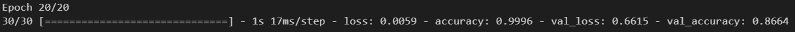

훈련데이터에 대한 `loss` , 검증 데이터에 대한 `loss` 를 알 수 있다.

#### 결과 시각화

모델의 결과를 객체에 저장, 시각화를 위한 `epochs` 객체 생성

```python
loss = history.history['loss']
val_loss = history.history['val_loss']
acc = history.history['accuracy']
val_acc = history.history['val_accuracy']
epochs = range(1,len(acc)+1)
```

`loss` 에 대한 그래프 생성

```python
import matplotlib.pyplot as plt

# bo는 파란색 점을 의미
plt.plot(epochs,loss,'bo',label = 'training loss')

# b는 파란색 실선을 의미
plt.plot(epochs,val_loss,'b',label = 'validation loss')

plt.title('Training and Validation loss',color = 'white')
plt.xlabel('Epochs',color = 'white')
plt.ylabel('Loss',color = 'white')
plt.legend()
plt.tick_params(colors = 'white', color = 'white')

plt.show()
```

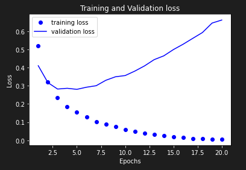

`accuracy` 에 대한 그래프 생성

```python
plt.plot(epochs,acc,'bo',label = 'training accuracy')
plt.plot(epochs,val_acc,'b',label = 'validation accuracy')
plt.title('Training and Validation accuracy',color = 'white')
plt.xlabel('Epochs',color = 'white')
plt.ylabel('Accuracy',color = 'white')
plt.legend()
plt.tick_params(colors = 'white', color = 'white')
```

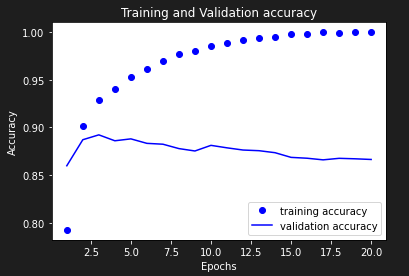

`epochs = 2` 부근에서 `validation set` 에 대한 `loss` 는 증가하고 `accuracy` 는 낮아지는 것을 볼 수 있다.

이는 학습을 계속 하면 훈련 데이터에 대해서는 잘 알게되지만, `variance` 가 증가하여 새로운 데이터에 대해서는 예측 성능이 떨어진다고 볼 수 있다.

#### epochs = 4 로 설정하고 모델 재 학습

학습횟수를 줄여 가장 성능이 좋은 `epoch` 을 찾고자 한다.

우선 기존의 모델을 삭제하고 모델을 다시 생성한다.

```python
# 학습된 모델을 삭제하고 새 모델을 생성한다.
del model

# 모델 생성
model = models.Sequential()
model.add(layers.Dense(16,activation = 'relu',input_shape = (10000,)))
model.add(layers.Dense(16,activation='relu'))
model.add(layers.Dense(1,activation='sigmoid'))
model.compile(optimizer='rmsprop',loss='binary_crossentropy',metrics=['accuracy'])
```

`epoch = 4` 로 설정하여 모델을 학습시킨다.

```python
history = model.fit(partial_x_train,partial_y_train,epochs=4,batch_size=512,validation_data=(x_val,y_val))
```

학습된 모델의 정보를 저장한다.

```python
loss = history.history['loss']
val_loss = history.history['val_loss']
acc = history.history['accuracy']
val_acc = history.history['val_accuracy']
epochs = range(1,len(acc)+1)
```

`loss` 와 `accuracy` 그래프를 출력한다.

```python
plt.plot(epochs,loss,'bo',label = 'training loss')
plt.plot(epochs,val_loss,'b',label = 'validation loss')
plt.title('Training and Validation loss',color = 'white')
plt.xlabel('Epochs',color = 'white')
plt.ylabel('Loss',color = 'white')
plt.legend()
plt.tick_params(colors = 'white', color = 'white')
plt.show()
```

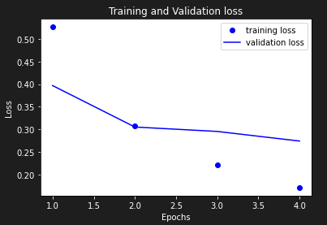

```python
plt.plot(epochs,acc,'bo',label = 'training accuracy')
plt.plot(epochs,val_acc,'b',label = 'validation accuracy')
plt.title('Training and Validation accuracy',color = 'white')
plt.xlabel('Epochs',color = 'white')
plt.ylabel('Accuracy',color = 'white')
plt.legend()
plt.tick_params(colors = 'white', color = 'white')
```

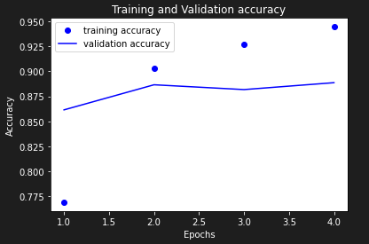


#### 성능평가

```python
model.predict(x_test)
```


## 뉴스 기사 분류 : 다중 분류 문제

### 데이터

#### 데이터 로드

사용 빈도 수 상위 10000개의 단어 정보만을 가지고 데이터를 가져온다. (`num_words = 10000` 옵션)

```python
from keras.datasets import reuters

(train_data, train_labels) , (test_data, test_labels) = reuters.load_data(num_words = 10000)
```

이 데이터는 훈련데이터는 8982개, 테스트 데이터는 2246개의 데이터를 가지고 있다.

데이터를 자세히 살펴보기위해 데이터프레임으로 변환한다.

```python
# 데이터프레임으로 변경
import pandas as pd

train_data_df = pd.DataFrame(train_data)
train_labels_df = pd.DataFrame(train_labels)

news_df = pd.DataFrame(train_data_df)
news_df.columns = ['train_data']
news_df['train_labels'] = train_labels_df
news_df
```

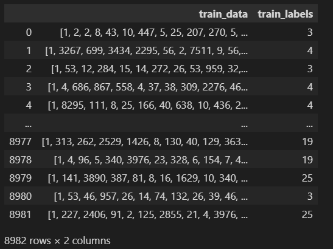

데이터의 대략적인 정보를 확인한다.

```python
news_df.info()
```

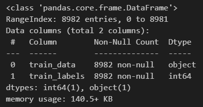

`null` 값은 존재하지 않는걸 알 수 있다.

```python
# 토픽의 개수와 각 토픽의 개수 확인
news_df['train_labels'].value_counts().sort_index()
```

전체 토픽의 개수는 46개이다.

데이터에 사용된 단어 딕셔너리를 가져올수 있다.

```python
# 단어 리스트 가져오기
word_index = reuters.get_word_index()
```

딕셔너리는 `키:값` 이  `단어:숫자` 형태로 되어있다. 숫자를 가지고 단어를 확인하기 위해 이를 뒤바꿔준다.

```python
# 딕셔너리의 키,값 바꾸기
word_dict = dict([(value, key) for (key,value) in word_index.items()])

# 전체 딕셔너리의 길이 확인. 30979개의 단어가 있다.
len(word_dict)
```

`convert_review` 함수를 써서 기사를 확인해 볼 수 있다.

```python
def convert_review(num):
    a = ""
    for i in train_data[num]:
        a = a + word_dict.get(i-3,'?') + " "
    return a
convert_review(106)
```

#### 데이터 전처리

`vectorize_sequence` 함수로 10000개의 열을 가진 데이터로 변환한다. 각각의 열은 단어를 의미하며, 단어가 존재하면 1, 아니면 0이다.

```python
import numpy as np

# 10000개의 열을 가지는 벡터를 생성하고, 해당 단어가 존재하면 1
def vectorize_sequence(sequences, dimension = 10000):
    results = np.zeros((len(sequences),dimension))
    for i, sequence in enumerate(sequences):
        results[i,sequence] = 1
    return results

# 훈련 데이터를 벡터로 변환
x_train = vectorize_sequence(train_data).astype('float32')

# 테스트 데이터를 벡터로 변환
x_test = vectorize_sequence(test_data).astype('float32')
```


### 딥러닝 모델

#### 모델 생성

딥러닝 모델을 생성한다. `input_layer` 는 10000개이며, 결과는 46개이다.

`optimizer` 는 `adam` 으로 설정했다. [optimizer 설명][https://onevision.tistory.com/entry/Optimizer-%EC%9D%98-%EC%A2%85%EB%A5%98%EC%99%80-%ED%8A%B9%EC%84%B1-Momentum-RMSProp-Adam]은 이 링크를 통해 자세히 알 수 있다.

`sparse_categorical_crossentropy` 는 데이터가 원 핫 인코딩 되어있지 않은 라벨링 데이터일 경우 사용한다.

```python
from keras import models
from keras import layers

model = models.Sequential()
model.add(layers.Dense(20,activation = 'relu',input_shape = (10000,)))
model.add(layers.Dense(20,activation='relu'))
model.add(layers.Dense(46,activation='softmax'))
model.compile(optimizer='rmsprop',loss='sparse_categorical_crossentropy',metrics=['accuracy'])
```

#### 모델 학습

훈련데이터와 검증데이터를 나눈다.

```python
# 훈련데이터와 검증데이터 나누기
x_val = x_train[:6000].astype(float)
partial_x_train = x_train[6000:].astype(float)

y_val = train_labels[:6000].astype(float)
partial_y_train = train_labels[6000:].astype(float)
```

모델을 학습시킨다.

```python
history = model.fit(partial_x_train,partial_y_train,epochs=20,batch_size=200,validation_data=(x_val,y_val))
```

#### 결과 시각화

모델 결과에 대한 정보를 저장한다.

```python
loss = history.history['loss']
val_loss = history.history['val_loss']
acc = history.history['accuracy']
val_acc = history.history['val_accuracy']
epochs = range(1,len(acc)+1)
```

`loss` 에 대한 시각화

```python
import matplotlib.pyplot as plt

plt.plot(epochs,loss,'bo',label = 'training loss')
plt.plot(epochs,val_loss,'b',label = 'validation loss')
plt.title('Training and Validation loss',color = 'white')
plt.xlabel('Epochs',color = 'white')
plt.ylabel('Loss',color = 'white')
plt.legend()
plt.tick_params(colors = 'white', color = 'white')
plt.show()
```

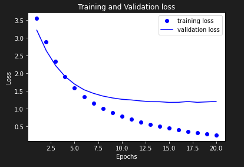

`accuracy` 에 대한 시각화

```python
plt.plot(epochs,acc,'bo',label = 'training accuracy')
plt.plot(epochs,val_acc,'b',label = 'validation accuracy')
plt.title('Training and Validation accuracy',color = 'white')
plt.xlabel('Epochs',color = 'white')
plt.ylabel('Accuracy',color = 'white')
plt.legend()
plt.tick_params(colors = 'white', color = 'white')
```

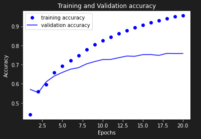

#### 결과 분석

`epoch = 5` 정도쯤에서 `loss` 의 감소폭이 줄어들고있다. `accuracy` 의 상승폭도 이 지점을 기점으로 줄어든다. 모델의 `accuracy` 가 증가하다 떨어지지 않고, `loss` 가 감소하다가 다시 올라가지 않는 모습을 볼 수 있다.

물론 훈련데이터와 검증데이터간의 차이가 보여진다. 이는 훈련데이터에 과적합되어서 훈련데이터를 더 잘 예측하는 것으로 보여진다. 하지만 `epoch = 20` 까지의 결과를 보았을 때 비록 약간의 과적합이 이루어져 훈련데이터를 더 잘 예측하고 검증데이터를 더 잘 예측하지 못하지만, 실질적으로 `accuracy` 가 증가하고 `loss` 가 감소하였기 때문에 모델자체의 성능은 `epoch` 5를 기준으로 보았을 때 더 뛰어나다고 생각된다.

`epoch` 을 40으로 늘려서 다시 한번 모델을 만들어 보고 적절한 수준의 `epoch` 을 찾아서 성능평가를 해야 한다고 생각된다.

#### epoch을 40으로 설정하고 모델 재 학습

모델 재학습

```python
# 모델 삭제
del model

# 모델 재생성
model = models.Sequential()
model.add(layers.Dense(20,activation = 'relu',input_shape = (10000,)))
model.add(layers.Dense(20,activation='relu'))
model.add(layers.Dense(46,activation='softmax'))
model.compile(optimizer='rmsprop',loss='sparse_categorical_crossentropy',metrics=['accuracy'])

# epoch = 40 으로 모델 재 학습
history = model.fit(partial_x_train,partial_y_train,epochs=40,batch_size=200,validation_data=(x_val,y_val))
```

시각화

```python
# 데이터 저장
loss = history.history['loss']
val_loss = history.history['val_loss']
acc = history.history['accuracy']
val_acc = history.history['val_accuracy']
epochs = range(1,len(acc)+1)

# loss에 대한 시각화
plt.plot(epochs,loss,'bo',label = 'training loss')
plt.plot(epochs,val_loss,'b',label = 'validation loss')
plt.title('Training and Validation loss',color = 'white')
plt.xlabel('Epochs',color = 'white')
plt.ylabel('Loss',color = 'white')
plt.legend()
plt.tick_params(colors = 'white', color = 'white')
plt.show()

# accuracy에 대한 시각화
plt.plot(epochs,acc,'bo',label = 'training accuracy')
plt.plot(epochs,val_acc,'b',label = 'validation accuracy')
plt.title('Training and Validation accuracy',color = 'white')
plt.xlabel('Epochs',color = 'white')
plt.ylabel('Accuracy',color = 'white')
plt.legend()
plt.tick_params(colors = 'white', color = 'white')
```

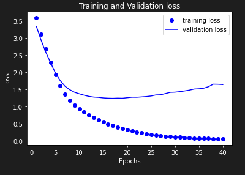

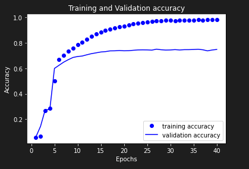

재학습된 모델의 그래프를 보면 `loss` 는 `epoch = 15` 를 기점으로 상승하고, `accuracy` 또한 `epoch = 15` 를 기점으로 거의 상승하지 않는다.

따라서 성능평가에는 `epoch = 15` 를 사용한다.

#### 성능평가

```python
model.predict(x_test)
```

```python
# 첫 번째 기사의 토픽의 결과값을 보여준다.
np.argmax(prediction[0])
```

