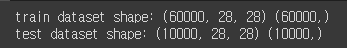
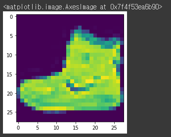
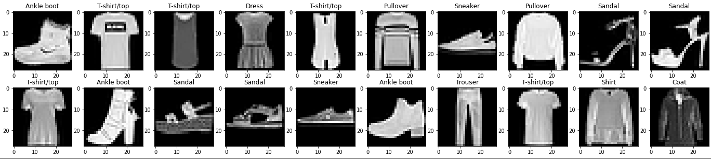
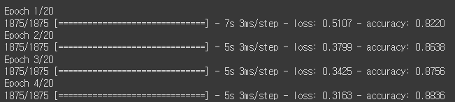
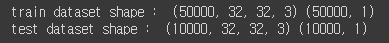
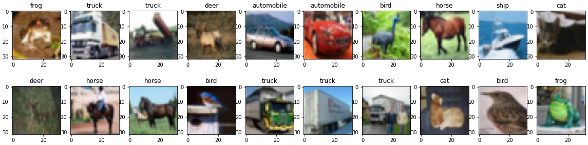
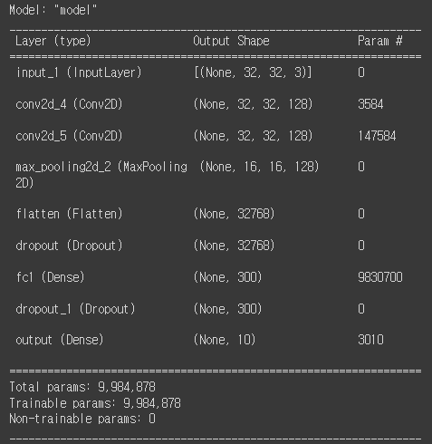
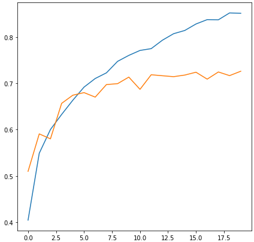
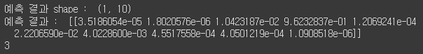

# day 29

## 딥러닝 모델 생성

### mnist data

#### 데이터 로딩

```python
from tensorflow.keras.datasets import fashion_mnist, mnist

(train_images, train_labels), (test_images, test_labels) = fashion_mnist.load_data()

# image size는 28x28의 grayscale 2차원 데이터
print("train dataset shape:", train_images.shape, train_labels.shape)
print("test dataset shape:", test_images.shape, test_labels.shape)
```



#### 데이터 시각화

```python
# MNIST image array 시각화
import matplotlib.pyplot as plt

plt.imshow(train_images[0])
```



20개의 사진을 병렬로 시각화

```python
class_names = ['T-shirt/top', 'Trouser', 'Pullover', 'Dress', 'Coat','Sandal', 'Shirt', 'Sneaker', 'Bag', 'Ankle boot']

plt.figure(figsize = (20,5))
for i in range(20):
  plt.subplot(2,10,i+1)
  plt.imshow(train_images[i],cmap = 'gray')
  plt.title(class_names[train_labels[i]])
```



#### 데이터 전처리

각각의 데이터는 0~255까지의 범위를 가지고 있다. 이 데이터를 0~1의 범위를 가지는 데이터로 만들고자 하여 모든 원소를 255로 나눠준다.

```python
import numpy as np
def get_preprocessed_data(images,labels):
  images = np.array(images/255.0,dtype = np.float32)
  labels = np.array(labels,dtype = np.float32)
  return images, labels
  
train_images, train_labels = get_preprocessed_data(train_images, train_labels)
test_images, test_labels = get_preprocessed_data(test_images, test_labels)
```

#### 딥러닝 모델 생성

```python
INPUT_SIZE = 28

from tensorflow.keras.layers import Dense, Flatten
from tensorflow.keras.models import Sequential

model = Sequential([
                    Flatten(input_shape =(INPUT_SIZE,INPUT_SIZE)),
                    Dense(100, activation = 'relu'),
                    Dense(30, activation = 'relu'),
                    Dense(10, activation = 'softmax')
])

model.summary()
```

#### 모델 학습

```python
from tensorflow.keras.optimizers import Adam
from tensorflow.keras.losses import CategoricalCrossentropy
from tensorflow.keras.metrics import Accuracy

model.compile(optimizer=Adam(0.001), loss = 'sparse_categorical_crossentropy',metrics = ['accuracy'])
```

```python
history = model.fit(x = train_images, y = train_labels, batch_size = 32, epochs = 20, verbose = 1)
```



#### 결과 확인

각각의 `epoch`에 대한 `loss` 와`accuracy`

```python
print(history.history['loss'])
print(history.history['accuracy'])
```

테스트 데이터에 대해서 예측

```python
pred_probs = model.predict(test_images)
```

테스트 데이터에 대해서 모델이 예측한 결과 확인

```python
np.argmax(pred_probs[0])
```

전체 테스트데이터에 대해서 성능평가

```python
model.evaluate(test_images, test_labels, batch_size = 64)
```


## CNN

### CIFAR10 데이터

#### 데이터 준비

```python
import numpy as np
import pandas as pd
import os

from tensorflow.keras.datasets import cifar10

(train_images, train_labels),(test_images,test_labels) = cifar10.load_data()

print("train dataset shape : ", train_images.shape, train_labels.shape)
print("test dataset shape : ", test_images.shape, test_labels.shape)
```



데이터는 (32,32,3)의 규격을 가진 `RGB` 데이터이다.

#### 데이터 시각화

20개의 이미지를 병렬로 시각화한다.

```python
names = np.array(["airplane","automobile","bird","cat","deer","dog","frog","horse","ship","truck"])

import matplotlib.pyplot as plt
import cv2

plt.figure(figsize = (20,5))
for i in range(20):
  plt.subplot(2,10,i+1)
  plt.imshow(train_images[i])
  plt.title(names[train_labels[i]].squeeze())
```



#### 데이터 전처리

image array의 0~255 사이의 값을 0~1 사이의 값으로 변환함. 정수값 pixel을 255.0으로 나눈다.

```python
(train_images, train_labels),(test_images,test_labels) = cifar10.load_data()

def get_preprocessed_data(images,labels):
  images = np.array(images/255.0,dtype = np.float32)
  labels = np.array(labels,dtype = np.float32)
  return images, labels
  
train_images, train_labels = get_preprocessed_data(train_images, train_labels)
test_images, test_labels = get_preprocessed_data(test_images, test_labels)
```

2차원 형태로 되어있는 `label` 데이터를 1차원으로 변환

```python
train_labels = train_labels.squeeze()
test_labels = test_labels.squeeze()
```

#### CNN 모델 생성

`convolusion -> relu -> convolusion -> relu -> pulling` 의 전통적인 `CNN` 모델을 생성한다

모듈 임포트

```python
from tensorflow.keras.models import Sequential, Model
from tensorflow.keras.layers import Input, Dense , Conv2D , Dropout , Flatten , Activation, MaxPooling2D , GlobalAveragePooling2D
from tensorflow.keras.optimizers import Adam , RMSprop 
from tensorflow.keras.layers import BatchNormalization
from tensorflow.keras.callbacks import ReduceLROnPlateau , EarlyStopping , ModelCheckpoint , LearningRateScheduler
```

```python
# 이미지 사이즈 저장
IMAGE_SIZE = 32
```

```python

input_tensor = Input(shape=(IMAGE_SIZE,IMAGE_SIZE,3))
```

`padding = "same"` 이면 자동으로 `feature map` 의 크기를 출력해 계산, 적용함. `feature map` 크기가 작아지는 현상을 막아준다.

`Conv2D` 를 적용한다.

```python
# 3 by 3 크기의 핅터를 32개(필터 : 출력공간의 차원(깊이)를 결정)
x = Conv2D(filters=32,kernel_size=(3,3),padding="same",activation="relu")(input_tensor)
x = Conv2D(filters=32,kernel_size=(3,3),padding="same",activation="relu")(x)
x = MaxPooling2D(pool_size=(2,2))(x)

x = Conv2D(filters=64,kernel_size=(3,3),padding="same",activation="relu")(x)
x = Conv2D(filters=64,kernel_size=(3,3),padding="same")(x)
x = Activation("relu")(x)
x = MaxPooling2D(pool_size=(2,2))(x)

x = Conv2D(filters=128,kernel_size=(3,3),padding="same",activation="relu")(input_tensor)
x = Conv2D(filters=128,kernel_size=(3,3),padding="same",activation="relu")(x)
x = MaxPooling2D(pool_size=(2,2))(x)
```

분류를 실시한다. `flatten` 함수로 평탄화시키고, `feature` 의 개수가 10개이므로 마지막 분류층은 10개의 노드를 가진다.

```python
x = Flatten(name="flatten")(x)
x = Dropout(rate = 0.5)(x)
x = Dense(300,activation = "relu", name = "fc1")(x)
x = Dropout(rate = 0.3)(x)
output = Dense(10, activation = "softmax", name = "output")(x)
```

모델에 대한 정보를 확인한다.

```python
model = Model(inputs = input_tensor, outputs = output)
model.summary()
```



#### 모델 학습

```python
# 모델 컴파일
model.compile(optimizer = Adam(), loss = 'sparse_categorical_crossentropy',metrics = ['accuracy'])

# 모델 학습
history = model.fit(x = train_images, y = train_labels, batch_size = 256, epochs = 20, validation_split=0.15)
```

#### 결과 확인

그래프로 정확도 확인

```python
import matplotlib.pyplot as plt

def show_history(history):
  plt.figure(figsize = (7,7))
  # plt.yticks(np.arranges(0,1,0.05))
  plt.plot(history.history["accuracy"],label = "train")
  plt.plot(history.history["val_accuracy"],label = "val_train")
  plt.legend

show_history(history)

model.evaluate(test_images,test_labels)
```



예측 결과 확인

```python
preds = model.predict(np.expand_dims(test_images[0],axis=0))  # 3차원을 4차원으로 늘림
print("예측 결과 shape : ",preds.shape)
print("예측 결과 : ",preds)
preds.argmax()
```

