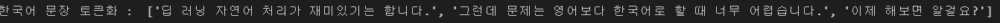
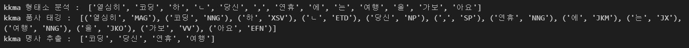

# day 31

## 텍스트 분석 & 자연어처리

### 텍스트 분석

#### 자연어처리 도구

`pip install gensim`  를 통해 패키지를 설치한다.

`nltk` 패키지에서 필요한 도구를 다운받을 수 있다.

```python
import nltk
nltk.download()
```

`JDK` 를 다운로드받아 java로 만들어진 `konlpy` 패키지의 에러를 없앤다. 다운로드는 [여기](https://www.oracle.com/java/technologies/downloads/#jdk17-windows) 에서 받을 수 있다.

`konlpy` 와 `tweepy` 패키지를 다운받는다.

추가로, `Jpype` 를 설치한다. [여기](https://www.lfd.uci.edu/~gohlke/pythonlibs/#jpype) 에서 다운받을 수 있다.


## 텍스트 전처리

### 토큰화

#### 토큰화

토큰화는 문장을 구성하는 단어들을 나누어 각각의 토큰으로 만드는 것이다.

```python
from nltk.tokenize import word_tokenize
print(word_tokenize("Don't be fooled by the dark sounding name, Mr.Jone's Orphanage is as cheery as cheery goes pastry shop"))
```

이 코드를 사용하면 에러가 발생하는데, 다음과 같은 메세지가 출력된다.


이는 `nltk` 패키지가 제대로 설치되지 않아서 일어나는 에러이다.

```python
import nltk
nltk.download('punkt')
```

주어진대로 패키지를 다운로드받으면 정상적으로 코드가 동작한다.


+ 토큰화에서 어퍼스트로피 처리

  `keras` 패키지로 어퍼스트로피를 처리할 수 있다.

  ```python
  from keras.preprocessing.text import text_to_word_sequence
  print(text_to_word_sequence("Don't be fooled by the dark sounding name, Mr.Jone's Orphanage is as cheery as cheery goes pastry shop"))
  ```

  

  또는 `nltk` 패키지로 처리가 가능하다.

  ```python
  from nltk.tokenize import WordPuncTokenizer
  print(WordPuncTokenizer().tokenize("Don't be fooled by the dark sounding name, Mr.Jone's Orphanage is as cheery as cheery goes pastry shop"))
  ```

  

토큰화는 다양한 방법으로 가능하기 때문에 원하는 아웃풋을 내주는 코드를 사용해야한다.

+ 토큰화에서 고려할 사항

  1. 특수문자를 단순 제외해서는 안됨
  2. 줄임말과 단어 내에 띄어쓰기가 있는 경우 고려

+ 표준 토큰화 예제

  1. 하이푼으로 구성된 단어는 하나로 유지한다.
  2. 어퍼스트로피로 접어가 함께하는 단어는 분리한다.

  다음과 같은 규칙을 가지고 토큰화를 진행해볼 수 있다.

  ```python
  from nltk.tokenize import TreebankWordTokenizer
  
  tokenizer = TreebankWordTokenizer()
  
  text = "Strating a home-based restaurant may be an ideal. it dosen't have a food chain or restraunt of their own."
  print("트리뱅크 워드 토크나이저 : ",tokenizer.tokenize(text))
  ```

  

#### 문장 토큰화

문장을 구분하여 토큰으로 만들 수 있다. 이때, 마침표, 물음표등으로 나눌 수도 있지만, 그게 무조건 정답일 수는 없다. 

```python
from nltk.tokenize import sent_tokenize

text = "His barber kept his word. But keepin such a huge secret to himself was driving him crazy. Finally, ther barber went up a mountain and almost to the edge of a cliff. He dug the midst of some reeds. He looked about, to make sure no one was near"
print("문장토큰화 1 :",sent_tokenize(text))
```


`sent_tokenize` 패키지는 단순히 마침표로 문장을 구분하지 않는다.

```python
text = "I am actively looking for Ph.D. students. And you are a Ph.D student"
print("문장토큰화 1 : ",sent_tokenize(text))
```

`Ph.D.` 에는 마침표가 들어가지만, 문장으로 처리되지 않았다.

#### 한국어 문장 토큰화

`pip install kss` 로 `kss` 패키지를 설치한다.

```python
import kss

text = "딥 러닝 자연어 처리가 재미있기는 합니다. 그런데 문제는 영어보다 한국어로 할 때 너무 어렵습니다. 이제 해보면 알걸요?"
print("한국어 문장 토큰화 : ",kss.split_sentences(text))
```



 #### 품사 태깅

단어 토큰화 과정에서 각 단어가 어떤 품사로 쓰였는지를 구분하는 것

```python
from nltk.tokenize import word_tokenize
from nltk.tag import pos_tag

text = "I am actively looking for Ph.D. students. And you are a Ph.D student"
tokenized_sentence = word_tokenize(text)

print("단어 토큰화 : ",tokenized_sentence)
print("품사 태깅",pos_tag(tokenized_sentence))
```

`pos_tag` 함수로 품사태깅을 할 수 있다.

`cannot import module` 에러의 경우 `nltk.download('averaged_perceptron_tagger')` 코드로 패키지를 설치하면 해결할 수 있다.


#### 한국어 품사 태깅

```python
from konlpy.tag import Okt
from konlpy.tag import Kkma

okt = Okt()
kkma = Kkma()

print("OKT 형태소 분석 : ",okt.morphs("열심히 코딩한 당신, 연휴에는 여행을 가봐요"))
print("OKT 품사 태깅 : ",okt.pos("열심히 코딩한 당신, 연휴에는 여행을 가봐요"))
print("OKT 명사 추출 : ",okt.nouns("열심히 코딩한 당신, 연휴에는 여행을 가봐요"))
```

`**JVMNotFoundException**: No JVM shared library file (jvm.dll) found. Try setting up the JAVA_HOME environment variable properly.` 에러가 발생했다. 

환경설정 변수에 `JAVA_HOME` 이라는 변수를 만들고 `jdk` 가 설치된 폴더의 `server` 폴더를 패스로 지정해준다.

그 후, `PATH` 에 `bin` 폴더를 패스로 지정해준다. 그  뒤 에디터를 재시작하면 해결된다.


위 코드의 결과는 다음과 같다.


kkm 토큰화

```python
print("kkma 형태소 분석 : ",kkma.morphs("열심히 코딩한 당신, 연휴에는 여행을 가봐요"))
print("kkma 품사 태깅 : ",kkma.pos("열심히 코딩한 당신, 연휴에는 여행을 가봐요"))
print("kkma 명사 추출 : ",kkma.nouns("열심히 코딩한 당신, 연휴에는 여행을 가봐요"))
```

