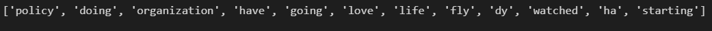
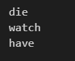
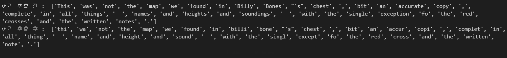
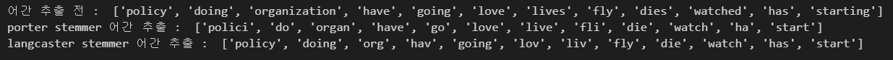
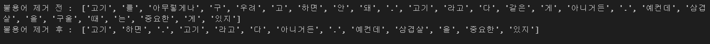
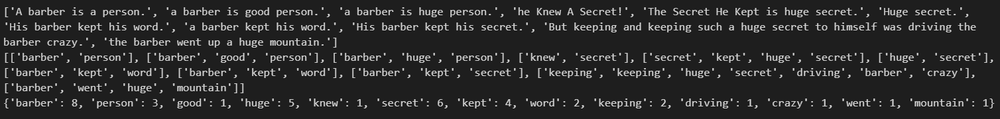

# day 32

## 텍스트 전처리

### 어간추출 및 표제어 추출

#### 표제어 추출

`nltk.stem` 의 `WordNetLemmatizer` 패키지를 사용해 단어의 핵심 의미를 가져올 수 있다.

우선 `nltk.download` 를 써서 필요한 패키지를 받아야한다.

```python
import nltk
nltk.download('wordnet')
```

```python
from nltk.stem import WordNetLemmatizer

n = WordNetLemmatizer()

words = ["policy","doing","organization","have","going","love","lives","fly","dies","watched","has","starting"]
print([n.lemmatize(w) for w in words])
```



적절하지 못한 단어가 추출될 경우 단어의 품사가 제대로 전달되지 않아서 발생할 수 있다.

단어의 품사를 설정해주면 적절한 값이 출력된다.

```python
# 단어의 품사를 전달해주기
print(n.lemmatize("dies","v"))
print(n.lemmatize("watched","v"))
print(n.lemmatize("has","v"))
```



#### 어간 추출

어간은 단어의 의미를 담고있는 단어의 핵심 부분이다.

어간 추출은 정해진 규칙을 가지고 어간을 자르는 것이다. 대충 자르는 것과 같아서 사전에 존재하지 않는 단어가 추출될수도 있다.

```python
# 어간추출
from nltk.stem import PorterStemmer
from nltk.tokenize import word_tokenize

stemmer = PorterStemmer()

sentence = "This was not the map we found in Billy Bones's chest, bit an accurate copy, complete in all things--names and heights and soundings--with the single exception fo the red crosses and the written notes."
tokenized_sentence = word_tokenize(sentence)
stemmed_words = [stemmer.stem(word) for word in tokenized_sentence]
print("어간 추출 전 : ",tokenized_sentence)
print("어간 추출 후 : ",stemmed_words)
```



`This` -> `thi` 나 `accurate` -> `accur` 와 같이 단어의 핵심 의미만을 추출해낸다.

+ stemmer 비교

  ```python
  # porter stemmer 와 langcaster stemmer 비교
  from nltk.stem import PorterStemmer
  from nltk.stem import LancasterStemmer
  
  porter_stemmer = PorterStemmer()
  langcaster_stemmer = LancasterStemmer()
  
  words = ["policy","doing","organization","have","going","love","lives","fly","dies","watched","has","starting"]
  
  print("어간 추출 전 : ",words)
  print("porter stemmer 어간 추출 : ",[porter_stemmer.stem(w) for w in words])
  print("langcaster stemmer 어간 추출 : ",[langcaster_stemmer.stem(w) for w in words])
  ```

  

 #### 한국어 불용어 제거

```python
# 한국어 불용어 제거
from nltk.corpus import stopwords
from nltk.tokenize import word_tokenize
from konlpy.tag import Okt

okt = Okt()

example = "고기를 아무렇게나 구우려고 하면 안 돼. 고기라고 다 같은 게 아니거든. 예컨데 삼겹살을 구울 때는 중요한 게 있지"
stop_words = "를 아무렇게나 구 우려 고 안 돼 같은 게 구울 때 는"

stop_words = set(stop_words.split(" "))

word_token = okt.morphs(example)

result = [word for word in word_token if not word in stop_words]

print("불용어 제거 전 : ",word_token)
print("불용어 제거 후 : ",result)
```




### 정수 인코딩

#### 단어를 딕셔너리에 저장

빈번하게 발생한 단어순으로 단어를 정리하기 위해 단어를 딕셔너리에 정리한다. 단어를 키로 단어가 쓰인 횟수를 값으로 사용한다.

다음 코드를 사용하면  `Resource stopwords not found.` 에러가 발생한다.

```python
import nltk
nltk.download('stopwords')
```

위 코드로 패키지를 설치해 에러를 해결해야한다.

```python
from nltk.tokenize import sent_tokenize
from nltk.tokenize import word_tokenize
from nltk.corpus import stopwords

raw_text = "A barber is a person. a barber is good person. a barber is huge person. he Knew A Secret! The Secret He Kept is huge secret. Huge secret. His barber kept his word. a barber kept his word. His barber kept his secret. But keeping and keeping such a huge secret to himself was driving the barber crazy. the barber went up a huge mountain."

# 문장 토큰화
sentences = sent_tokenize(raw_text)
print(sentences)

# 정수 인코딩
voca = {}
prep_sentence = []
stop_words = set(stopwords.words("english"))

for sentence in sentences:
    # 단어 토큰화
    tokenized_sentence = word_tokenize(sentence)
    result = []
    for word in tokenized_sentence:
        word = word.lower() # 모든 단어를 소문자로 만들어 단어의 개수를 줄임
        if word not in stop_words: # 불용어가 아닌 단어를 선택
            if len(word) > 2: # 길이가 너무 짧지 않은 단어를 선택
                result.append(word) # 단어를 결과에 저장
                if word not in voca: # 단어가 voca에 없으면 새 단어를 추가
                    voca[word] = 0
                voca[word] += 1 # 단어가 사용됐으므로 voca에 값을 1 올림
    prep_sentence.append(result)

print(prep_sentence)
print(voca)
```



먼저 문장 토큰화를 진행하여 문장을 나눈다. 나눠진 문장을 하나씩 단어 토큰화를 한다. 이때, 단어가 불용어가 아니고 길이가 너무 짧지 않으면 딕셔너리에 저장하고 값을 1 올린다. 

불용어를 제거하지 않은 문장에서 단어 토큰화를 진행하고 불용어를 제거하면 위와같은 결과가 나온다. `voca` 딕셔너리에 단여를 정렬해서 저장한다.

