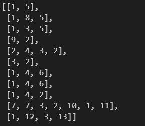

# day 33

## 텍스트 전처리

### 정수 인코딩

#### 정수 인코딩

딕셔너리에 단어의 빈도수와 단어를 저장해놓는다. 저장된 딕셔너리를 정렬한다.

```python
voca_sorted = sorted(voca.items(),key= lambda x:x[1], reverse=True)
voca_sorted
```


딕셔너리에서 단어의 빈도수 순서대로 단어가 정렬된다.

정렬된 단어에 순위를 정한다. 너무 적은 빈도수의 단어는 제외한다.

```python
word_to_index = {}
i = 0
for (word,freq) in voca_sorted:
    if freq > 1:
        i += 1
        word_to_index[word] = i

print(word_to_index)
```


다음과같이 가장 빈도수가 높은 단어는 1, 적은 단어는 7로 단어의 빈도수에 따라서 인코딩되었다.

인덱스가 5보다 큰 단어를 제거한다. 

```python
voca_size = 5
# word_freq에 인덱스가 5보다 큰 단어를 저장한다.
words_freq = [word for word, index in word_to_index.items() if index >= voca_size + 1]
# word_freq에 저장된 단어를 word_to_index에 삭제한다.
for w in words_freq:
    del word_to_index[w]
print(word_to_index)
```

그 다음 5개의 단어 이외의 단어는 `OOV` 로 취급한다.(`out of voca`)

```python
word_to_index["OOV"] = len(word_to_index) + 1
print(word_to_index)
```


`prep_sentence` 에 저장된 토큰화된 문장에 들어있는 단어들을 위에 정수 인코딩된 숫자로 변환한다.

```python
encoded_sentences = []
for sentence in prep_sentence:
    encoded_sentence = []
    for word in sentence:
        try:
            encoded_sentence.append(word_to_index[word])
        except KeyError:
            encoded_sentence.append(word_to_index["OOV"])
    encoded_sentences.append(encoded_sentence)
print(encoded_sentences)
```


#### Couter 사용

`Counter` 함수를 사용해 단어의 빈도수를 셀 수 있다.

```python
from collections import Counter

# 2차원 리스트를 1차원으로 풀기.
all_words_list = sum(prep_sentence,[])

# counter 함수로 각각의 단어의 빈도수 체크
voca_counter = Counter(all_words_list)

print(voca_counter)
```


상위 5개의 단어만 저장

```python
voca_size = 5
voca_counter = voca_counter.most_common(voca_size)
```

상위 5개의 단어에 순서 인덱스를 부여한다,

```python
word_to_index_counter = {}
i = 0
for (word,freq) in voca_counter:
    i += 1
    word_to_index_counter[word] = i

print(word_to_index_counter)
```


#### 정수 인코딩 정리

1. 문장 토큰화
2. 단어 토큰화
3. 불용어 제거
4. 문장별로 단어를 정리해 리스트에 저장
5. 각 단어를 딕셔너리에 저장, 빈도수저장
6. 빈도수 별로 정렬, 인덱스값 부여
7. 인덱스값으로 단어리스트 대체


### 패딩

#### keras로 정수 인코딩

```python
import numpy as np
from keras.preprocessing.text import Tokenizer

# 문장토큰화, 단어토큰화가 완료된 문장
prep_sentence = [['barber', 'person'],
 ['barber', 'good', 'person'],
 ['barber', 'huge', 'person'],
 ['knew', 'secret'],
 ['secret', 'kept', 'huge', 'secret'],
 ['huge', 'secret'],
 ['barber', 'kept', 'word'],
 ['barber', 'kept', 'word'],
 ['barber', 'kept', 'secret'],
 ['keeping', 'keeping', 'huge', 'secret', 'driving', 'barber', 'crazy'],
 ['barber', 'went', 'huge', 'mountain']]

# 토크나이저 저장
tokenizer = Tokenizer()

# 정수 인코딩
tokenizer.fit_on_texts(prep_sentence)
encoded = tokenizer.texts_to_sequences(prep_sentence)

encoded
```



#### 패딩

각 문장에 대해서 가장 긴 문장과 일치하게 0이라는 가상의 단어를 넣어줌으로써 길이를 일치시킨다. 열을 일치시킴으로써 컴퓨터가 병렬처리를 할 수 있는 환경을 만들어준다. 이를 패딩이라한다.

```python
# 가장 많은 단어를 가진 문장 찾기
max_len = max(len(item) for item in encoded)

# 각 문장을 가장 긴 문장에 맞게 0일라는 가상의 단어로 채워준다.
for sentence in encoded:
    while len(sentence) < max_len:
        sentence.append(0)

padded_np = np.array(encoded)
padded_np
```


#### 케라스 전처리도구로 패딩

정수인코딩이 완료된 후 `pad_sequences()` 함수로 제로 패딩 할 수 있다.

```python
from keras.preprocessing.sequence import pad_sequences
from keras.preprocessing.text import Tokenizer

prep_sentence = [['barber', 'person'],
 ['barber', 'good', 'person'],
 ['barber', 'huge', 'person'],
 ['knew', 'secret'],
 ['secret', 'kept', 'huge', 'secret'],
 ['huge', 'secret'],
 ['barber', 'kept', 'word'],
 ['barber', 'kept', 'word'],
 ['barber', 'kept', 'secret'],
 ['keeping', 'keeping', 'huge', 'secret', 'driving', 'barber', 'crazy'],
 ['barber', 'went', 'huge', 'mountain']]
 
# 정수인코딩
tokenizer = Tokenizer()
tokenizer.fit_on_texts(prep_sentence)
encoded = tokenizer.texts_to_sequences(prep_sentence)

# 패딩
padded = pad_sequences(encoded)

# 단어 집합의 크기보다 1 큰 숫자 사용
last_value = len(tokenizer.word_index) + 1

# 패딩
padded = pad_sequences(encoded,padding="post",value=last_value)
padded
```


### keras를 이용한 원 핫 인코딩

#### 정수인코딩

```python
from keras.preprocessing.text import Tokenizer
from tensorflow.keras.utils import to_categorical

text = "나랑 점심 먹으러 갈래 점심 메뉴는 햄버거 갈래 갈래 햄버거 최고야"

tokenizer = Tokenizer()
tokenizer.fit_on_texts([text])
print(tokenizer.word_index)
```


```python
print(tokenizer.word_counts)
```


#### 텍스트를 인코딩

텍스트 정보를 앞서 정수인코딩한 정보로 변환한다.

```python
sub_text = "점심 먹으러 갈래 메뉴는 햄버거 최고야"
encoded = tokenizer.texts_to_sequences([sub_text])[0]
print(encoded)
```


#### 원 핫 인코딩

정수 인코딩을 통해 변환된 문장을 원 핫 인코딩으로 변환

```python
one_hot = to_categorical(encoded)
print(one_hot)
```

