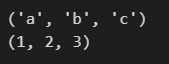

# day 34

## 텍스트 전처리

### 데이터의 분리

#### zip 함수

zip 함수는 리스트를 분리시켜 저장할 수 있게 도와준다.

이중 리스트를 `zip` 으로 분리시키면 각각의 요소로 분해된다.

```python
# zip 함수로 분리
list = [["a",1],["b",2],["c",3]]
x,y = zip(*list)
print(x)
print(y)
```



`x` 에는 `"a","b","c"` , `y` 에는 `1,2,3` 이 분해되었다.


### 한국어 전처리 패키지

#### PyKoSpacing

`PyKoSpacing` 패키지는 한국어 띄어쓰기 패키지이다. `pip install git+https://github.com/haven-jeon/PyKoSpacing.git` 로 다운로드한다.

띄어쓰기를 일부러 하지 않은 문장을 변형해보자

```python
# 한국어 띄어쓰기
from pykospacing import Spacing

spacing = Spacing()
kospacing_sent = spacing(new_sent)

print(sent)
print(kospacing_sent)
```


띄어쓰기가 제대로 완료되는 것을 볼 수 있다.

#### Py-Hanspell

`Py-Hanspell` 패키지는 한국어 맞춤법을 교정해주는 패키지이다. `pip install git+https://github.com/ssut/py-hanspell.git` 로 다운로드한다.

맞춤법이 틀린 문장을 교정해준다.

```python
# 한국어 맞춤법 교정
from hanspell import spell_checker

sent = "맛춤뻡 틀리면 외 않되? 쓰고싶은대로쓰면돼지"

spelled_sent = spell_checker.check(sent)

hanslell_sent = spelled_sent.checked
print(hanslell_sent)
```


각각의 단어의 맞춤법이 정확히 들어맞는지 확인해볼 수 있다.

```python
# 단어별로 맞춤법 틀린지 아닌지 체크
for key, value in spelled_sent.words.items():
    print(key,value)
```


`hanspell` 로 띄어쓰기를 확인해볼 수 있다.

```python
# hanspell 로 띄어쓰기 확인.
spelled_sent = spell_checker.check(new_sent)
hanslell_sent = spelled_sent.checked

print(hanslell_sent)
```


## 카운트 기반의 단어 표현

### 다양한 단어의 표현 방법

자연어 처리에는 단어를 표현하는 것이 가장 기본이된다. 다양한 방법으로 단어를 표현할 수 있어야한다.

컴퓨터가 단어를 어떻게 인식하게 하느냐가 중요한 문제이다.


단어의 표현 방법은 다양한 방법이 있다.

#### 카운트 기반의 단어 표현

모든 단어를 `n x n` 행렬로 만들어 카운트를 세는 방법이다.


#### Bag of Words

단어의 순서는 고려하지 않고 단어의 빈도수에만 집중한 단어표현 방법이다.

각 단어에 고유한 정수 인덱스를 부여하고, 각 인덱스의 위치에 단어 토큰의 등장 횟수를 기록한 벡터를 만든다.

```python
from konlpy.tag import Okt
import re

okt = Okt()

# 정규 표현식을 통해 온점을 제거.
token = re.sub("(\.)","","정부가 발표하는 물가상승률과 소비자가 느끼는 물가상승률은 다르다.")

# okt 형태소 분석기를 통해 토큰화 작업을 수행한 뒤에 token에 저장
token = okt.morphs(token)

print(token)
```


앞서 만든 단어 토큰들에 인덱스를 부여한다. 추가로, 각각의 단어의 등장 횟수를 가진 벡터를 생성한다.

```python
# 단어에 인덱스를 부여할 딕셔너리 생성
word2index = {}
# 단어의 등장횟수를 저장할 벡터 생성
bow = []

# 전체 단어 리스트를 반복
for voca in token:
    # 단어 딕셔너리에 단어가 존재하지 않을 경우
    if voca not in word2index.keys():
        # 딕셔너리에 새로운 단어를 저장하고 인덱스를 저장. 인덱스는 딕셔너리의 길이로, 새로 추가되는 단어는 매번 새로운 인덱스를 가짐.
        word2index[voca] = len(word2index)
        # 단어의 등장횟수를 저장하는 벡터에 새로운 단어가 등장하였으니 새로운 열에 1을 추가
        bow.insert(len(word2index)-1,1)
	# 단어 딕셔너리에 존재하는 단어일 경우
    else:
        # 단어 딕셔너리에서 인덱스를 불러옴
        index = word2index.get(voca)
        # 해당 인덱스의 위치에 있는 단어 벡터에 값을 1 추가
        bow[index]=bow[index]+1
```

단어 딕셔너리와 등장횟수를 확인한다.

```python
print(word2index)
print(bow)
```


서로 다른 두 문장을 합쳐서 사용할 수 있다.

```python
from konlpy.tag import Okt
import re

okt = Okt()

# 정규 표현식을 통해 온점을 제거.
doc1 = "정부가 발표하는 물가상승률과 소비자가 느끼는 물가상승률은 다르다."
doc2 = "소비자는 주로 소비하는 상품을 기준으로 물가상승률을 느낀다.
doc3 = doc2 + " " + doc1
token = re.sub("(\.)","",doc3)

# okt 형태소 분석기를 통해 토큰화 작업을 수행한 뒤에 token에 저장
token = okt.morphs(token)

word2index = {}
bow = []

for voca in token:
    if voca not in word2index.keys():
        word2index[voca] = len(word2index)
        bow.insert(len(word2index)-1,1)
    else:
        index = word2index.get(voca)
        bow[index]=bow[index]+1
        
print(word2index)
print(bow)
```


#### CountVectorizer 클래스로 Bag of Words 만들기

`CountVectorizer` 는 간편하게 `BOW` 를 만들 수 있게 도와준다.

```python
# CountVectorizer로 BOW 만들기
from sklearn.feature_extraction.text import CountVectorizer

corpus = ["you know I want your love. Because I love you."]

vector = CountVectorizer()

# 단어의 등장횟수 기록
print(vector.fit_transform(corpus).toarray())
# 단어의 인덱스 기록
print(vector.vocabulary_)
```


### 불용어 제거

#### 사용자가 직접 정의한 불용어 사용

```python
# 사용자가 직접 정의한 불용어 사용
from sklearn.feature_extraction.text import CountVectorizer

text = ["Family is not an important thing. It's everything"]
# 불용어 정의
vect = CountVectorizer(stop_words=["the","a","an","is","not"])

print(vect.fit_transform(text).toarray())
print(vect.vocabulary_)
```


#### 패키지에 수록된 불용어 사용

```python
# 패키지에 수록된 불용어 사용
from sklearn.feature_extraction.text import CountVectorizer

text = ["Family is not an important thing. It's everything"]
# 불용어 정의
vect = CountVectorizer(stop_words="english")

print(vect.fit_transform(text).toarray())
print(vect.vocabulary_)
```


`nltk` 패키지에 수록된 불용어 목록 사용

```python
# 패키지에 수록된 불용어 사용
from sklearn.feature_extraction.text import CountVectorizer
from nltk.corpus import stopwords

text = ["Family is not an important thing. It's everything"]
# 불용어 정의
sw = stopwords.words("english")
vect = CountVectorizer(stop_words=sw)

print(vect.fit_transform(text).toarray())
print(vect.vocabulary_)
```


### 단어문서행렬

문서별로 단어의 빈도를 정리한 표

단어문서행렬은 다음과 같은 특징을 가진다.

1. 비정형 데이터인 텍스트를 표 형태로 정형화 가능
2. 정형 데이터의 다양한 통계 기법 적용 가능
3. 처리가 단순하지만 어순과 맥락을 무시하는것이 단점

#### 희소표현

단어 문서 행렬에서 대부분의 값은 0이며, 이런 행렬을 `sqarse matrix` 라 한다.

이에따라 용량을 아끼기 위해 0을 빼고 저장하는 압축방법을 사용한다.

+ 데이터 다운로드

  ```python
  import wget
  import pandas as pd
  
  wget.download("https://raw.githubusercontent.com/euphoris/datasets/master/imdb.xlsx")
  df = pd.read_excel("imdb.xlsx",index_col=0)
  ```

+ 데이터 확인

  ```python
  df.shape  # (748, 2)
  ```

#### DTM 만들기

```python
# DTM 만들기
from sklearn.feature_extraction.text import CountVectorizer

# max_feature = 500 으로 설정하여 빈도수가 가장 많은 상위 500개의 단어만 표에 포함시킴
# stop_words="english" 로 불용어는 표에서 제외시킴
cv = CountVectorizer(max_features= 500, stop_words="english")
dtm = cv.fit_transform(df["review"])
```

`dtm` 을 보면 748개의 행과 500개의 열로 이루어진 것을 볼 수 있다.

```python
dtm.shape  # (748, 500)
```

단어의 목록은 `cv` 에 저장되어있다.

```python
# 10개의 단어만 출력
cv.get_feature_names()[:10]
```


단어의 개수를 확인할 수 있다.

```python
# 단어별 총 빈도
dtm.sum(axis=0)  # 각각의 단어들이 몇번 출현했는지 확인
dtm.sum(axis=1)  # 각각의 문장에 몇개의 단어가 있는지 확인
```

이를 데이터프레임으로 확인할 수 있다.

```python
# 단어의 빈도수를 저장
word_count = pd.DataFrame({
    "단어" : cv.get_feature_names(),
    "빈도" : dtm.sum(axis=0).flat
})

# 빈도수 순으로 정렬
word_count_sorted = word_count.sort_values("빈도",ascending = False)

word_count_sorted
```


정리한 데이터를 `csv` 파일로 저장

```python
word_count.to_csv("../data files/word_count.csv")
```

