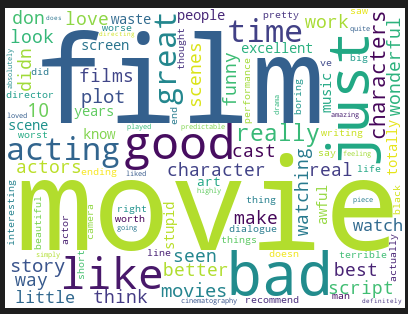
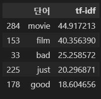
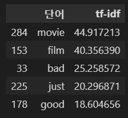
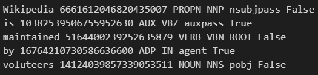
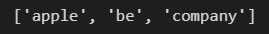

# day 35

## 텍스트 분석

### Word Cloud

`!conda install -y -c conda-forge wordcloud` 명령어를 편집기에서 실행하여 패키지를 설치한다.

#### 데이터 로드

기존에 저장했던 빈도수 데이터를 가져온다

```python
import pandas as pd

word_count = pd.read_csv("../data files/word_count.csv",index_col = 0)
```

#### 데이터 정제

`word_count` 를 딕셔너리로 변환한다.

```python
count_dict = word_count.set_index("단어")["빈도"].to_dict()
```

`단어` 를 새로운 행 인덱스로 변환한 후 `빈도` 열을 가져오고, `to_dict` 함수를 사용하여 딕셔너리로 변환한다.

#### word cloud 생성

word cloud 객체를 생성한다.

```python
from wordcloud import WordCloud

wc = WordCloud(background_color="white",max_words=100,width=400,height=300)
```

`max_words` : word cloud에 넣을 최대 단어 수.

`width` ,`height` : word cloud의 크기 설정

그래프 그리기

```python
cloud = wc.fit_words(count_dict)
cloud.to_image()
```



많이 나온 단어는 크게 그려주고 적게나온 단어는 작게 그려주는 시각화 기법이다.

결과를 저장한다

```python
cloud.to_file("word_cloud.png")
```


### Sparse Matrix 압축

#### Coordinate List

0이 아닌 값을 행,열,값으로 저장한다.

#### Compressed Sparse Row

값과 열 번호를 별도로 저장한다. 행번호 대신 값에서 각 행의 시작과 끝 인덱스를 저장하여 행번호를 압축한다.

이 방식은 행마다 숫자 1개씩은 무조건 나온다는 가정을 한다.


### TF-IDF

기존 DTM을 사용하는것보다 더 많은 정보를 문서에 고려할 수 있다.

TF-IDF가 항상 성능이 뛰어난 것은 아니다.

#### 개념

+ TF : 단어의 등장 빈도

+ IDF : 특정 단어가 등장한 문서의 빈도의 역수

+ 똑같이 자주 나오는 단어라고 해도 모든 문서에 고르게 자주 나오는 단어는 특별한 의미가 없는 경우가 많다.
+ 모든 문서에 나오는 단어를 고려하여 단어의 빈도를 보정하는 방법.

+ 여러 문서에 자주 나오면 df 상승, idf하락

+ 문서간의 차이가 중요한 상황에서는 idf가 높은 단어가 좋은단어
+ TF-IDF : TF와 IDF를 곱한 값, 상대적으로 적은 문서에 나오면서 특정 문서에 자주나온 단어. DTM에 가중치를 주는 방법

#### TF-IDF 생성

+ 데이터 준비

  ```python
  import pandas as pd
  
  df = pd.read_excel("imdb.xlsx")
  ```

+ tf-idf 생성

  ```python
  from sklearn.feature_extraction.text import TfidfVectorizer
  
  tfidf = TfidfVectorizer(max_features=500,stop_words="english")
  dtm = tfidf.fit_transform(df["review"])
  
  # 빈도수 계산
  word_count = pd.DataFrame({
      "단어" : tfidf.get_feature_names(),
      "tf-idf" : dtm.sum(axis=0).flat
  })
  word_count.sort_values("tf-idf",ascending=False).head()
  ```

  

#### DTM을 TF-IDF로 변환

```python
# 기존의 dtm에서 tf-idf로 변환
from sklearn.feature_extraction.text import CountVectorizer
from sklearn.feature_extraction.text import TfidfTransformer

cv = CountVectorizer(max_features=500, stop_words="english")
dtm2 = cv.fit_transform(df["review"])

trans = TfidfTransformer()
dtm3 = trans.fit_transform(dtm2)

word_count2 = pd.DataFrame({
    "단어" : tfidf.get_feature_names(),
    "tf-idf" : dtm3.sum(axis=0).flat
})

word_count2.sort_values("tf-idf",ascending=False).head()
```



앞선 `dtm` 과 여기 `dtm3` 는 같은 값을 보인다.


### 품사 태깅과 표제어추출

`spacy` 패키지 다운로드 : `!conda install -y -c conda-forge spacy`

영어 모듈 다운로드 : `!python -m spacy download en_core_web_sm`

#### 형태소 분석과 표제어 추출

```python
import spacy

# 영어 모형 불러오기
nlp = spacy.load("en_core_web_sm")

# 영어 텍스트에 모형 적용
text = "Wikipedia is maintained by voluteers"
doc = nlp(text)

for token in doc:
    print(token.text,
          token.lemma,
          token.pos_,
          token.tag_,
          token.dep_,
          token.is_stop)
```



`PROPN` 은 고유명사라는 의미이다. `nsubjpass` 문법적 의존관계이며 `False` 는 불용어가 아니라는 의미이다.

#### 명사와 동사의 표제어로 단어문서행렬 만들기.

명사와 동사의 표제어만 추출하는 함수 생성

```python
import spacy

nlp = spacy.load("en_core_web_sm")

def extract_nv(text):
    doc = nlp(text)
    words = []
    for token in doc:
        if token.tag_[0] in "NV":
            words.append(token.lemma_.lower())
    return words
```

```python
extract_nv("Apple is a company")
```



명사와 동사의 표제어만 추출하는 함수를 이용하여 DTM을 생성할 수 있다.

```python
from sklearn.feature_extraction.text import CountVectorizer
import pandas as pd

# 데이터 로딩
df = pd.read_excel("imdb.xlsx",index_col=0)

# 벡터 생성
cv = CountVectorizer(max_features=500, tokenizer=extract_nv)

# DTM 생성
dtm = cv.fit_transform(df["review"])

wc = pd.DataFrame({
    "단어" : cv.get_feature_names(),
    "tf-idf" : dtm.sum(axis=0).flat
})
wc.sort_values("빈도",ascending=False).head()
```


## 주제분석(LSA)

+ 주제분석
  + 텍스트 분석을 비지도 학습으로 하는 방법.
  + 비지도학습 : 관찰된 x를 설명하는 z의 존재를 가정 
  + 모르는 z가 x를 설명한다고 가정한다.
  + z를 은닉 또는 잠재 변수라 말한다. 
  + 잠재변수 : 관찰 불가능하거나 또는 현재 데이터에 포함되지 않은 변수. 주로 이론적으로 가정되는 개념이다. 현재 데이터의 내재적 구조를 잘 설명하게함.
  + 주제분석은 텍스트에 대한 비지도학습. 문서의 단어빈도에 영향을 미치는 잠재변수를 가정.
  + 위의 잠재변수를 "주제" 라고 한다.
  + 일상적 의미에서의 주제와는 다름.

### 주제분석의 방법

+ 행렬 분해에 의한 방법

+ 확률 분포에 의한 방법

#### LSA

+ 단어 문서 행렬을 여러 행렬의 곱으로 분해하는 방법.
+ 주제가 연속변수라고 가정
+ 여러 주제들에 가중치를 곱하여 더하면 단어문서행렬이 된다고 가정.
+ 주제들은 단어 빈도의 분산을 설명
+ `DTM = (w1 x 주제1) + (w2 x 주제2) + (w3 x 주제3) .....` 
+ 위와같은 식의 결과가 `DTM` 이라고 가정한다.
+ 단어 빈도의 분산을 최대한 많이 설명하는 방법
  + 많고 적음의 편차가 생기는 것을 수치화 한 것이 분산
  + 각 문서마다 단어들의 분산이 다르다.
  + 주제를 가정하면 단어들의 분산을 설명할 수 있다.