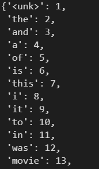
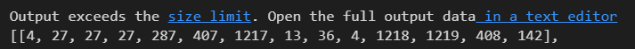
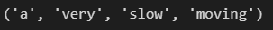
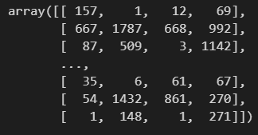
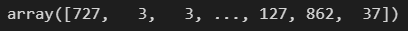

# day 36

## 언어 모형

언어모형이란 자연어 문장의 확률을 계산하는 모형이다.

예를들어, 

1. 나는 밥을 먹었다.
2. 나는 밥을 마셨다.

일때,  2번 문장보다 1번 문장이 확률이 높다.

언어모형 자체로는 의미가 없지만, 다른 큰 모형에 들어가서 활용된다.


### 언어모형의 활용

언어모형은 다른 모형에 들어갔을 때 매우 쓸모있다.

#### 사전 학습

pre-training이라는 뜻으로 자연어처리의 한 종류이다.

언어 모형은 텍스트만으로 학습이 가능하고, 사전학습된 언어모형으로 학습 효율을 높일 수 있다.

이때 언어 모형은 `x`만을 가지고 학습이 가능하기 때문에 `x->y` 를 예측하는 모델에 엮여서 효율적인 학습이 가능하다.

#### 자연어 생성

자연어 문장을 생성할 때 확률이 높은 표현을 고를 수 있다. 더욱 자연스러운 문장을 생성할 때 언어모형을 사용할 수 있다.

ex) 챗봇, 번역기


### N-Gram

N-Gram은 문장을 `N` 개의 토큰을 묶어서 세는것을 말한다.

#### N-Gram 언어모형

문장을 이루는 토큰의 확률을 `n-gram`으로 추정한다.

문장의 확률은 토큰이 확률의 곱이다.

+ 유니그램 언어모형

  `n = 1` , 모든 토큰이 독립. 직전에 무슨 토큰이 나오든지 다음 토큰에 영향을 주지 않는 모형이다.

+ 바이그램 언어모형

  `n = 2` , 모든 토큰은 직전(-1)의 토큰에 의존한다. 더 이전 토큰과는 독립

  `i have a dream` 이라는 문장이 있을 경우 각각의 단어는 직전 토큰에 의존해 확률을 구한다.

#### 마코프 속성

마코프 속성이란 확률적인 과정에서 직전 단계에만 의존하는 속성을 말한다.

마코프 속성을 가정한 모형들을 마코프 모형이라 한다.

바이그램 언어모형은 마코프 모형의 일종이다.

#### N-Gram에서 N이 커질경우

토큰의 수가 `w`면 토큰의 조합은 `w^n` 개이다

 `n` 이 커질수록 더 정확해지지만 더 많은 데이터가 필요하다.

특정 단어의 조합이 학습데이터에 없으면 -> 확률은 0 이된다.

이 특정 단어의 조합이(학습 데이터에 없는 조합이) 테스트 데이터에 나타나면 -> 문장 전체의 확률이 0이된다.

이는 `n-gram` 의 문제점이다. 

+ UNK

  분석 대상 어휘에 포함되지 않는 단어를 `UNK` 라는 특수한 단어로 대체하여 토큰의 조합을 줄일 수 있다.

  저빈도 토큰을 `unk` 로 대체하면 혼란도가 낮아진다.

  모든 단어를 `unk`로 바꾸면 혼란도는 1이되지만 아무런 가치가 없다. 

  혼란도는 어휘가 동일한 경우에만 비교한다.

+ 라플라스 평활

  관찰된 사례의 확률이 줄어들어서 discounting이라 한다.

  라플라스 평활은 어휘가 많아지면 모든 확률이 0에 가까워지는 문제를 가지고 있다. 따라서 1 대신 k를 더한다.

  k는 validation set을 통하여 결정한다. 이때 k는 1보다 작은 값이다.

+ back off

  물러나다라는 의미로 `n-gram`인 경우 `n-1 gram`을 사용한다.

  확률의 합이 1보다 커지므로, 적절한 discounting이 필요하다

+ interpolation

  여러 `n-gram`을 가중평균하여 토큰의 확률을 구한다. 여러 `n-gram` 확률이 모두 0이 아니면 확률이 나오기 때문에 유효하다.

  하지만 가중치를 어떻게 정하느냐의 문제가 발생한다.


### 신경망 언어 모형

`n-gram` 은 일반화가 안된다. 이 해결책으로 신경망을 이용한 언어 모형이 탄생했다.

이전의 토큰을 `one-hot-encoding` 된 형태로 입력하고, 다음의 토큰을 예측한다.(다항분류문제)

#### 단어 임베딩

단어 임베딩이란 단어를 실수 벡터 형태로 표현하는 것이다.

신경망에 임베딩 레이어를 추가하여 단어 임베딩을 얻을 수 있다.

`입력층` -> `임베딩레이어` -> `은닉층` -> `출력층` 

입력층에 원-핫-인코딩된 데이터를 넣는다. 임베딩 레이어가 입력층을 가지고 학습한다. 

임베딩 레이어는 `Dense Layer`와 거의 동일하다. 입력에 가중치를 곱하여 출력한다.

입력이 `one-hot-encoding` 이므로 가중치의 각 행이 각 단어의 임베딩에 해당한다.

#### 전이학습

한 문제에 학습된 결과를 다른 문제에 적용시키는 것을 말한다.

언어모형은 별도의 `y`가 필요하지 않으므로 대량의 데이터를 모으기 쉽다.

신경망 언어 모형으로 단어 임베딩을 학습 후 다른 모형에 추가한다. 이는 단어 임베딩의 가장 중요한 용도이다.


## 언어모형 실습

### Tokenizer

#### 데이터 로드

`url` 을 사용하여 데이터를 다운 받는다.

```python
import wget

wget.download("https://github.com/euphoris/datasets/raw/master/imdb.zip")
```

다운받은 데이터를 불러온다.

```python
import pandas as pd
df = pd.read_csv('imdb.zip')
df.head()
```

#### 토큰화

`Tokenizer` 는 문장 데이터를 숫자 벡터로 변환하기 위해 사용한다.

`num_words` 는 빈도수 순서대로 2000개만을 사용한다는 의미이다.

```python
import tensorflow as tf

tk = tf.keras.preprocessing.text.Tokenizer(num_words = 2000, oov_token = "<unk>")
```

그 다음`tk`를 초기화한다. `tk`안에 실질적인 데이터를 입력한다. 한국어는 전처리를 해서 형태소로 넣어야한다. 영어는 상관없다.

```python
tk.fit_on_texts(df["review"])
```

`tk` 를 살펴보면 많이 사용된 단어 순서대로 정렬된 것을 확인할 수 있다.

```python
tk.word_index
```



`word_index` 는 단어를 넣었을 때 인덱스를 반환하고 `index_word`는 인덱스를 넣었을 때 단어를 반환한다.

```python
tk.word_index["good"]
tk.index_word[31]
```

토큰화한 데이터를 파일로 저장한다.

```python
import joblib

joblib.dump(tk,"tokenizer.pkl")
```


### 전처리

#### 데이터 로드

`imdb` 와 토큰화 과정에서 저장한 `tokenier.pkl` 파일을 불러온다.

```python
import pandas as pd
import joblib

df = pd.read_csv("imdb.zip")
tk = joblib.load("tokenizer.pkl")
```

#### 문장을 숫자 벡터로 인코딩

```python
seqs = tk.texts_to_sequences(df["review"])
seqs
```



위와같이 문장을 숫자 벡터로 변환할 수 있다.

리스트에 숫자가 어떤 단어인지 확인할 수 있다.

```python
tk.index_word[4], tk.index_word[27],tk.index_word[287],tk.index_word[407]
```



#### 언어 모형에 맞게 데이터 변형

신경망에 x,y값을 넣고 학습을 시키기 위해 앞선 4개의 데이터 다음 어떤 단어가 나와야 하는지에 대한 데이터를 저장한다.

```python
data = []
for seq in seqs:
    for i in range(0,len(seq)-4):
        data.append(seq[i:i+4],seq[i+4])
```

`data` 에는 리스트에 저장된 4개의 단어 단어 다음에는 어떠한 단어가 나오는지 저장할 수 있다.

데이터의 학습 효과를 증대시키기 위해 데이터를 셔플한다.

```python
import random

random.shuffle(data)
data
```

그 다음 `data` 에 저장되어 있는 데이터를 `x`,`y` 로 분리해야한다.

```python
import numpy as np

xs = np.array([x for x,y in data])
yx = np.array([y for x,y in data])
```





`joblib` 으로 저장한다.

```python
joblib.dump((xs,ys),"im-data.pkl")
```

