# day 37

## 언어 모형 실습

### 학습

#### 저장했던 데이터 로드

토큰화한 데이터와 정수인코딩한 데이터를 불러온다.

```python
import joblib

tk = joblib.load("tokenizer.pkl")
xs,ys = joblib.load("im-data.pkl")
```

#### 데이터 확인

단어집합에 패딩을 추가한다.

```python
# 단어 개수에 패딩 숫자를 추가한다.
NUM_WORD = tk.num_words + 1
```

`tk`의 단어리스트를 확인한다.

```python
tk.index_word
```

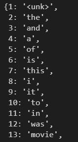

들어갈 학습 데이터를 확인한다.

```python
xs[0]
```

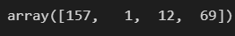

신경망에 데이터를 추가하려면 원-핫-인코딩으로 바꿔야한다. 하지만 임베딩 레이어에 넣으면 원핫인코딩을 해준다.

#### 학습모형 만들기

패키지 적재

```python
import tensorflow as tf
```

임베딩 레이어 생성, `input_dim` 은 패딩을 추가한 `NUM_WORD`로 추가한다.

`NUM_WORD`의 수인 2001개의 열을 가진 원핫벡터로 변환된다.

```python
emb1 = tf.keras.layers.Embedding(input_dim=NUM_WORD, output_dim=8)
```

임베딩 레이어의 output이 8이기 때문에 `Dense`는 8로 받아야한다.

또한 결과는 `NUM_WORD` 와 같은 숫자로 나와야 한다.

`GlobalAveragePooling1D()` 계산의 효율성을 위해 사용한다.한번에 입력되는 데이터가 4개의 단어인데, 임베딩이 생긴다. 하나의 결과를 내기 위해서는 8개의 노드와 4개의 단어 때문에 32개의 단어가 인풋으로 들어온다. 이 함수를 사용하면 인풋이 8개로 유지된다.

```python
lm = tf.keras.Sequential([emb1,  # 32개의 단어로 나뉜다
                          tf.keras.layers.GlobalAveragePooling1D(), # 32개를 평균내서 8개로 줄인다.
                          tf.keras.layers.Dense(8,activation="relu"),
                          tf.keras.layers.Dense(NUM_WORD)]) # 2001개의 출력이 나온다.
```

```python
lm.summary()
```

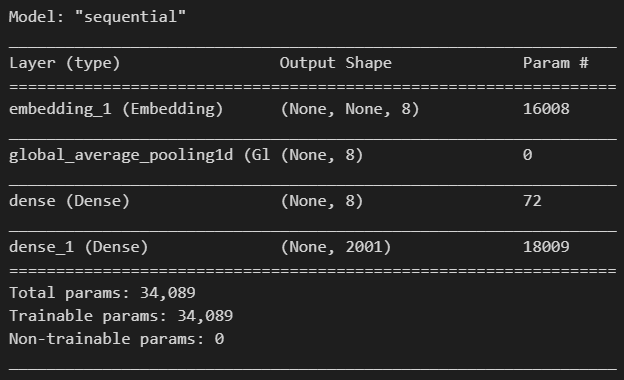

임베딩 레이어에서 4 * 8개의 32개의 데이터가 들어간다. `GlobalAveragePooling1D()` 레이어로 들어가면 32개의 평균을 내어 8개로 인풋을 줄인다.

다음 층에서 평균낸 8개의 인풋이 넘어간다. 파라미터의 수는 8*9(8+vias 1) = 72개가 된다.

`dense_1` 은 9*2001 = 18009개의 파라미터를 가진다.

#### 딥러닝 모델 컴파일

학습을 시키려면 `loss` 를 설정해야한다. `SparseCategoricalCrossentropy(from_logits=True) ` 여기서 확률 계산을 해서 `softmax`를 적용해 output을 낸다.

`(from_logits=True)` 은 그 전의 인풋 데이터를 `logit`이라 부르는데 `softmax`를 `loss`를 계산할 때 적용한다는 의미이다.

```python
lm.compile(loss=tf.keras.losses.SparseCategoricalCrossentropy(from_logits=True),
           optimizer = "adam",
           metrics = ["accuracy"])
```

#### 모델 학습

```python
lm.fit(xs,ys,epochs=1)
```

학습시킨 모델을 저장한다.

```python
lm.save("lm.krs")
```

#### 단어 임베딩

위의 모델을 생성하는 곳에서 만들었던 `emb1` 이 단어 임베딩이다.

```python
e = emb1.embeddings.numpy()
e
```

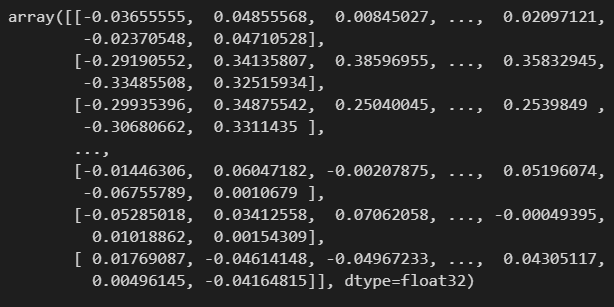

```python
e.shape #(2001,8) 2001개의 단어에 대해서 8차원으로 임베딩한 결과
```

가중치를 저장한다.

```python
w = emb1.get_weights()[0]
w
```

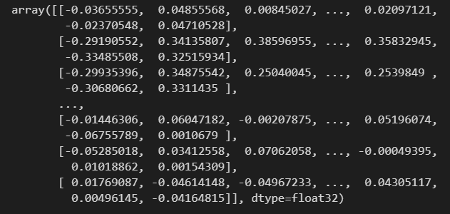

`embeddings` 값과 가중치 값을 비교한다.

```python
import numpy as np
np.array_equal(e,w)  # True
```

임베딩과 가중치가 같다. 임베딩은 일반적인 층의 가중치를 학습하는것과 같다.

임베딩만을 저장한다.

```python
np.savez("word-emb.npz",emb = e)
```


###  GlobalAveragePooling1D

패키지 로드

```python
import tensorflow as tf
import numpy as np
```

다음과 같은 데이터가 있다.

```python
x = np.array([[[1,2,3],[3,6,9]]], dtype="float32")
x
```

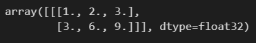

3차원 배열로 되어있다. 각 배열`[1,2,3]` 은 하나의 단어를 의미하며 숫자는 임베딩된 숫자이다.

```python
x.shape # (1,2,3)
```

1은 데이터가 1개가 들어갔다.

3은 벡터의 길이

2는 이러한 벡터가 2개있다.

즉 (1,2,3)은 1은 총 1개의 단어가 인풋으로 들어가며, 총 2개의 단어가 있고, 각 단어는 3개의 임베딩된 숫자를 가지고있다는 뜻이다.

```python
avg = tf.keras.layers.GlobalAveragePooling1D()
```

`GlobalAveragePooling1D` 로 평균을 내면 다음과 같은 결과가 나온다.

```python
y = avg(x).numpy()
y
```

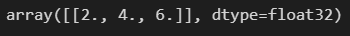

```python
y.shape  # (1,3)
```

2개의 단어가 들어갔지만 1개의 단어로 출력된다. 즉 `GlobalAveragePooling1D` 은 여러개의 단어를 평균을 내어 보여준다.


### 다음 토큰의 예측확률

#### 모델 로드

```python
import joblib

tk = joblib.load("tokenizer.pkl")
xs,ys = joblib.load("im-data.pkl")
```

```python
import tensorflow as tf

lm = tf.keras.models.load_model("lm.krs")
```

#### 데이터 예측

예측할 데이터

```python
x = xs[0:1]
y = ys[0]
```

데이터 확인

```python
[tk.index_word[i] for i in x[0]]
```

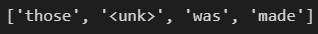

```python
tk.index_word[y]
```

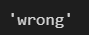

데이터 예측

```python
import numpy as np

logit = lm.predict(x.astype("float32"))
logit.shape  # (1,2001)
```

```python
logit
```

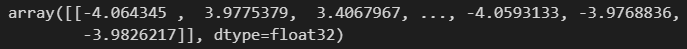

텐서플로의 `softmax` 함수를 사용하면 확률값으로 변환된다.

```python
p = tf.nn.softmax(logit).numpy()
p
```

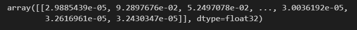

 `p` 는 입력된 단어의 예상되는 확률을 나타낸다. `y`의 확률이 얼마나 되는지 확인해보자

```python
p[0,y] # 0.0003761839
```

`p` 에서 가장 큰 값을 찾아보면 1이 나온다. 1은 `unk` 를 의미한다. 그 이유는 2000개의 단어를 제외한 다른 모든 단어를 `unk` 로 퉁쳐버렸기 때문에 2000개를 제외한 모든 단어의 확률이 `unk` 로 합쳐졌기 때문에 이 확률이 제일 높다.

```python
p.argmax()  # 1
```


### 전이학습

하나의 문제의 학습을 수행한 이후 다른 문제에 적용하는 것이 전이학습이다.

#### 데이터 로드

```python
import pandas as pd
import joblib

df = pd.read_csv("imdb.zip")
tk = joblib.load("tokenizer.pkl")
```

#### 데이터 전처리

텍스트를 숫자벡터로 변형한다.

```python
seqs = tk.texts_to_sequences(df["review"])
```

`seqs` 에 저장된 리스트들은 길이가 다르다. 이 리스트들의 길이를 맞춰주어야한다.

가장 긴 텍스트의 길이를 기준으로 0을 넣어서 길이를 맞춘다. 

```python
import tensorflow as tf

pads = tf.keras.preprocessing.sequence.pad_sequences(seqs)
```

이전에 훈련했던 단어 임베딩을 불러온다.

```python
import numpy as np

z = np.load("word-emb.npz")
e = z["emb"]
```

#### 감성분석

기존에 훈련했던 임베딩을 `emb2` 에 적용한다.

```python
emb2 = tf.keras.layers.Embedding(input_dim= tk.num_words+1,
                                 output_dim = 8,
                                 embeddings_initializer = tf.keras.initializers.Constant(e))
```

훈련 모델을 만든다.

```python
model = tf.keras.Sequential([emb2,
                             tf.keras.layers.GlobalAveragePooling1D(),
                             tf.keras.layers.Dense(8, activation="relu"),
                             tf.keras.layers.Dense(1,activation="sigmoid")])
```

```python
model.summary()
```

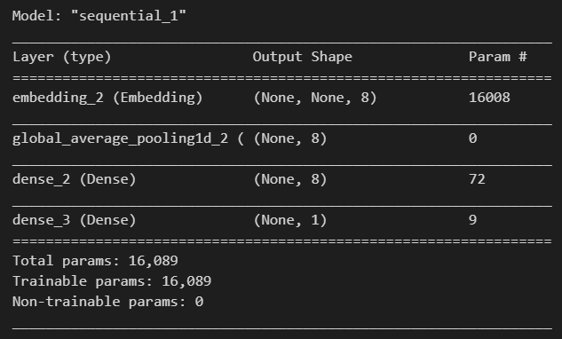

모델 컴파일

```python
model.compile(loss = "binary_crossentropy",
              optimizer = "adam",
              metrics = ["accuracy"])
```

`y`값을 가져온다. `y` 는 감정을 나타낸 정보이다.

```py
y = df["sentiment"].values
```

모델 피팅

```python
model.fit(pads, y)
```


## 단어 임베딩과 순환신경망

### 유사도

#### 거리와 유사도

거리 : 두 사례 x,y의 차이 표현. 두 사례가 같으면 0

유사도 : 두 사례의 비슷함을 표현, 거리와 달리 엄밀한 정의가 없다.

+ 거리의 종류
  1. 유클리드 거리 : L2거리라고한다. x,y 점의 실질적 거리. `sqrt(x^2 + y^2)`
  2. 맨해튼 거리 : L1거리 칸수의 거리. x에서 y까지 가는데 걸리는 칸수.
  3. 레벤슈타인 거리 : 두 문자열을 같게 만들기 위해 필요한 수정의 수
  4. 해밍 거리 : 길이가 같은 문자열에서 같은 위치에 다른 글자가 있는 경우
+ 유사도
  1. 자카드 유사도 : 교집합의 크기 / 합집합의 크기. 두 집합이 겹치지 않으면 0, 완전히 겹치면 1이된다.
  2. 코사인 유사도 : 문서 유사도를 계산할 때 흔히 사용, 값을 -1~1로 표현


### 단어 임베딩

단어 임베딩은 단어를 밀집벡터로 표현하는 방법이다.