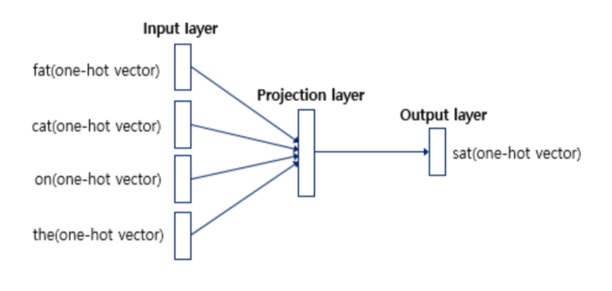
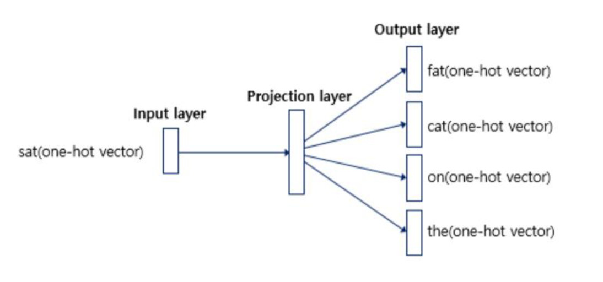
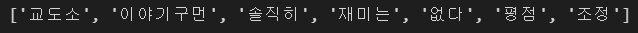
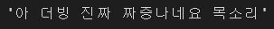
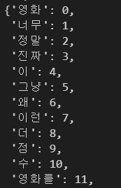
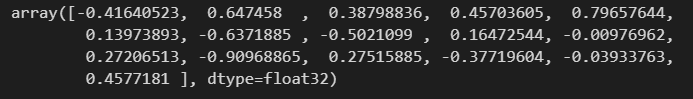
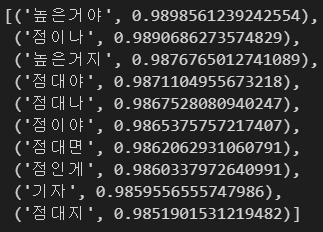
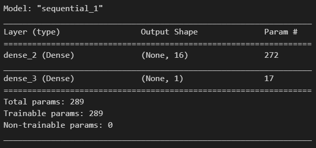

# day 38

## 단어 임베딩

### Word2Vec

단어 임베딩을 효율적으로 계산할 수 있도록 신경망 언어 모형을 수정한다.

#### CBOW

중심단어와 주변단어로 나눈다. `window = 2` 라고하자.

"The fat cat sat on the mat" 이라는 문장이 있을 때, "sat" 을 중심단어로 선택하면 왼쪽에 "fat" 과 "cat"이, 오른쪽에 "on" 과 "the" 이 주변단어가 된다.

이를 원-핫-벡터로 표현한다면 중심단어는 `[0,0,0,1,0,0,0]` 이 되고 주변단어는 `[0,1,0,0,0,0,0]` `[0,0,1,0,0,0,0]` `[0,0,0,0,1,0,0]` `[0,0,0,0,0,1,0` 이 된다.

이를 신경망으로 표현하면 다음과같다.



`input layer` 에 주변 단어가 들어가고 `output layer` 에서 중심단어가 출력된다.

#### Skip-gram

`CBOW` 와는 반대로 중심단어가 들어가면 주변단어가 출력된다.




### FastText

Word2Vec을 개선한 것으로, 글자 단위의 n-gram을 이용한 준단어 토큰화를 사용한다.

`n = 3` 일 경우, `where` 라는 단어는 `<wh` `whe` `her` `ere` `re>` 로 분해하여 사용한다. 이를 통해 단어 임베딩을 사용한다.


## FastText 감성분석 실습

### gensim을 이용한 FastText

#### 데이터 다운로드

```python
import pandas as pd
import requests

# 웹의 데이터를 로컬에 파일로 저장
res = requests.get("https://github.com/e9t/nsmc/raw/master/ratings_train.txt")
with open("ratings_train.txt","wb") as f:
    f.write(res.content)

# 로컬에 저장된 파일 불러오기.
nsmc = pd.read_csv("ratings_train.txt", sep = "\t")
```

#### 데이터 전처리

+ 정규 표현식으로 한글만 가져오는 함수 작성

  ```python
  import re
  
  def find_hangeul(text):
      return re.findall(r'[ㄱ-ㅎ-가-힣]',text)
  ```

  특수문자를 제외한 한글만이 나오는지 확인

  ```python
  find_hangeul(nsmc.loc[0,"document"])
  ```

  

+ 특수문자를 제외하고 한글만 받은 데이터를 문장으로 변형

  ```python
  def only_hangeul(text):
      return " ".join(find_hangeul(text))
  ```

+ `null` 을 제외한 데이터를 선택

  이때, `only_hangeul` 함수를 사용하여 `null` 이 아닌 데이터를 전처리한다.

  ```python
  # null이 아닌 정보만을 선택하고, 이 데이터에 find_hangeul함수 적용
  data = nsmc[nsmc["document"].notnull()]["document"].map(only_hangeul)
  ```

  제대로 문장이 나오는지 확인한다.

  ```python
  data[0]
  ```

  

+ 파일을 로컬에 저장한다.

  ```python
  with open("nsmc.txt","w",encoding="utf8") as f:
      f.write("\n".join(data))
  ```

#### FastText 모형 학습

+ 모듈 적재

  ```python
  from gensim.models.word2vec import Word2Vec
  from gensim.models.fasttext import FastText
  ```

+ 모델 생성

  `vector_size=16` 으로 설정하여 단어 하나당 16차원으로 학습. 기본값은 100이다.

  `sg = 0` 옵션으로 `CBOW` 로 사용한다. 만약 `sg = 1` 이면 `Skip-Gram` 을 사용한다. 

  `alpha` : 학습률을 설정한다. `min_alpha` 는 학습률을 낮춰주는 역할을 한다.

  `window` : 좌우 몇개의 단어로 학습을 할지 결정한다. 

  `min_count` : 최소 몇번 나와야 학습을 한다. 너무 작은 숫자로 등장하면 학습을 하지 않는다.

  `vector_size` 를 제외한 모든 옵션을 기본값으로 설정하였다.

  ```python
  model = FastText(vector_size=16, sg=0, alpha=0.025, min_alpha=0.0001, window=5, min_count=5)
  
  # 단어 생성. 저장된 파일을 직접 모델에 넣을 수 있다.
  model.build_vocab(corpus_iterable=data)
  # model.build_vocab(corpus_iterable="nsmc.txt")
  ```

+ 모형 학습

  ```python
  model.train(corpus_iterable=data,
              epochs=5,
              total_examples= model.corpus_count,
              total_words=model.corpus_total_words)
  ```

+ 모델 저장

  ```python
  model.save("nsmc.fasttext")
  # 모델을 불러올때
  # model = FastText.load("nsmc.fasttext")
  ```

  

### FastText 임베딩

#### 모형 불러오기

```python
from gensim.models.fasttext import FastText

model = FastText.load("nsmc.fasttext")
```

+ 모델의 키와 인덱스 확인

  ```python
  model.wv.key_to_index
  ```

  

+ 단어의 임베딩 값 확인

  ```python
  model.wv["히어로"]
  ```

  

+ 학습이 되어있지 않은 데이터 확인

  ```python
  "슈퍼히어로" in model.wv.key_to_index  # False
  ```

+ 학습이 되어있지 않은 데이터의 임베딩 값 확인

  ```python
  model.wv["슈퍼히어로"]
  ```

  학습이 되어있지 않더라도 임베딩값은 나온다.

#### 유사도

+ 유사도 계산

  ```python
  from sklearn.metrics.pairwise import cosine_similarity
  
  # 두 단어의 임베딩이 얼마나 유사한지 확인.
  model.wv.similarity("슈퍼히어로","히어로")  # 0.98798746
  ```

  0이면 전혀 유사관계가 아니고 1이면 같은 단어이다.

  ```python
  # 유사하지 않은 단어의 경우 유사도가 떨어진다.
  model.wv.similarity("슈퍼히어로","평론가")
  ```

+ 비슷한 단어 찾기

  ```python
  model.wv.most_similar("평론가")
  ```

  

  

### FastText를 이용한 감성분석

#### 데이터 준비

```python
from gensim.models.fasttext import FastText
import pandas as pd

# 앞서 생성한 모델 불러오기
ft = FastText.load('nsmc.fasttext')

# 데이터 불러오기
nsmc = pd.read_csv('ratings_train.txt', sep='\t')
```

#### 데이터 전처리

+ `null` 값 제거

  ```python
  df = nsmc[nsmc['document'].notnull()]
  ```

+ 데이터 셋 분리

  ```python
  from sklearn.model_selection import train_test_split
  
  doc_train, doc_test, y_train, y_test = train_test_split(df['document'], df['label'], test_size=0.2, random_state=56)
  ```

+ 특수문자를 제거하는 함수

  ```python
  import re
  
  def find_hangul(text):
      return re.findall(r'[ㄱ-ㅎ가-힣]+', text)
  ```

+ 제로 벡터 생성

  ```python
  import numpy as np
  
  x_train = np.zeros((1000, 16))
  x_train
  ```

+ 모델을 사용하여 단어의 임베딩값 확인

  각각의 단어의 임베딩 값을 확인할 수 있다.

  ```python
  for i, doc in enumerate(doc_train.iloc[:3]):
      for word in find_hangul(doc):
          print(word)
          vs = ft.wv[word]
          print(vs)
  ```

  각각의 단어의 임베딩 값을 확인할 수 있지만, 이럴경우 모든 문장의 모든 단어에 대해서 임베딩 값을 확인하기 때문에 너무 많은 차원을 가지게 된다.

  따라서 문장별로 임베딩값을 확인할 수 있으면 차원이 줄어들 것이다.

  위 모델에서는 단어는 16차원을 가지게되는데, 이 임베딩 값의 평균을 내면 문장의 임베딩값이 출력된다.


#### 모델 학습

```python
import tensorflow as tf

# 모델 생성
model = tf.keras.Sequential([tf.keras.layers.Dense(16,activation="relu"),
                             tf.keras.layers.Dense(1,activation="sigmoid")])

# 모델 컴파일
model.compile(loss="binary_crossentropy",optimizer="adam",metrics=["accuracy"])

# 모델 학습
model.fit(x_train,y_train.values[:1000],epochs=1)

# 모델 정보 요약
model.summary()
```



