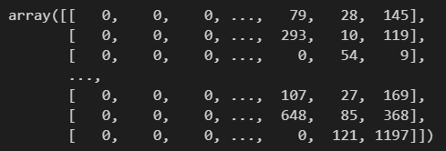
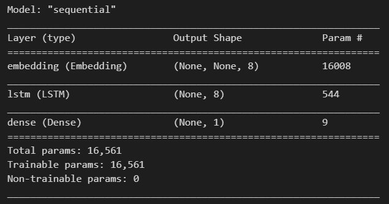

# day 39

## 순환신경망

순환 신경망은 이전 단계의 처리 결과가 다음 단계에 입력이 되는 형태의 신경망이다.

동일 처리를 반복하는 형태이므로 길이가 긴 문장을 처리하더라도 파라미터의 수가 늘어나지 않는다.

### 경사소실문제의 해결

RNN은 여러 단계에 걸쳐 동일한 형태를 반복, 즉, 0.9 x 0.9 x 0.9 .... = 0 이된다. 먼 거리에 걸친 정보전달이 제대로 되지 않음

#### LSTM, GRU

ht는 (-1 ~ 1) 의 범위를 가진다. 1보다 작기 때문에 계속 곱해나가면 0이된다.

+ LSTM

  출력 ht은 순환하고, 활성화함수 ht를 거치지 않는 별도의 Ct를 순환시킨다.

  t-1-------------------------------> Ct

  t-1-------------------------------> ht

  순환되는 정보가 2개

+ GRU

  순환되는 ht에 ht-1과 더한다.

  t-1 ---------------------------------> ht

  ​     |--------------------------| 

  Ct에 태워서 같이 내보낸다.

둘 다 순환되는 신호가 활성화 함수를 거치지 않는다.

#### 순환신경망의 방향

+ 정방향 : 앞에서 뒤로 처리
+ 역방향 : 뒤에서 앞으로 처리
+ 양방향 : 정방향과 역방향으로 각기 처리한 결과를 합침

#### 단점

+ 순차적 계산
+ 병렬 계산이 불가능하므로 계산속도가 느림
+ 긴 문맥의 학습은 잘 되지 않음


## 순환신경망 실습

### 데이터 준비

+ 데이터 준비

  기존에 다운받았던 분석용 리뷰 데이터.

  ```python
  import pandas as pd
  
  df = pd.read_csv("imdb.zip")
  ```

+ 토큰화 정보 준비

  토큰화했던 파일 불러오기.

  `tk` 는 리뷰데이터에 있는 단어를 많이 나오는 순서대로 정렬한 이후, 2000개의 단어를 뽑아서 토큰화한 것이다.

  ```python
  import joblib
  
  tk = joblib.load("tokenizer.pkl")\
  tk.index_word[148]
  ```

+ 훈련,테스트 데이터셋 나누기

  ```python
  from sklearn.model_selection import train_test_split
  
  review_train, review_test, y_train, y_test = train_test_split(df["review"],df["sentiment"],test_size=0.2,random_state=56)
  ```

+ 텍스트를 숫자형 벡터로 변환

  ```python
  seqs = tk.texts_to_sequences(review_train)
  ```

+ 패딩(모든 리뷰의 길이를 같게 만들어줌.)

  ```python
  import tensorflow as tf
  
  pads = tf.keras.preprocessing.sequence.pad_sequences(seqs,maxlen = None, padding = "pre", truncating= "pre")
  pads
  ```

  

  ```python
  NUM_WORDS = tk.num_words + 1
  ```

### 순방향 순환신경망

#### LSTM 신경망 모형 만들기

+ Embedding : `NUM_WORDS+1` 개의 단어가 인덱스로 출력된다. 한개의 단어당 8개의 벡터를 출력한다. `mask_zero` 옵션은 0을 무시하는 옵션이다.
+ LSTM : LSTM 모델을 사용한다. 마지막에 8차원으로 변환하여 출력한다.
+ Dense : 출력은 0 or 1이기때문에 1개이다.

```python
model = tf.keras.Sequential([tf.keras.layers.Embedding(NUM_WORDS,8,mask_zero=True),
                             tf.keras.layers.LSTM(8),
                             tf.keras.layers.Dense(1,activation="relu")])
```

```python
model.summary()
```



위 모델은 아직 데이터가 들어가지 않은 껍데기 모델이다. `None` 으로 처리되어있는 부분은 데이터가 들어갈 부분이다.

들어온 단어를 각 단어당 8벡터씩 처리를한다.

#### 모델 학습

```python
model.compile(loss="binary_crossentropy",optimizer="adam",metrics=["accuracy"])
```

```python
model.fit(pads,y_train.values,epochs=10)
```


### 역방향 순환신경망

패딩을 `post` 로 바꿔준다.

```python
pads = tf.keras.preprocessing.sequence.pad_sequences(seqs,maxlen = None, padding = "post", truncating= "pre")
```

#### 모델 생성

`go_backword` 옵션을 설정하여 역방향으로 방향을 설정한다.

```python
model = tf.keras.Sequential([tf.keras.layers.Embedding(NUM_WORDS,8,mask_zero=True),
                             tf.keras.layers.LSTM(8, go_backwards=True),
                             tf.keras.layers.Dense(1, activation="sigmoid")])
```

#### 모델학습

```python
model.compile(loss="binary_crossentropy",optimizer="adam",metrics=["accuracy"])
```

```python
model.fit(pads,y_train.values,epochs=10)
```


### 양방향 순환신경망

#### 모델생성

`Bidirectional` 함수로 양방향 모델을 만들 수 있다.

```python
model = tf.keras.Sequential([tf.keras.layers.Embedding(NUM_WORDS,8,mask_zero=True),
                             tf.keras.layers.Bidirectional(tf.keras.layers.LSTM(8)),
                             tf.keras.layers.Dense(1, activation="sigmoid")])
```

```python
model.compile(loss="binary_crossentropy",optimizer="adam",metrics=["accuracy"])
```

```python
model.fit(pads,y_train.values,epochs=10)
```

