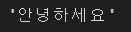
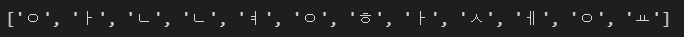

# day 40

## 자연어 생성

자연어 처리의 두 분야

+ 자연어 이해 : 사람의 언어로 읽기, 듣기. 사람의 언어를 입력하여 어떠한 정보를 추출하는 것.
  + 감성분석 : 자연어 문장에 나타난 긍정/부정의 감성을 분류하거나 점수를 매김
+ 자연어 생성 :  정보를 토대로 자연어 텍스트를 생성하는 것.
  + 일기예보생성 : 기온, 강수량 등의 데이터를 바탕으로 적절한 기사를 생성


### 자연어 생성

#### 자연어 생성 방법

+ 규칙 기반 자연어 생성

  - 자연어 생성을 여러 단계로 분할

    1. 원천 데이터에서 문장에 포함시킬 부분 선택

    2. 강조할 부분과 언급할 부분 나눔

    3. 표현 방법 결정.

    4. 문장으로 표현, 문장을 템플릿 형태로 생성하거나 인공어 사용 -> 자연어 문장으로 번역

  + 장점 : 자연어 생성의 각 과정을 세세하게 제어 가능
  + 단점 : 개발에 많은 노력 필요, 자연스러운 문장 생성 어려움

+ 기계 학습 자연어 생성
  + 기존의 자연어 문장을 학습시켜 새로운 문장을 생성
  + 단계를 나누지 않고 처음부터 끝까지 구현이 가능
    + 예) 기존의 날씨 데이터와 일기예보 텍스트를 수집해서 날씨데이터 x를 입력하면 일기예보 텍스트 y가 출력되게 함
  + 장점 : 자연스러운 표현이 가능
  + 단점 : 많은 데이터 필요, 제어가 어려움
    + 기존에 텍스트가 많이 없는 경우, 새로운 데이터가 포함되는 경우 어려움을 겪는다.
+ 혼합 방식
  + 실제 솔루션 개발은 혼합적으로 이뤄지는 경우가 많다.
  + 기계학습 : 이론적 연구가 많음, 그러나 데이터 부족, 제어문제
  + 규칙기반 : 시스템의 연구가 많이되어있음.

#### 자연어 생성 분야

+ 입력 형식에 따른 구분 
  + 입력 (x) 에 대한 (y) 출력.
  + data-to-text : 기사/보고서 생성
  + image-to-text : 구조적 데이터가 아니라 이미지 데이터가 입력으로 들어감. 이미지에 대한 설명(캡션 생성)
  + text-to-text : 기계 번역, 챗봇, 요약
  + 이야기 생성

#### 기계학습을 통한 자연어 생성

+ 기본 흐름
  1. 데이터 수집
  2. 전처리 : 글자단위 토큰화, 준단어 토큰화
     + 글자수준 토큰화
       1. 글자 단위로 나누어 토큰화하는 것.
       2. 미등록 어휘 문제가 없음.
       3. 텍스트에서 의미나 문법적 측면을 무시하고 잘게 나누기 때문에 처리가 어려움.
  3. 모형 개발 및 학습 : 언어모형, 특정 단어 이후 가장 확률이 높은 단어를 이어붙임.
  4. 생성 : 디코딩


### 한국어 글자 수준 토큰화

#### 모아쓰기와 풀어쓰기

+ 한국어에는 모아쓰기 (밝) 와 풀어쓰기(ㅂㅏㄱㄹ)가 있다.
+ 한국어 모아쓰기 글자 수 : 11172글차
+ 풀어쓰기 글자 수 
  + 초성 : 19
  + 중성 : 21
  + 종성 : 28 (종성 없음을 1글자로 포함할 경우)
+ 한국어 모아쓰기 <-> 풀어쓰기간 변환은 유니코드 정규화를 이용하여 간단히 할 수 있다.

#### 유니코드 정규화

+ 유니코드란 문자 표기를 위한 국제 표준이다.
+ 한글, 로마자 등의 154종의 스크립트, 총 14만여개의 글자가 수록되어있다.
+ 현재는 쓰이지 않는 문자도 수록되어있다.

유니코드 정규화는 동등한 문자들을 다루는 방법이다.

#### 한글 풀어쓰기 실습

+ 한국어 단어 `안녕하세요` 가 있다. 이 단어를 유니코드로 풀어서 확인할 수 있다.

  ```python
  x = "안녕하세요"
  len(x)  # 5
  list(x) # ['안', '녕', '하', '세', '요']
  ```

+ `unicodedata` 모듈은 유니코드로 변환을 도와주는 모듈이다.

  `NFD` 방식으로 `x` 를 유니코드화 한 것이 `y`다.

  `y`를 출력해보면 `x` 와 똑같아 보이지만, 내부적으로는 유니코드로 변환되어있다.

  ```python
  import unicodedata
  
  y = unicodedata.normalize("NFD",x)
  ```

  ```python
  print(y)
  ```

  

+ `x` 와 `y` 를 비교해보면 알 수 있다.

  ```python
  x == y  # False가 나온다.
  ```

  ```python
  list(y)
  ```

  

+ `y[0]` 과 `y[5]` 는 같아보이지만, 유니코드상에서는 다르다.

  `y[0]` 은 초성이고 `y[5]` 는 종성이기 때문이다.

+ `ord` 함수를 사용하면 유니코드상 몇 번째 문자인지 확인할 수 있다.

  초성, 종성, 키보드 입력값이 모두 같은 자음이지만, 유니코드상으로는 다른 값이 나온다.

  ```python
  ord(y[0])  # 4363
  ord(y[5])  # 4540
  ord("ㅇ")  # 12615
  ```

  