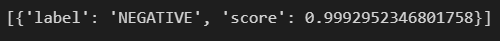

# day 42

## 언어모형

### 언어모형 

#### 확률의 연쇄규칙

+ 결합확률 : x1, x2가 동시에 발생할 확률 `p(x1,x2)`
+ 조건부확률 : x1일때 x2일 확률 `p(x2|x1)`

+ 연쇄규칙 : `p(x1,x2) = p(x2|x1)p(x1)`

#### 인과적 언어모형

+ 결합 확률 대신 조건부 확률 형태의 언어모형
  + `P(xn | x1, x2, .... xn-1)` 
  + 밥을 먹었다 =>  `P(밥) x P(을|밥) x P(먹|밥,을) x P(었|밥,을,먹) x P(다 | 밥,을,먹,었)`
+ 단순히 언어모형이라 한다.
+ 인공 신경망 등의 모형으로 구현하기 쉬움
+ 단어를 순서대로 생성 가능

#### N-Gram 언어모형

+ 텍스트에서 최대 n개까지의 단어 조합의 빈도를 세서 언어 모형을 간단히 구현할 수 있음
+ n단어 이상의 맥락은 고려할 수 없다.
+ n이 커질수록 조합이 폭발적으로 증가하여 많은 저장공간 필요 : storage problem
+ 텍스트가 충분히 많지 않으면 대부분의 조합의 빈도가 0

#### 신경망 언어모형

+ n개의 단어를 입력으로 받음. `x1, x2, x3 .... xn`

+ 각 단어 `xt`를 원핫인코딩

  + n개의 단어를 길이가 n인 벡터로 표현
  + 다른 값은 모두 0으로 두고 단어의 번호에 해당하는 값만 1로 표시

+ 단어 임베딩

  + 단어를 m차원의 조밀한 벡터로 표현
  + 의미적, 문법적으로 유사한 단어는 비슷한 값을 가지도록 함
  + 신경망에서는 원핫인코딩된 입력 x에 가중치행렬 w를 곱하는 레이어로 구현

+ 앞먹임 신경망

  + feed forward 신경망.
  + x가 들어오면 가중치를 곱하고 y가 나온다. `y = bx` 이건 너무 쉽다
  + activate function을 사용하여 비선형 형태로 출력한다.
  + `x1, x2, x3 .... xn` -> 원핫인코딩 -> 임베딩 -> 은닉층 -> 출력층 -> (`xn+1`)

+ 다음에 나올 `xn+1` 를 예측

+ 장점

  + storage problem
    + 신경망 언어모형은 어휘의 종류가 `w`, 임베딩의 크기가 `e`, 은닉층의 크기가 `h` 일 경우 `we + eh + hw` 의 파라미터만 필요

  + sparsity problem
    + 비슷한 단어는 비슷한 임베딩을 갖게된다. 
    + 말뭉치에 `떡을 먹다` 라는 문장이 없어도 `밥을 먹다` `빵을 먹다` 등의 사례를 통해 `떡을 먹다` 에 높은 확률을 주도록 학습 가능

+ 한계점
  + `n-gram` 과 마찬가지로 n개의 단어까지만 반영됨
  + 단어의 위치에 따라 가중치가 달라짐
  + n을 키우면 모형이 커짐

#### 순환신경망과 주의 매커니즘

+ 신경망은 경사하강법을 통해 학습
+ 동일한 가중치 `w` 가 여러번 곱해지므로
  + 점점 작아져서 사라짐 -> 학습이 안됨
  + 점점 커져서 폭발 -> 학습이 불안정
+ LSTM
  + 순환신경망의 사라지는 경사 문제를 해결
  + 한계점
    + 순차적으로 계산되기 때문에 병렬처리가 어려움
    + 문장이 길어질수록 네트워크도 길어져 학습이 어려움

+ 주의 메커니즘
  + LSTM의 한계를 극복하기 위한 방법
  + 주의 메커니즘은 모든 단어를 비교해서 현재의 처리 단계에 필요한 정보를 바로 가져온다
  + 순환신경망에 비해 계산량은 많으나, 병렬처리가 쉬움
+ 트랜스포머
  + 주의 메커니즘만을 사용한 Seq2Seq 모형
  + 문장내의 주의 메커니즘 적용
  + 문장 간에도 주의 메커니즘 적용


## 언어모형 실습

### transformers 라이브러리

+ 트랜스포머 계열의 딥러닝 모형을 위한 라이브러리
+ 패키지 다운로드
  + `!pip install transformers`

#### 감성분석

+ `pipeline` 패키지의 `pipeline("sentiment-analysis")` 감성분석 패키지를 사용한다.

+ 미리 학습되어 만들어진 패키지를 사용하여 감성분석을 실행할 수 있다.

  ```python
  from transformers import pipeline
  
  classifier = pipeline("sentiment-analysis")
  classifier("i am glat to hear that you finally made it")
  ```

  

+ 위 문장은 `positive`, 긍정으로 분류되었으며 점수는 0.999점으로 아주 높은 점수를 받았다. 이 문장이 긍정적인 문장일 확률이 매우 높다는 것을 알 수 있다.

+ 부정적인 문장을 넣을 경우 부정문으로 분류된다

  ```python
  classifier("i hate you.")
  ```

  

#### 한국어 감성분석

+ 패키지를 다운받는다. `model` 파라미터를 이용해 원하는 패키지를 사용할 수 있다.

  ```python
  from transformers import pipeline
  
  classifier_korean = pipeline("sentiment-analysis", model = "monologg/koelectra-small-finetuned-nsmc")
  ```

+ 긍정문

  ```python
  classifier_korean("이 영화 진짜 재밌다")
  ```

  

+ 부정문

  ```python
  classifier_korean("이야기가 말이 안된다")
  ```

  


### 뒤에 올 단어 예측

#### TFAutoModelForCausalLM

`TFAutoModelForCausalLM`텐서플로 전용 패키지로, 사전학습된 모형을 가지고 앞의 단어를 보고 뒤의 하나를 맞추는 언어 모형

#### 모델 생성

+ 토크나이저 생성

  `from_pretrained` 함수는 사전에 학습된 모델을 사용하는 것이다.

  ```python
  tokenizer = AutoTokenizer.from_pretrained("xlnet-base-cased")
  ```

+ 모델 생성

  ```python
  model = TFAutoModelForCausalLM.from_pretrained("xlnet-base-cased")
  ```

+ 토크나이저 확인

  ```python
  tokenizer.vocab_size   # 32000
  ```

  ```python
  vocab = tokenizer.get_vocab()
  vocab
  ```

  

+ 인덱스와 단어를 변경한다.

  ```python
  id2word = {i : word for word,i in vocab.items()}
  id2word
  ```

  

#### 단어 예측

+ 문장 인코딩

  `return_tensors="tf"` 는 텐서타입으로 반환하는 옵션이다.

  ```python
  sequence = f"Once upon a time, there was,,,"
  input_ids = tokenizer.encode(sequence,return_tensors="tf")
  input_ids
  ```

  

  ```python
  id2word[1977]   # '▁Once'
  ```

+ 모델학습

  인코딩된 문장을 모델에 넣어준다.

  ```python
  result = model(input_ids)
  logits = result[0]
  logits
  ```

  

  ```python
  logits.shape    # TensorShape([1, 12, 32000])
  ```

  + `[1, 12, 32000]` 1개의 문장이 들어가있고, 토큰이 12개인 문장이다. 맨 마지막 토큰 다음에 나올 확률을 계산할 때, 32000개의 토큰이 가지는 값 의미한다. 즉, 위 결과는 문장의 다음에 나올 단어가 32000개 단어 중 어떤 단어가 나올지를 로짓값으로 보여준다.

+ 마지막 단어의 다음 단어의 확률을 저장

  ```python
  next_to_logits = logits[:,-1,:]
  next_token_logits.shape   # TensorShape([1, 32000])
  next_token_logits
  ```

  

+ ```python
  # 확률 단위로 변환해서 보여줌.
  tf.nn.softmax(next_token_logits)
  ```

+ 가장 나올 가능성이 높은 상위 10개 단어 출력

  ```python
  top = tf.math.top_k(next_token_logits,k=10)
  top
  ```

  

  단어의 인덱스를 보여준다

  ```python
  top.indices
  ```

  

  문장 이후 나올 가능성이 가장 높은 10개의 단어를 출력한다.

  ```python
  for i in top.indices[0].numpy().tolist():
      print(id2word[i])
  ```

  

  