# day 43

## 언어 모형 실습

### 마스크 언어 모형

마스크 언어모형을 사용하여 문장 중간 토큰을 예측해보는 실습을 진행한다.

#### 파이프라인을 활용한 가려진 단어 예측

```python
from transformers import pipeline
```

+ `fill-mask` 는 가려진 부분을 채워넣는 옵션이다.

  ```python
  nlp = pipeline("fill-mask")
  ```

+ 마스킹된 문장 생성

  ```python
  text = f"Pizza is my {nlp.tokenizer.mask_token}"
  text
  ```

  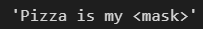

+ 파이프라인에 문장 입력

  ```python
  nlp(text)
  ```

  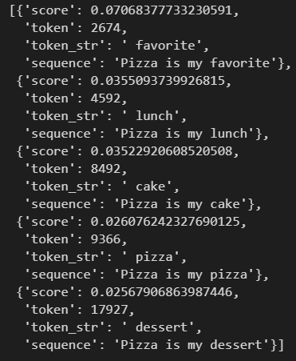

  + `score` 는 해당 단어가 나올 확률을 의미한다.
  + `token` 은 인덱스를 의미하며, `token_str` 은 실제 단어이다.
  + `sequence` 는 예측한 문장이 나온다.

+ 파이프라인의 단점은 빈칸이 두 개일 경우 에러가 발생한다는 점이다.

  ```python
  text2 = f"Pizza is {nlp.tokenizer.mask_token} my {nlp.tokenizer.mask_token} food"
  nlp(text2)
  ```

  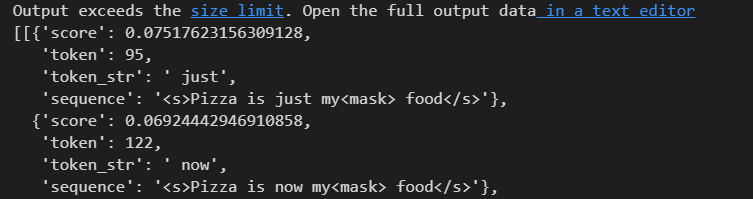

  + `sequence` 에 `<mask>` 가 나타난다. 이는 단어를 제대로 예측하지 못했다는 것을 의미한다.


### TFAutoModelForMaskedLM

```python
from transformers import TFAutoModelForMaskedLM, AutoTokenizer
```

#### 모델 다운로드

+ 미리 훈련된 모델을 다운받는다. `from-pretrained` 는 미리 훈련되어진 모델을 가져오는 함수이다.

  ```python
  tokenizer = AutoTokenizer.from_pretrained("distilroberta-base")
  model = TFAutoModelForMaskedLM.from_pretrained("distilroberta-base")
  ```

+ 어휘 목록을 가져오고, 숫자를 키로, 단어를 값으로 하는 딕셔너리를 만든다.

  ```python
  vocab = tokenizer.get_vocab()
  id2word = {i:word for word,i in vocab.items()}
  ```

#### 모델 적용

+ 입력할 문장

  ```python
  sequence = f"Pizza is my {tokenizer.mask_token} food"
  sequence  # 'Pizza is my <mask> food'
  ```

+ 문장 인코딩

  ````python
  input_ids = tokenizer.encode(sequence, return_tensors="tf")
  ```

+ 마스킹된 단어 확인

  ```python
  tokenizer.mask_token_id  # 50264
  ```

+ 인코딩된 문장에서 마스킹된 단어와 일치하는 것 찾기

  ```python
  input_ids[0] == tokenizer.mask_token_id
  ```

  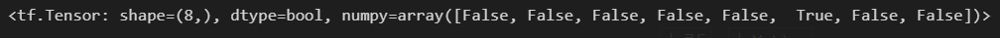

+ 마스킹된 단어가 인코딩된 문장에 몇 번째 요소인지 찾기

  ```python
  import tensorflow as tf
  
  mask_token_indices = tf.where(input_ids[0] == tokenizer.mask_token_id)[0].numpy().tolist()
  mask_token_indices   # [5]
  ```

+ 인코딩된 문장을 모델에 적용 및 결과 저장

  ```python
  result = model(input_ids)
  logits = result[0]
  ```

+ 다음에 올 단어 예측

  `logits` 에 저장된 결과는 `[1, 8, 50265]` 차원의 배열이다. 문장의 개수는 1개, 단어의 개수는 8개이다.

  `i` 에 저장된 숫자는 마스킹 단어가 문장의 몇 번째에 위치하는지에 대한 정보이다.

  50265개의 단어가 모두 나올 확률을 가지는데,

  `top` 에 상위 10개의 단어를 저장하여 출력한다.

  ```python
  i = mask_token_indices[0]
  mask_token_logits = logits[0,i,:]
  top  = tf.math.top_k(mask_token_logits, k = 10)
  top
  ```

  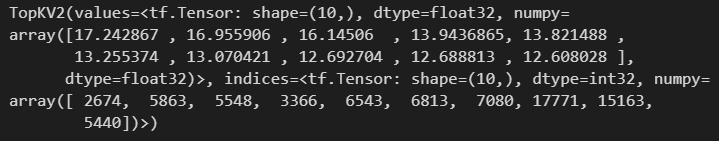

+ 예측된 단어 10개를 출력

  ```python
  for i in top.indices.numpy().tolist():
      print(id2word[i])
  ```

  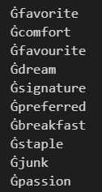

#### 마스킹된 단어가 2개 이상일 경우

+ 문장 인코딩

  적용할 문장을 인코딩하고, 마스킹된 단어가 몇 번째 단어인지를 가지고 있는 리스트를 저장한다.

  ```python
  import tensorflow as tf
  
  # 문장 생성
  sequence = f"Pizza {tokenizer.mask_token} my {tokenizer.mask_token} food"
  
  # 생성된 문장을 인코딩
  input_ids = tokenizer.encode(sequence, return_tensors="tf")
  
  # 마스킹된 단어가 몇 번째 단어인지 확인
  mask_token_indices = tf.where(input_ids[0] == tokenizer.mask_token_id)
  # squeeze는 [[3],[5]] 로 이루어진 배열을 [3,5]로 압축한다.
  mask_token_indices = tf.squeeze(mask_token_indices).numpy().tolist()
  ```

+ 모델 적용

  인코딩된 문장을 모델에 적용하고, 결과를 저장한다.

  마스킹된 단어로 반복문을 돌려 각각의 마스킹된 단어에 올 확률이 높은 상위 10개 단어를 저장한다.

  ```python
  # 문장을 모델에 적용
  result = model(input_ids)
  
  # [1,8,50265] 차원의 예측 결과를 logits에 저장
  logits = result[0]
  
  # 마스킹된 단어의 인덱스가 저장된 리스트를 반복, [3,5]를 반복
  for i in mask_token_indices:
      print(f"==={i}===")
      # i번째 단어의 예측 결과를 저장
      mask_token_logits = logits[0,i,:]
      # 50265개의 단어중 가장 확률이 높은 상위 10개의 단어를 저장 및 출력
      top = tf.math.top_k(mask_token_logits, k = 10)
      for i in top.indices.numpy().tolist():
          print(id2word[i],end = ",")
      print()
  ```

  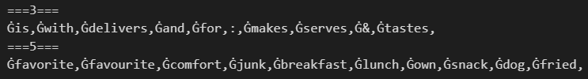


## 파이프라인

### 질문 - 답변

#### 모델 다운로드

`question-answering` : 비정형 텍스트를 학습하여 주어진 질문에 대한 대답을 출력하는 모델을 다운이다.

```python
from transformers import pipeline

qa = pipeline("question-answering")
```

#### 모델 적용

+ 질문을 적으면 대답이 나오는 모델이다.

  ```python
  text = """
  Seoul, officially the Seoul Special City, is the capital and largest metropolis of South Korea. 
  Seoul has a population of 9.7 million people, 
  and forms the heart of the Seoul Capital Area with the surrounding Incheon metropolis and Gyeonggi province.
  """
  
  qa(question = "where is the capital city of South Korea?",context = text)
  ```

  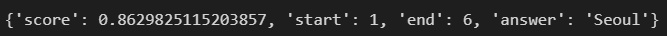

+ 다른 질문 적용

  ```python
  qa(question = "How many people live in Seoul?",context = text)
  ```

  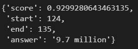

  학습한 지문에는 `live` 라는 단어가 없지만, `live` 라는 단어에 대해서 대응할 수 있도록 학습된 모형을 사용하기 때문에 질문에 답을 할 수 있다.

  

### NER(Named Entity Recognition)

#### 모델 다운로드

`NER` : 비정형 텍스트의 개체명 언급을 인명, 단체, 장소, 의학 코드, 시간 표현, 양, 금전적 가치, 퍼센트 등 미리 정의된 분류로 위치시키고 분류

```python
ner = pipeline("ner")
```

#### 모델 적용

```python
ner(text)
```

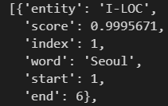

`entity` `score` 등으로 해당 단어가 얼마나 해당 객체에 적합한지 평가한다.


### 요약

#### 모델 다운로드

`summarization` : 적당한 길이(너무 짧거나 길지 않은)의 텍스트를 요약

```python
summ = pipeline("summarization")
```

#### 모델 적용

```python
text = """
A zettelkasten consists of many individual notes with ideas and other short pieces of information that are taken down as they occur or are acquired.
The notes may be numbered hierarchically so that new notes may be inserted at the appropriate place, 
and contain metadata to allow the note-taker to associate notes with each other. 
For example, notes may contain subject headings or tags that describe key aspects of the note, and they may reference other notes. 
The numbering, metadata, format and structure of the notes is subject to variation depending on the specific method employed.
A zettelkasten may be created and used in a digital format, sometimes using personal knowledge management software. 
But it can be and has long been done on paper using index cards.
The system not only allows a researcher to store and retrieve information related to their research, but has also been used to enhance creativity.
"""

summ(text)
```

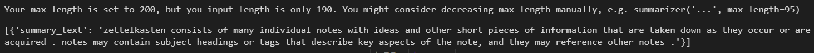


### Zero-Shot Classification

#### 모델 다운로드

`Zero-Shot Classification` : 데이터가 전혀 필요하지 않은 파이프라인. 분류의 이름만 알려주면 추가 학습 없이 분류가 가능

```python
zs = pipeline("zero-shot-classification")
```

#### 모델 적용

+ 문장과 분류 레이블 설정

  ```python
  seq = "pizza is my favorite food"
  label = ["food","ocean","space"]
  ```

+ 레이블과 유사도 비교

  ```python
  zs(seq,label)
  ```

  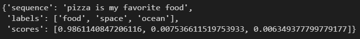

  `food` 가 될 확률이 0.98이다

+ 레이블을 변경하고 다시 실행

  ```python
  label = ["politics","society","life"]
  zs(seq,label)
  ```

  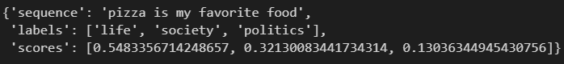

  레이블과 유사할수록 스코어는 높아진다.


